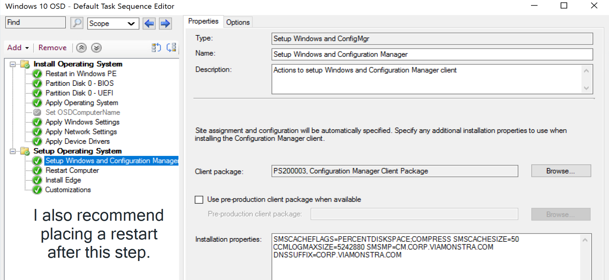

# Setup Windows and Configuration Manager

This step does quite a bit, when you start this step, you're in WinPE, by the time it's done, you're in the Full OS with a configuration manager client installed.  Not many option fields, but you can use this to customize the CM Client quite a bit, and this is the first place to start when the client install doesn't go well during OSD.  

There is so much going on in this step, that it really makes all of the other steps seem like child's play.  This step pulls together your settings, applies the unattend.xml (after building it), and if you choose to, will run the entire Windows Setup Process.  Once again, you're going to want to start by reading the docs which gives a nice high level overview, I'll then demo and show logs to shed light on what they docs are implying.  

Things to note, this Step is really the parent step to these steps:

- [Apply Operating System](SCCM_TaskSequence_Step_ApplyOperatingSystemImage.md) (Recast ConfigMgr Docs Site)
- [Apply Windows Settings](SCCM-TaskSequence-Step-Apply-Windows-Settings.md)
- [Apply Network Settings](SCCM-TaskSequence-Step-Apply-Network-Settings.md)

Setup Windows and ConfigMgr step, takes information from those 3, pulls it together and gives you a functioning OS.  

## MS Docs

### Step

<https://docs.microsoft.com/en-us/mem/configmgr/osd/understand/task-sequence-steps#BKMK_SetupWindowsandConfigMgr>

### CM Client Setup Properties

<https://docs.microsoft.com/en-us/mem/configmgr/core/clients/deploy/about-client-installation-properties>

## Powershell

- [Get-CMTSStepSetupWindowsAndConfigMgr](https://docs.microsoft.com/en-us/powershell/module/configurationmanager/get-cmtsstepsetupwindowsandconfigmgr)
- [New-CMTSStepSetupWindowsAndConfigMgr](https://docs.microsoft.com/en-us/powershell/module/configurationmanager/new-cmtsstepsetupwindowsandconfigmgr)
- [Remove-CMTSStepSetupWindowsAndConfigMgr](https://docs.microsoft.com/en-us/powershell/module/configurationmanager/remove-cmtsstepsetupwindowsandconfigmgr)
- [Set-CMTSStepSetupWindowsAndConfigMgr](https://docs.microsoft.com/en-us/powershell/module/configurationmanager/set-cmtsstepsetupwindowsandconfigmgr)

So lets start by looking over this step:

Your options are limited, you can use the pre-production client if you like but I've left it the default.  Installation Parameters, there are many to choose from, I'm just setting the CCMCache size here in my demo.

## Step Timeline

### Apply Operating System from WIM version

Lets walk through the step when in the scenario that you're running OSD from a captured image "WIM" file.  

- Step Launches OSDSetupWindows.exe
  - This then calls OSDSetupHook.exe **/configure**:c:\windows\system32
  - Downloads your CM Client to _SMSTaskSequence\Packages\PackID 
  - Copies OSDSetupHook.exe to c:\windows\system32
  - Creates c:\windows\system32\_SMSOSDSetup
  - Populates _SMSOSDSetup with TSRes.dll & other things
  - Exits the OSDSetupHook Process
- OSDSetupWindows.exe then calls OSDSetupHook.exe **/Install**:c:\windows
  - This creates the folder: c:\windows\setup\Scripts
    - [setupcomplete.cmd](https://docs.microsoft.com/en-us/windows-hardware/manufacture/desktop/add-a-custom-script-to-windows-setup#run-a-script-after-setup-is-complete-setupcompletecmd) (Runs at the end of Windows Setup)
      - "%windir%\system32\osdsetuphook.exe /execute
    - DisableCMDRequest.TAG [(Disables Shift-F10)](https://oofhours.com/2020/08/04/disable-shift-f10-in-oobe/) [(User Voice to give us ability to disable creation of this file)](https://configurationmanager.uservoice.com/forums/300492-ideas/suggestions/41410762-osd-create-variable-to-control-creation-of-disab)
  - Loads Offline Registry
    - Checks for previously installed CM Client (if using B&C WIM)
    - Sets the Machine to use the correct Drive Letter.
    - Unloads

After that step says it's complete, the TSManager picks back up and continues the work, as it still has a few things to accomplish before rebooting.  

- The machine is set to reboot into Full OS
- BCDBoot runs to make the Applied OS bootable
- TSManager triggers the reboot on behalf of the step
- Progess dialogs update to reflect restart.

So after the Reboot, the setupcomplete.cmd runs and triggers the task sequence again.  

- Confirms the Machine joined the domain during OOBE
- Runs net start W32time & w32tm.exe to sync up to the domain
- Loads the TS Vars from C:\_SMSTaskSequence\TSEnv.dat
- Configures the Local Admin account
- Checks if MBR to re-assign drive letters if required
- Starts the CCMSetup.exe process to install the Client
  - Settings published to Active Directory [(MS Docs)](https://docs.microsoft.com/en-us/mem/configmgr/core/clients/deploy/about-client-installation-properties-published-to-active-directory-domain-services)
  - Settings you can use in the Step [(MS Docs)](https://docs.microsoft.com/en-us/mem/configmgr/core/clients/deploy/about-client-installation-properties)
- Once install is done, and the client is fully active, it registers the TS with execmgr.
  - Basically it's taking the standalone TS process and handing it over to the newly installed client in the Full OS.

### Apply Operating System from Original Source

Now lets repeat that process, but this time, we'll look at how the step performs when you're installing windows from source files (Upgrade package).

Everything looks normal, until you get to the "Setup Windows & ConfigMgr" Step, but as you can see, it's literally doing the "Setup Windows" portion before your eyes.

  

The Unattend.XML file is compiled and injected into the Setup Process, which runs for a few minutes, once completed, the Step configures the offline OS to trigger the Task Sequence once booted into the Full OS.  It then goes on to download the content required to install the CM Client

At this point, the process is similar to that above, the client is staged, the step completes and calls the system to restart.

## Things to Note

- Not all ccmsetup parameters are allowed in this step, however I have not seen them to cause issue, the ccmsetup.log show that they are just ignored.  

## Related Items

- CM Client Install
  - log: c:\windows\ccmsetup\logs\ccmsetup.log  
  You'll find that this log will shed the light on any client install issues,along with a time gap in your SMSTS.log file.  
    You might notice some "interesting" time shifts in the logs, this is typically caused by the machine starting the OSD process using your BIOS time, then shortly before this the ccmsetup is triggered, a command was run to sync the time with the domain, hence the discrepancy in the time line.
- Windows Logs (Panther)
  - You'll find info here from when Windows was installed during this step, like this example of where you see Windows Setup finding the SetupComplete.cmd file that the step created as it's Hook to trigger the Task Sequence: 

## Troubleshooting

I've seen issues personally and heard from others that somethings the TS will get stuck on this step, or you won't see the TSProgressUI afterwards.  First thing you'll want to do is ensure you have a Restart Computer Step directly after this step.

**About Recast Software**
1 in 3 organizations using Microsoft Configuration Manager rely on Right Click Tools to surface vulnerabilities and remediate quicker than ever before.  
[Download Free Tools](https://www.recastsoftware.com/?utm_source=cmdocs&utm_medium=referral&utm_campaign=cmdocs#formarea)  
[Request Pricing](https://www.recastsoftware.com/pricing?utm_source=cmdocs&utm_medium=referral&utm_campaign=cmdocs)
