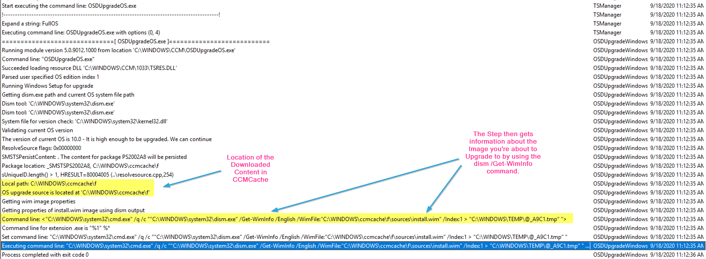
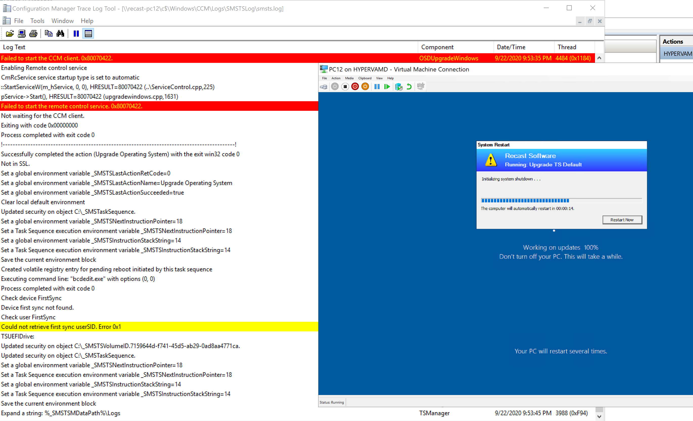
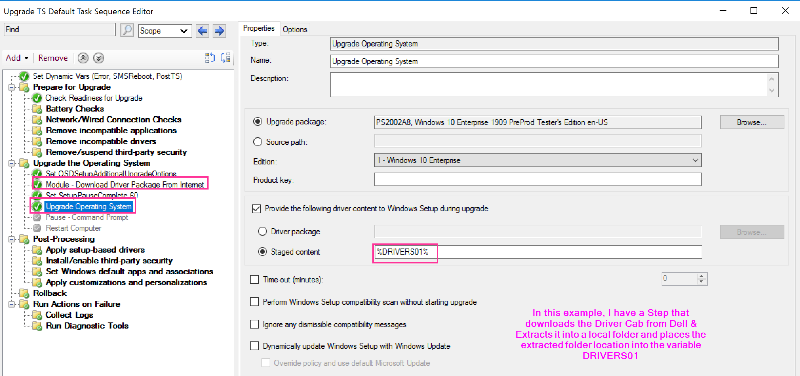

# Upgrade Operating System

This step is used during an in-place upgrade of your machine from and older version of windows to a newer version of windows, or in some cases, to the same version of windows.  This step is the primary engine in an upgrade task sequence.  Much of this step, you're actually left blind to what is going on, as it fully hands off your machine to the Windows 10 Setup Engine, leaving you in the dark until after Setup is complete and it hands back control to the task sequence via the setupcomplete.cmd file that is triggered by the windows setup process.  That's about as long as an intro as I want, but buckle up, as this page is going to be long, because there is just so much ground to cover here.

## MS Docs

- Task Sequence Step: <https://docs.microsoft.com/en-us/mem/configmgr/osd/understand/task-sequence-steps#BKMK_UpgradeOS>
- Windows 10 Upgrade Troubleshooting: <https://docs.microsoft.com/en-us/windows/deployment/upgrade/resolve-windows-10-upgrade-errors>
- Windows 10 Upgrade Task Sequence: <https://docs.microsoft.com/en-us/mem/configmgr/osd/deploy-use/create-a-task-sequence-to-upgrade-an-operating-system>

## PowerShell

- [Get-CMTSStepUpgradeOperatingSystem](https://docs.microsoft.com/en-us/powershell/module/configurationmanager/Get-CMTSStepUpgradeOperatingSystem)
- [New-CMTSStepUpgradeOperatingSystem](https://docs.microsoft.com/en-us/powershell/module/configurationmanager/New-CMTSStepUpgradeOperatingSystem)
- [Remove-CMTSStepUpgradeOperatingSystem](https://docs.microsoft.com/en-us/powershell/module/configurationmanager/Remove-CMTSStepUpgradeOperatingSystem)
- [Set-CMTSStepUpgradeOperatingSystem](https://docs.microsoft.com/en-us/powershell/module/configurationmanager/Set-CMTSStepUpgradeOperatingSystem)

## Variables

- **[_SMSTSOSUpgradeActionReturnCode](https://docs.microsoft.com/en-us/mem/configmgr/osd/understand/task-sequence-variables#SMSTSOSUpgradeActionReturnCode)** - Is set to the value of the Windows Setup Engine, during Upgrade you want this to be 0, during Compatibility Scan, you want this to be 0xC1900210
  - [MS Docs - Windows Upgrade Return Codes](https://docs.microsoft.com/en-us/windows/deployment/upgrade/upgrade-error-codes)
- **[SetupCompletePause](https://docs.microsoft.com/en-us/mem/configmgr/osd/understand/task-sequence-variables#SetupCompletePause)** - After the upgrade of Windows, and the setupcomplete.cmd file triggers, this variable will place a "pause", or countdown based on the count you place in this variable.  By Default, I use 180, and on our slower VDI machines, 300.
- **[OSDSetupAdditionalUpgradeOptions](https://docs.microsoft.com/en-us/mem/configmgr/osd/understand/task-sequence-variables#OSDSetupAdditionalUpgradeOptions)** - This allows you to append to the setup engine's install command line.  Typical things include enabling or disabling the diagnostic prompt, or slipping in language packs or [MigNEO](https://www.asquaredozen.com/2020/09/13/windows-10-feature-updates-testing-the-migneo-disable-parameter/)
  - [Windows Setup Command-Line Options](https://docs.microsoft.com/en-us/windows-hardware/manufacture/desktop/windows-setup-command-line-options)
- **[_SMSTSSetupRollback](https://docs.microsoft.com/en-us/mem/configmgr/osd/understand/task-sequence-variables#SMSTSSetupRollback)** - Set by SetupRollback.cmd file if upgrade fails and rollback.  Allows the Task Sequence to gracefully fail.

## Custom Actions

There are several command files you can create that get triggered through the Windows Setup Process, the Task Sequence uses a couple of them by default, and the rest are not used... but that doesn't mean you can't use them! [Deep Dive Page about Custom Actions](https://docs.recastsoftware.com/ConfigMgr-Docs/Windows-Servicing/Windows-Setup-Custom-Action-Scripts.html)

- Used by Task Sequence [Dedicated Blog Post](https://garytown.com/customize-setupcomplete)
  - **SetupRollback.cmd** - Used if Upgrade Fails, will trigger the Task Sequence to kick back in and sets the variable _SMSTSSetupRollback to True.  
  C:\Windows\SMSTSPostUpgrade\SetupRollback.cmd
  - **SetupComplete.cmd** - Used to Trigger the Task Sequence after the successful upgrade.  C:\Windows\SMSTSPostUpgrade\SetupComplete.cmd & the log File: C:\Windows\SetupComplete.log [](media/UpgradeOS10.png)[](media/UpgradeOS09.png)

- Windows Only [MS Docs - Custom Actions](https://docs.microsoft.com/en-us/windows-hardware/manufacture/desktop/windows-setup-enable-custom-actions)
  - preinstall.cmd
  - precommit.cmd
  - postuninstall.cmd
  - success.cmd
  - failure.cmd

## Related Steps

- [Check Readiness](SCCM_TaskSequence_Step_CheckReadiness.md)

## The Step

[](media/UpgradeOS01.png)  

You have several options, only one required, your [upgrade Media](ConfigMgr-Docs/Content/SCCM-Content-Upgrade-Operating-System-Package.md).  After you've set that, then choose the other options to fit your needs.

### Driver Content

- You can pick an actual Driver Package, but this is just plain crazy talk.  Unless you have one driver package that works for all your models, this would force you to have an upgrade step per model and control with conditions.  This is why I've never seen this done, but I've seen "Staged Content" Selected, with a variable which contains the location of the drivers.[](media/UpgradeOS02.png)

### OSDSetupAdditionalUpgradeOptions Variable

- You can modify the setup command line by leveraging the OSDSetupAdditionalUpgradeOptions variable, using a "Set Task Sequence Variable" step.  More info about Command line Arguments on [MS Docs for Windows 10 Setup Commands](https://docs.microsoft.com/en-us/windows-hardware/manufacture/desktop/windows-setup-command-line-options)
[](media/UpgradeOS43.png)

### Other Options

- **Time-out**
  - I've not seen a good reason to use this, but it's basically there by default
- **Perform Windows Setup compatibility scan without starting upgrade**
  - This is useful to get an idea if there are any hard blockers on your systems before you run the upgrade.  This is also a good way to pre-cache the content on the machines before you run the upgrade as it requires the same content.  I'd highly recommend running this on all endpoints before upgrading, and using the results for reporting. [(/Compat ScanOnly)](https://docs.microsoft.com/en-us/windows-hardware/manufacture/desktop/windows-setup-command-line-options#compat)
- **Ignore any dismissible compatibility messages**
  - This will have the setup engine ignore any notifications that you would see if running the setup process manually when there are warnings about items on your system, and it tells you that setup will ignore those, or remove them as part of the upgrade. [(/Compat IgnoreWarning)](https://docs.microsoft.com/en-us/windows-hardware/manufacture/desktop/windows-setup-command-line-options#compat)
- **Dynamically update Windows Setup with Windows Update**
  - This will download and apply updates dynamically to your setup media. [(/DynamicUpdate)](hhttps://docs.microsoft.com/en-us/windows-hardware/manufacture/desktop/windows-setup-command-line-options#dynamicupdate)
  - Deep Dives (Adam's Blog [Post: Enabling Dynamic Update AND Ignoring Dissmissable Compatibility Warnings during an Windows 10 In-Place Upgrade Task Sequence in ConfigMgr](https://www.asquaredozen.com/2018/07/18/enabling-dynamic-update-and-ignoring-dissmissable-compatibility-warnings-during-an-windows-10-in-place-upgrade-task-sequence-in-configmgr/))

> [!NOTE]
> Enabling Dynamic Updates has the potential to do very bad things as it can literally download gigabytes of content per machine, which can slow down the upgrade process dramatically if the machine has a slow link, or bring down your network by utilizing your organization's bandwidth by having many machines reaching out to microsoft at the same time.

- **Override policy and use default Microsoft Update**
  - This will ignore the settings on your machine and go right out to Microsoft

[](media/UpgradeOS05.png)

You can see the Windows 10 Setup Engine Command line is created based on those options along with the OSDSetupAdditionalUpgradeActions as I've highlighted above.

Ok, Demo time!  

## Demo 1 - Compatibility Scan

This first demo we're going to dive into running the step in compatibility scan mode.
[](media/UpgradeOS03.png)  

The Step starts out by gathering the information in the variables set that correspond to the step in the TS and options selected, then learning about the Image you're about to use for the upgrade.

[](media/UpgradeOS06.png)  
[](media/UpgradeOS07.png)  
[](media/UpgradeOS08.png)  

So in this set of logs, we see the basics of this step.  The step starts out by determining what the step needs to do based on the options (variables) of the step. The Step then checks the Upgrade Package to make sure it's compatible with the system you're going to upgrade.  The step then triggers the setup engine and does the task we told it to do.  In this example, it runs the compat scan, and it's pretty quick returning back no issue.

## Demo 2 - Failed Compat Scan

In this demo, I have a software that is not compatible with the upgrade process and when installed actually blocks the machine from upgrading.
[](media/UpgradeOS11.png)  
In that log, the error comes back with the hex code, which you can look up some basic ones on the [MS Doc](https://docs.microsoft.com/en-us/windows/deployment/upgrade/upgrade-error-codes#result-codes) Site.  To get more details on the local machine, head over to the Panther folder.
[](media/UpgradeOS13.png)
Once there, check out the newest CompatData XML file.
[](media/UpgradeOS12.png)  
Here the Hard Blocker will be listed.

## Demo 3 - Upgrade from 1809 to 1909

This will be a regular successful upgrade from 1809 to 1909 to explain what the step is doing.

- Step Starts in Online Stage (DownLevel Phase)
  - [Windows Upgrade Phase Overview](https://docs.microsoft.com/en-us/windows/deployment/upgrade/troubleshoot-upgrade-errors#the-windows-10-upgrade-process)
- Confirms Upgrade Package is compatible
- Installs CM Custom SetupComplete.cmd & SetupRollback.cmd
- Disables the CCM Client and places in to Provisioning Mode
  - Provisioning Mode - [GARYTOWN Blog Post](https://garytown.com/configmgr-client-provisioning-mode)
  - Provisioning Mode - [MS Docs](https://docs.microsoft.com/en-us/mem/configmgr/osd/understand/provisioning-mode)
- Builds and executes the Setup Command Line
- Monitors the Registry "SetupProgress" Value and reports it in the UI
- Reboots into SafeOS Phase
  - At this point ConfigMgr is "blind" for awhile, and if you have any issues, you'd need to look at the [Windows Panther Setup Logs](https://docs.microsoft.com/en-us/windows/deployment/upgrade/log-files)
- Reboots into First Boot Phase
- Reboots into Second Boot Phase
  - At this point, the Task Sequence is triggered by the SetupComplete.cmd file
    - As of [CM 2006, the SetupComplete.cmd is no longer shown](https://docs.microsoft.com/en-us/mem/configmgr/core/plan-design/changes/whats-new-in-version-2006#improvements-to-os-deployment) during the process.  You'll see it popup for about a second before it minimizes and you can no longer see it.
      - This was done by adding this to the SetupComplete.cmd

      ```
      powershell.exe -noprofile -executionpolicy bypass -window hidden -command ""
      ```

    - SetupComplete.cmd is triggered by having these registry keys:
      - HKEY_LOCAL_MACHINE\SYSTEM\Setup
        - CmdLine (REG_SZ = C:\Windows\SMSTSPostUpgrade\SetupComplete.cmd)
        - SetupType (DWord = 2)
      - Those keys are cleared out after SetupComplete.cmd runs
        - CmdLine (Blank)
        - SetupType (DWord = 0)

> [!TIP]
> You could totally hijack those registry values and use it to do your bidding.. probably not supported, more info on [GARYTOWN Blog Post](https://garytown.com/setupcomplete-cmd-related-registry-values)

[](media/UpgradeOS15.png)  
[](media/UpgradeOS14.png)
[](media/UpgradeOS18.png)  
Below I have the SetupComplete log showing when it triggered the "Wait" and when it then triggers the TS (TSMBootstrap.exe) and where it aligns to the smsts.log
[](media/UpgradeOS19.png)
After the TS kicks back in, it triggers the repair of the CM Client, then waits for the CM Client to be come active.  The Reason for the SetupComplete Pause was that sometimes, especially on slow machines, the WMI Namespace wasn't fully migrated by the time the CM Client was being repaired, and then it would throw errors "Invalid name space", so by adding a pause, it provided more time for the migration of the WMI Namespace to be completed so when the client is repaired, it would find the namespace and not error.
[](media/UpgradeOS20.png)
Shortly after the client is working again, another restart is triggered.  Below I'm showing the SetupComplete.cmd file (Bottom Right), along with the SetupComplete.log (TopRight), and the SMSTS.log (Left) to show how the logs line up with the command file.
There is an additional reboot that relies on the SetupComplete.cmd file, the first one exits with a specific exit code, which tells the SetupComplete.cmd file to stage the system to run TSMBootstrap again by setting a registry value, because a reboot is coming.  The next time, it exits with a 0 code, and lets you know there is no reboot triggered and resets the registry.  I've color coded the image to note the sections of the logs and command file that correspond to each other.
[](media/UpgradeOS21.png)
All of that happens before the next step in the task sequence, in my test task sequence, the next step I had was to pause the TS, to make it easier to confirm logs and time lines.

Here back in the console, we can see the TS Progress UI. Below is right as the Setup Engine is ending, SetupComplete ran the first time, trigging the TSMBootstrap.exe to kick the TS Back in and the TS is slowing coming back to life.
[](media/UpgradeOS24.png)
As the TS kicks in, it triggers a CM Client repair (ccmsetup.exe / remediate), it then stays on that screen until the client starts, if you were looking at the SMSTS.log during this image below, you'd see the client starting, then all of the red lines "Failed to start the CCM client 0x8007022", over and over, until the service is started, which then triggers another reboot...
[](media/UpgradeOS22.png)  

[](media/UpgradeOS23.png)
At this point, the system is rebooting and going to be triggering the SetupComplete.cmd file for the second time, this corresponds to the image above with the SetupComplete.log file.  The System reboots into the black "Splash Screen" with the spinning wheel, where it stays for rest of the TS. The SetupComplete Runs again, and triggers the Task Sequence, and loads the ProgressUI, and it then continues into the next step, as shown below.  In my Example, I have the step "Pause - Command Prompt" as the step directly following the upgrade, which made it easier for me look at logs and grab a screen capture.

[](media/UpgradeOS16.png)  
[](media/UpgradeOS17.png)  
After the upgrade and you logon, you'll see the upgrade has removed all my customizations.

## Demo 4 - Successful Upgrade with Drivers

This is 95% the same as the last situation, but I'll show just the few changes to apply drivers.
[](media/UpgradeOS32.png)
[](media/UpgradeOS31.png)
[](media/UpgradeOS30.png)
The Command Line CM Builds adds the /installdrivers switch with the location to the drivers, where were stored in the DRIVERS01 variable.
Then during the upgrade, the Setup Engine applies those drivers.

One thing to note, if you tell it to use drivers, and don't provide drivers, bad things also happen:
[](media/UpgradeOS33.png)
Most of the time I saw the error 0x80070003 it was because drivers didn't download properly, or something with drivers went wrong.  Build some additional logic into your TS to avoid this problem.

## Demo 5 - Failed Upgrade Downlevel Phase

This demo will be a failure during the Downlevel Phase of the Setup Engine, to simulate failures, I'll be doing hard resets during the upgrade.
Here I started the Upgrade, and at 12% I reset the machine
[](media/UpgradeOS25.png)
After Restart and Logon:
[](media/UpgradeOS26.png)
The CM Client is currently in Provisioning Mode, and the CM Client is Diabled.
To resolve that:

```
Invoke-WmiMethod -Namespace "root\ccm" -Class "SMS_Client" -Name "SetClientProvisioningMode" $false

c:\windows\ccm\ccmeval.exe
```

Those commands will restore the CM Client and allow you to launch Software Center:
[](media/UpgradeOS27.png)
However, at this point the Task Sequence engine is hung and the Client won't do much until you clear that out.

```
Get-WmiObject -Namespace Root\CCM\SoftMgmtAgent -Class CCM_TSExecutionRequest | Remove-WmiObject
```

[](media/UpgradeOS28.png)
You can see that cleared out the TS and it doesn't even show in software center currently.
But the SMSTSLog\smsts.log is still there!  Lets clear that out too.

```
Set-Service smstsmgr -StartupType manual
Start-Service smstsmgr
```

[](media/UpgradeOS29.png)
Here the smsts log has merged back into the parent folder and completely cleared out the task sequence. A quick refresh of software center now shows the TS there and that is has failed. At this point, you could trigger the upgrade again, but I'd still recommend a reboot before trying that.

## Demo 6 - Failed Upgrade SafeOS / First or Second Boot Phase

This demo will be a failure during the other Phases of the Setup Engine, to simulate failures, I'll be doing hard resets during the upgrade.  Just to note, a failure in any of phases after the Downlevel phase, you get the same results from the Task Sequence.  

For this test, I've added a Pause in the Rollback Group to confirm that Rollback is triggered:
[](media/UpgradeOS34.png)
In the Image Below, I've kicked off the Upgrade and it is now past the reboot into the SafeOS phase.  I'm now during a hard reset. (Unexpected Reboot)
[](media/UpgradeOS35.png)
The OS starts it's recovery of undoing changes:
[](media/UpgradeOS36.png)
The Setup Engine triggers SetupRollback.cmd, which triggers the BootStrap and you'll see the TS Progress UI reappear:
[](media/UpgradeOS37.png)
While the TSProgressUI is showing above, this is what is going on in the logs:
[](media/UpgradeOS38.png)
The SetupRollback.cmd kicks off, triggering the TSMBootstrap, which kicks the Task sequence back into gear.  It also sets the Var _SMSTSSetupRollback = True.
The TS then checks the CM Client, finding that because the machine didn't upgrade, but rolled back, it does not need to remediate the client, just enable it:
[](media/UpgradeOS39.png)
[](media/UpgradeOS40.png)
Now the the TS has "Successfully" Completed the OS Upgrade Step, it can continue on, and when it comes to the Rollback Group, now that_SMSTSSetupRollback is true, it will run that group and my Pause Step:
[](media/UpgradeOS41.png)
[](media/UpgradeOS42.png)

At this point, it would continue to run rest of your Task Sequence and exit gracefully.

You can see the difference between a reboot happening during the downlevel phase vs happening after that.  You'd much rather it happen after the first reboot, as the TS recovers and the CM Client is ok.  This is the reason we've chosen to use the "/MigNEO disabled" switch, to get the upgrade past the downlevel phase as fast as possible when running the upgrade via a Task Sequence.

## Tips

### Testing for yourself

- If you want to understand this process more and run some tests yourself, I'd recommend following the basic outline of how I ran my tests.
- Very Simple Task Sequence, set a few variables and options, and then set a pause after the upgrade step. Also consider using the Task Sequence Debugger
- Delete the smsts.log file before you start the upgrade as well, making it easier to find the part of the log you want.
- Open a "Remote CMTrace" to the machine (\\\ComputerName\C$\ccm\logs\smstslog\smsts.log) so you can watch the logs on another machine as the upgrade goes.

### Use Updated Media  

- If you can't enable the "Dynamic Updates" in the step, make sure you update the media offline using WimWitch or OSDBuilder.
- Check VLSC for update media regularly, then use that for your Base that you update regularly.
- Dynamic Updates, I can't speak enough for the importance of including dynamic updates
  - MS Docs - [Dynamic Updates](https://docs.microsoft.com/en-us/windows/deployment/update/media-dynamic-update#:~:text=Whenever%20installation%20of%20a%20feature%20update%20starts%20%28whether,those%20updates%20to%20your%20operating%20system%20installation%20media.)
  - Adam Gross Blog - [Dynamic Updates](https://www.asquaredozen.com/2018/08/20/adding-dynamic-updates-to-windows-10-in-place-upgrade-media-during-offline-servicing/)

## Common issues

- To be fair, this step doesn't have issues, it performs as expected 100% of the time.  The part that has issues, is the Windows 10 Setup engine.  But since the Windows 10 Setup Engine is tied so closely to this step, lines often gets blurred and users / other IT folks often say "The TS Failed" when it was a Windows Setup issue due to an compatibility problem or something else that failed, but since it happened during the task sequence, the ConfigMgr admin is usually on the hook to figure it out.
  - Pre-Screen machines for upgrade, run reports to find machines with low disk space, or other low resources.  Find machines with down level software.
- Windows 10 Upgrade Issues
  - Get to know how Windows 10 upgrade works, look at generic [Windows 10 documentation](https://docs.microsoft.com/en-us/windows/deployment/).
  - 3rd Party Security Software.
    - Full Disk Encryption software with Pre-Boot has really caused problems, and it's often model specific issues.  Stick to Bitlocker
    - AntiVirus / AntiMalware / Scanning Tools.  We've had these block parts of the Upgrade Process, and also block files during migration.  Make sure you have all of the exceptions in place
      - c:\Windows\ccmcache
      - C:\\_SMSTaskSequence
      - C:\$Windows.~BT
      - C:\Windows\Panther
      - C:\Windows.old
      - C:\Windows\ServiceProfiles\NetworkService\AppData\Local\PeerDistPub

## Related Blog Posts

- [ConfigMgr and The Case of the Mysterious {3DA228BE-34DA-49f4-A081-66465B077429} Folder](https://www.sysmansquad.com/2020/09/30/configmgr-and-the-case-of-the-mysterious-3da228be-34da-49f4-a081-66465b077429-folder/)

## Summary

At this point, hopefully you have a good understanding of what the step does, and as a bonus, a bit more about the Windows 10 upgrade engine as well.  The MS Docs have gotten really well, much better than even a couple years ago when we were first getting used to this Windows as a Service world.  If you have any additional scenarios you'd like me to demo, reach out to me on twitter: @gwblok or @RecastSoftware.

**About Recast Software**
1 in 3 organizations using Microsoft Configuration Manager rely on Right Click Tools to surface vulnerabilities and remediate quicker than ever before.  
[Download Free Tools](https://www.recastsoftware.com/?utm_source=cmdocs&utm_medium=referral&utm_campaign=cmdocs#formarea)  
[Request Pricing](https://www.recastsoftware.com/pricing?utm_source=cmdocs&utm_medium=referral&utm_campaign=cmdocs)