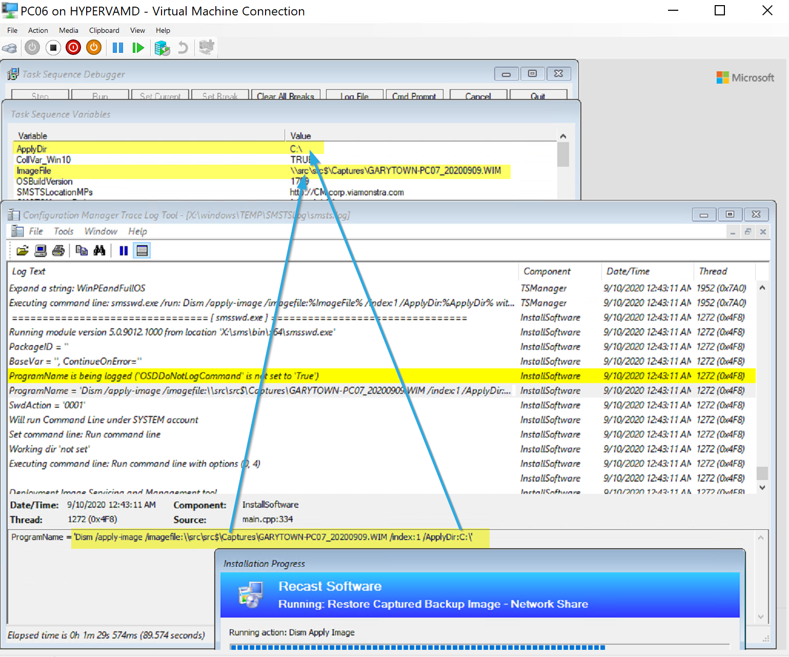

# Backup & Restore Machine with Task Sequence

Have you ever had the need to backup a device's full drive?  Perhaps you have a very important machine that is getting older, vendor support is limited, and the organization is very worried about risk?  In this post I'll cover using ConfigMgr Task Sequences to backup the OS Volume and Restore.  Backup is easy, Restore is more complicated, but I'll provide examples and explanations along with a few methods to accomplish this.

## Backup

Assumptions:

- Backup to Network Location  
  - Network Access Account (NAA) is already configured and has rights to locations

I'll demo two methods for backing up to the network, one using a generic Network Share, and one using the ConfigMgr State Migration Point.  I'll give details about the TS after the demos.

### Demo 1 - Backup & Restore using State Restore

#### Backup to State Restore Point

Here we'll create a State Restore Connection
[](media/BackupTS01.png)  
Source = PC07  
Destination= PC06

Now Let's run the Capture TS on 07:
[](media/BackupTS02.png)
[](media/BackupTS03.png)
Right now, I'm using a simple command line step calling DISM to create the backup WIM file, but when I get time I want to update the script to provide a % in the Progress UI..

So it's been about 24 hours since I wrote that last line, and since then, thanks to friends on Twitter, I now have a method to show % complete.
[](media/BackupTS04.png)
When complete, you can see the WIM on the State Restore Point:
[](media/BackupTS10.png)  

#### Capture TS

Here is my Capture Task Sequence

- Request the State Store, so it knows where to place the backup.
- Get Date Stamp, this is more important if you're storing on a file share and plan to do continuous backups on an interval of the machine.  I use it to append to the Machine Name when creating the WIM file. (As shown above in the image)
- Create Capture INI file. [MS Docs](https://docs.microsoft.com/en-us/windows-hardware/manufacture/desktop/dism-configuration-list-and-wimscriptini-files-winnext) - This is used to exclude the _SMSTaskSequence and other folders when capturing the WIM.
- Create DISMCaptureScript.ps1 - This embedded script creates another script that gets called in the next step.  This is a work around because this same script fails to run when embedded.
- Run DISM Capture Script, this runs the script created in the last step, which has the commandline to capture the WIM and create a nice progress UI.
- Release State Store, disconnects from Server.

[](media/BackupTS05.png)

#### Restore from Restore Point

Now that we have the WIM captured (Backup of the machine), lets restore it to the machine we picked to have it restored to (PC06).  Kicking off the Task Sequence, you can see the vital information is in the variables, here is the process in action.

[](media/BackupTS08.png)  
[](media/BackupTS07.png)  
Here you can see in the log that it is applying the WIM from the server, and when it's done:
[](media/BackupTS11.png)  
[](media/BackupTS09.png)  
You can see that Computer PC07's System has been successfully restored to PC06.

#### Restore TS

The Restore TS is pretty simple

- Format machine
- Request State Store to find the WIM Image
- Find the WIM file in the State Store and assign it to the variable "ImageFile"
- Set Variables, which is just applyDir, which is C:
- DISM apply Image, simple dism command to apply the WIM
- Relase State Store
- BCDBoot, we need to make the machine bootable by adding a bcd entry.

[](media/BackupTS12.png)

### Demo 2 - Backup & Restore to File Server

This is 95% the same process as above, but instead of connecting to the State Migration Point, we're going to map a network drive and use that.

#### Capture TS

[](media/BackupTS06.png)  
[](media/BackupTS14.png)  
DISM Capture Step Command:

```
DISM /Capture-Image /CaptureDir:%CaptureDir% /ImageFile:%ImageFile% /Name:%_SMSTSMachineName% /Compress:%Compression% /ConfigFile:%ConfigFile%
```

Here you see the steps are very similar, and I didn't take time to incorporate the PowerShell Script to provide the % progress bar.  Sometimes simple is good.

#### Running Capture

[](media/BackupTS13.png)  
[](media/BackupTS15.png)

And the finished capture is safely on the file server.

#### Restore TS

This TS is once again 95% the same as the Restore TS for State Store, but instead of using the State Store, we map a drive and use that location.
[](media/BackupTS16.png)

#### Restore Process

[](media/BackupTS17.png)
The Restore is quite simple, we're grabbing the path of the WIM File and applying it to the machine after a quick format, and after, adding a record to the BCDBoot loader.

## Things to Consider

I've been told that DISM might not be supported for this, and while I personally haven't run into any issues, it's still worth noting.  [This KB applies to ImageX.exe](https://support.microsoft.com/en-us/help/935467/you-cannot-use-the-imagex-exe-tool-as-a-backup-tool-for-a-windows-comp) (which was used for Build & Capture back in the day), so it might still apply to DISM, but unsure.  KB

## Download of Task Sequences

Here you can download a Task Sequence that contains all 4 of the Task Sequences we covered.

[Backup & Restore Task Sequence Set](https://github.com/recast-software/ConfigMgr-Docs/tree/main/TaskSequence/media/BackupRestore.zip)

## Related Topics

- Johan's [@josch62](https://twitter.com/josch62) Repo on [GitHub with DISM Script](https://github.com/Josch62/Experimental)

**About Recast Software**
1 in 3 organizations using Microsoft Configuration Manager rely on Right Click Tools to surface vulnerabilities and remediate quicker than ever before.  
[Download Free Tools](https://www.recastsoftware.com/?utm_source=cmdocs&utm_medium=referral&utm_campaign=cmdocs#formarea)  
[Request Pricing](https://www.recastsoftware.com/pricing?utm_source=cmdocs&utm_medium=referral&utm_campaign=cmdocs)