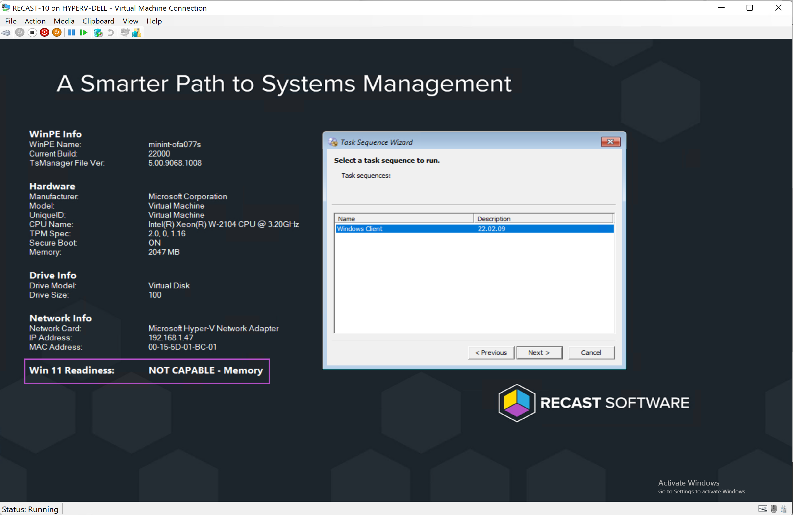
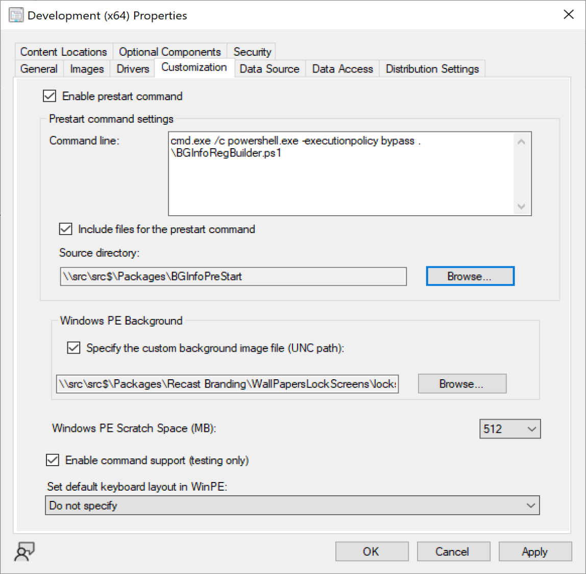
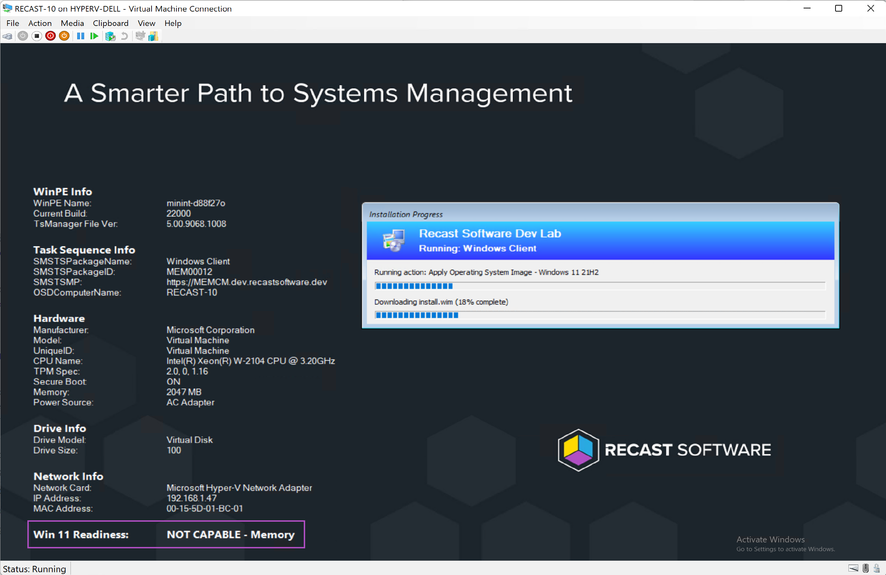
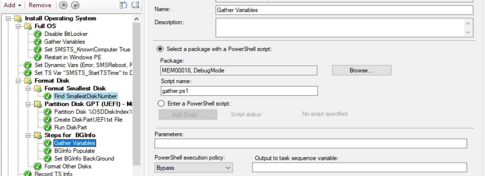
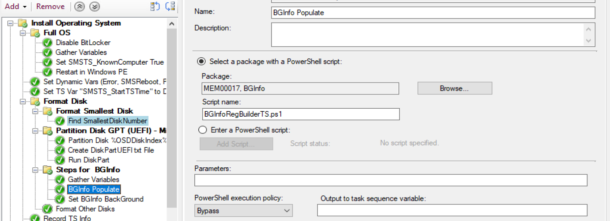
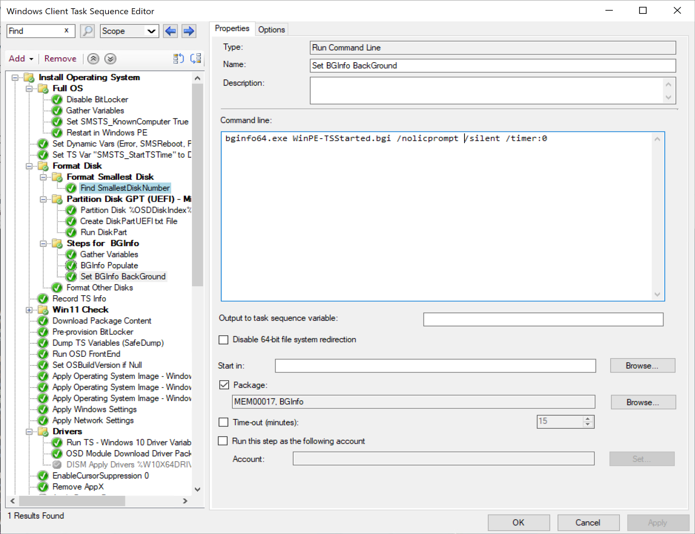
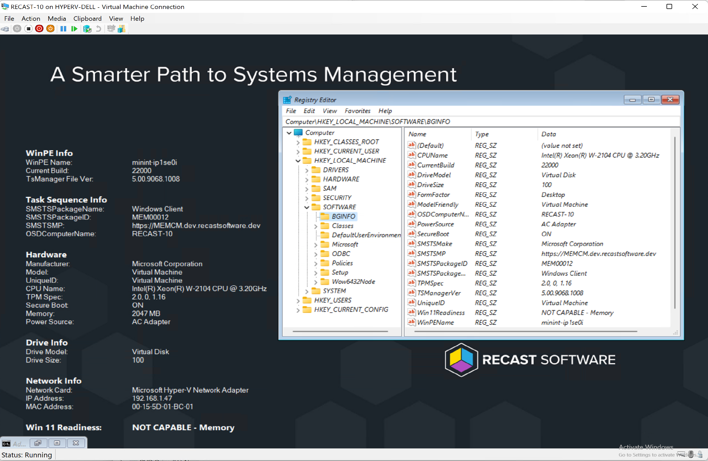

# Leveraging BGInfo in WinPE

BGInfo allows you to display vital information on the background of the desktop of the machine, which is great during OSD, to make specific information standout to any technicians that might be deploying a machine.  

I'll only be covering BFInfo while in WinPE in this post, but their are ways to use it in the Full OS as well, which I'll tackle at a later time.

## MS Docs

MS Docs | Download BGInfo.exe: <https://docs.microsoft.com/en-us/sysinternals/downloads/bginfo>

## Notes / Tips

BGInfo provides a list of default times you can display, and the ability to add custom information that you can query from the machine.  Since powershell isn't a native option to gather the information, I've found it easiest for me to have a powershell script gather all of the important information I want to display, then write it to a generic registry key to be consumed by BGInfo.
I have defaulted my scripts to using:  HKLM:\SOFTWARE\BGINFO

In these examples, I'm hoping you'll see that you can really display any information you want about the machine, or details about the task sequence you're running.

## Examples

Scripts and BGInfo Template files can be downloaded on [GitHub](https://github.com/gwblok/garytown/tree/master/OSD/BGInfo).  In these examples, I'm leveraging a modified version of the Windows 11 Readiness script to provide details about the hardware's Windows 11 compatibility.  

### BootMedia Pre-Start

This method allows BGInfo to display specific information about the device before even starting a Task Sequence, which might assist a technician to make a better decision about deploying the machine, or which Task Sequence should be used.  All information must be gathered directly from the machine at this point, it doesn't have access to your Task Sequence variables.  This still gives you a lot of options to display a lot of information about the hardware, and even the Boot Image you're using.  One thing I found useful was to add the TSManager version, this made sure I knew if I was using the updated ConfigMgr client bits in the media or not.

  

In this example, I've modified the Boot Image to include a pre-start command and content.

  

### Task Sequence Step

This method requires having the content in a CM Package, then trigger it during the task sequence.  I actually use both examples together, so that once the Task Sequence starts, it updates the information with additional items from the Task Sequence, which I've added into it's own "Task Sequence Info:" section.

  

In this method, I'm gathering several task sequence variables and placing them into the registry for BGInfo to consume, then running BGInfo.  This requires three TS Steps:

- Gather (PowerShell Step) - Running a community script to automatically populate several variables.
- BGInfo Populate (PowerShell Step) - Custom script that takes the variables I want and places the information into the registry: HKLM:\SOFTWARE\BGINFO
- Set BGInfo Background (Command Line Step) - Triggers BGInfo with the correct template file.

#### Step Images

  
  
  

#### Registry Image

  

## Summary

BGInfo is a great way to display information during OSD in WinPE.  Hopefully save someone some time by catching a machine that shouldn't be deployed, or prevent from running the wrong Task Sequence.

If you're curious how any of the information that is displayed was gathered, look in the scripts.  There are some conditions based on hardware vendor as well, like grabbing the Friendly Model Name, and the Unique ID.  Each Vendor I use something different for the Unique ID, to learn more about the vendors and powershell commands to get info from them, check out the Manufacturer Info Page.

**About Recast Software**
1 in 3 organizations using Microsoft Configuration Manager rely on Right Click Tools to surface vulnerabilities and remediate quicker than ever before.  
[Download Free Tools](https://www.recastsoftware.com/?utm_source=cmdocs&utm_medium=referral&utm_campaign=cmdocs#formarea)  
[Request Pricing](https://www.recastsoftware.com/pricing?utm_source=cmdocs&utm_medium=referral&utm_campaign=cmdocs)
