# Run As

This page is to provide more information about the Run As feature that is available on several steps.  Instead of adding this info to each step that has this ability, I've pulled it out.

The Run As feature gives you the ability to run the step as a specific user account.  Since the task sequence is running as the local system account, it will not have permissions on any domain devices.  If you're planning to save logs, pull files from a share, or connect with most any network resource, you'd need credentials.

## Potential Use Cases

- Connecting to network folders
  - Transferring Files or connecting to file like a database to read information.
- Making Active Directory Changes
  - Moving the machine to a differnet OU
  - Looking up Group Information
- Running ConfigMgr PowerShell Commands
  - [Example Script on GitHub](https://github.com/gwblok/garytown/blob/master/TS_OSDBUILDER/OSDBuilder_TS-Step_UpdateSRC.ps1) where I used a Task Sequence to update Packages. [Full Blog Post](https://garytown.com/osd-builder-in-a-task-sequence)

## Common Issues

- Bad Username / Password
  - Error Codes: 2147943726 / 0x8007052e / -2147023570
[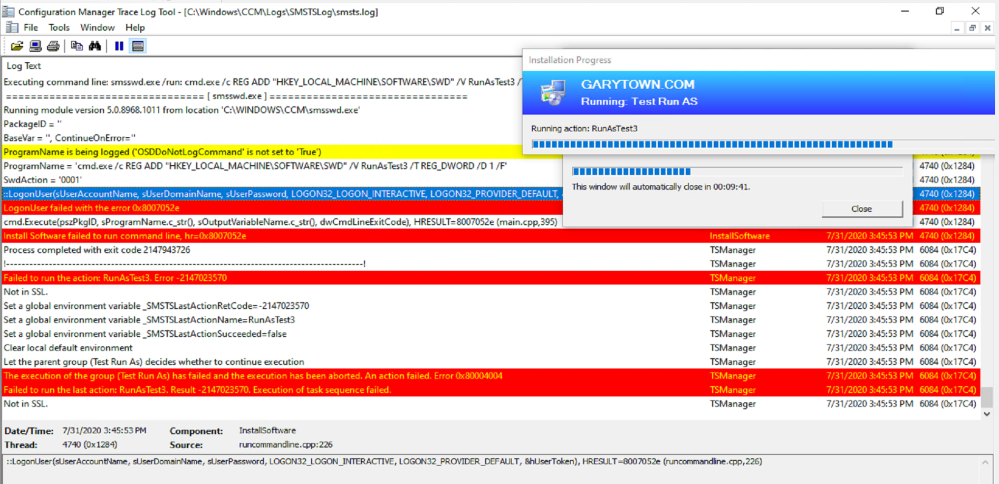](media/RunAsFail01.png)
- Not able to transfer files to network resource:  I've run into issues when using RunAs on a PowerShell Script Step which was set to copy files to a network location.  I added a "Connect to Network Folder" Step before the PowerShell Script Step, using the account information, which did successfully map a drive, then the PowerShell Step worked fine to transfer files using UNC Paths without using the Run As option.  

## Using Local Account

If you want to use a local account to run the step, you can do that.  In the user name field use either of these options:

- %ComputerName%\UserName
- .\UserName
- Variable

### Using Local Account - Demo

In this demo I create a local administrator, then use that account to run the actions. I then run 3 steps that create a registry key using a different method of calling the local account.

- Test 1: %ComputerName%\UserName
- Test 2: .\UserName
- Test 3: %Variable%
  - This is a variable that is created that shoves the domain and user into a single variable.

**Test 1 Step**
[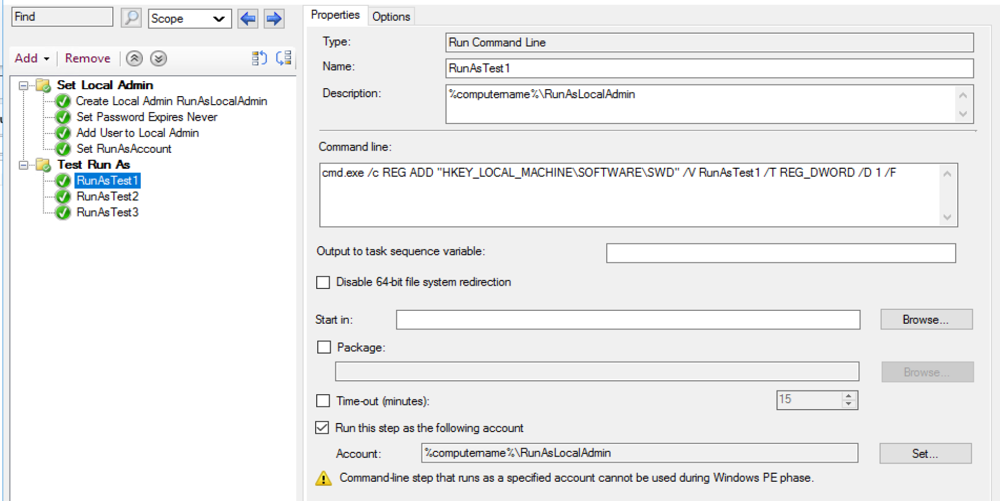](media/RunAsOption01.png)
**Test 1 Log**
[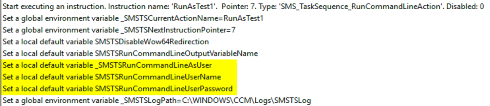](media/RunAsResults01.png)
Note, this section above is the same for all 3 steps
[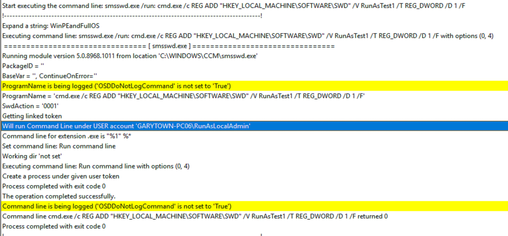](media/RunAsResults02.png)
**Test 2**
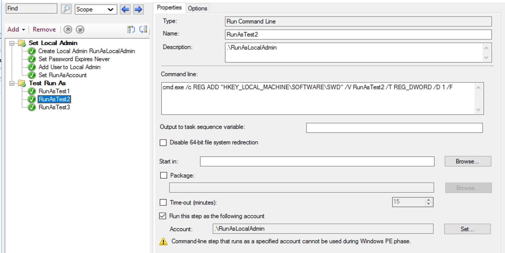
**Test 2 Log**
[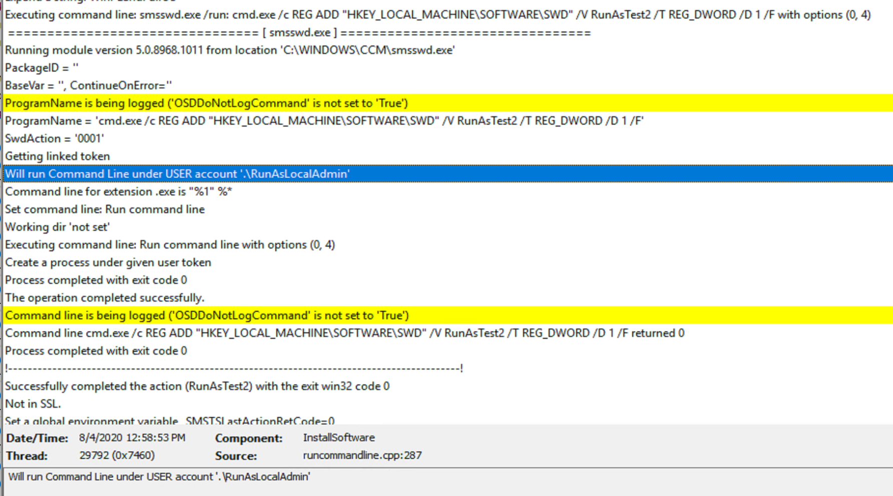](media/RunAsResults03.png)
**Test 3**
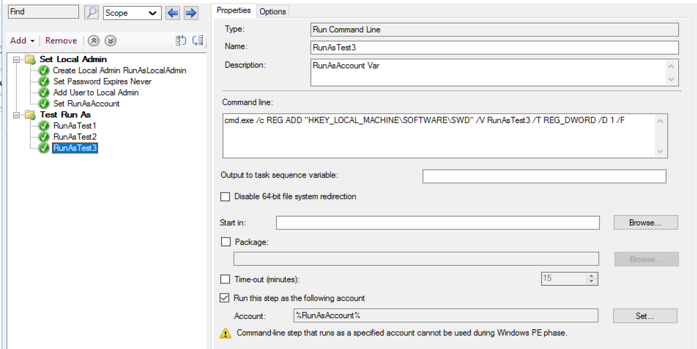
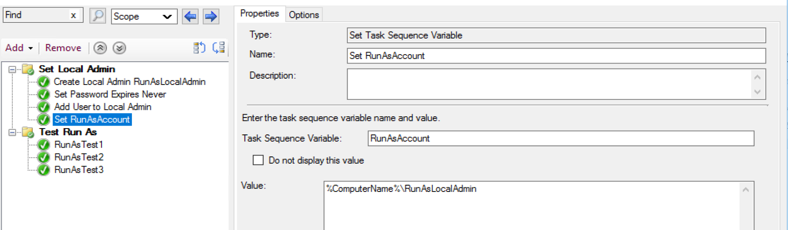
**Test 3 Log**
[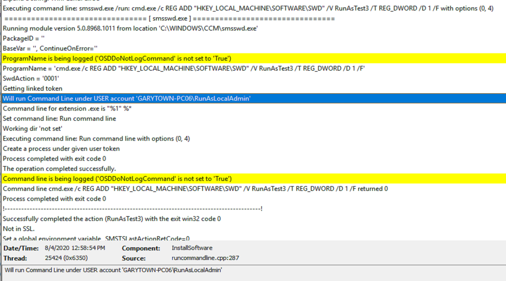](media/RunAsResults04.png)
**Results**

All successfully wrote their keys and values to the registry.

[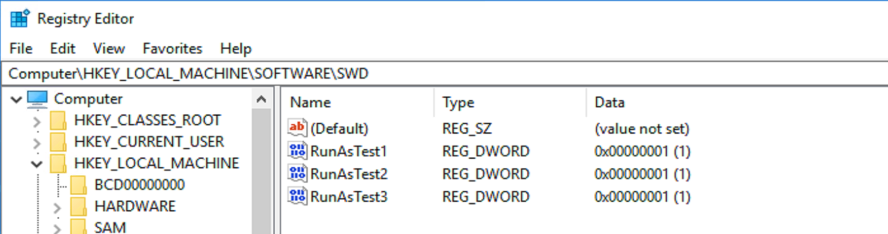](media/RunAsResults01.png)
You can see from the logs how it captures the username used, but not the password. It will not let you hide the username, so take that into account if you're ever worried about the SMSTS Log falling into the wrong hands.
Sometimes if you have a sensitive command line, you might want to hide the information from being shown, in which case you can have it hide the output from the command line itself by using the Task Sequence Variable [OSDDoNotLogCommand](https://docs.microsoft.com/en-us/mem/configmgr/osd/understand/task-sequence-variables#OSDDoNotLogCommand)

In this demo, I'm going to run the same thing, but set the [OSDDoNotLogCommand](https://docs.microsoft.com/en-us/mem/configmgr/osd/understand/task-sequence-variables#OSDDoNotLogCommand) variable.  
[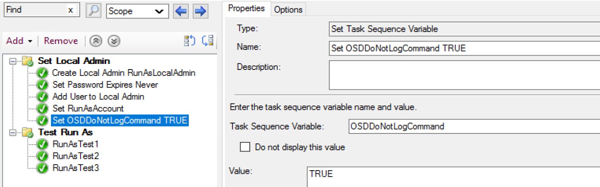](media/RunAsDemo201.png)
[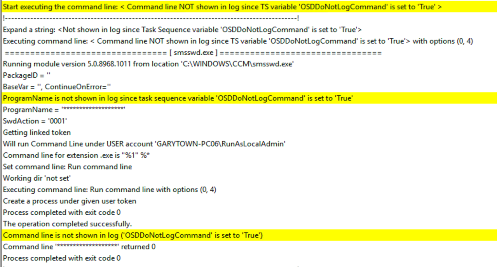](media/RunAsDemo202.png)
There, you can see it completed the step successfully, but unlike the logs above, it did not show the command line that was running.

**About Recast Software**
1 in 3 organizations using Microsoft Configuration Manager rely on Right Click Tools to surface vulnerabilities and remediate quicker than ever before.  
[Download Free Tools](https://www.recastsoftware.com/?utm_source=cmdocs&utm_medium=referral&utm_campaign=cmdocs#formarea)  
[Request Pricing](https://www.recastsoftware.com/pricing?utm_source=cmdocs&utm_medium=referral&utm_campaign=cmdocs)