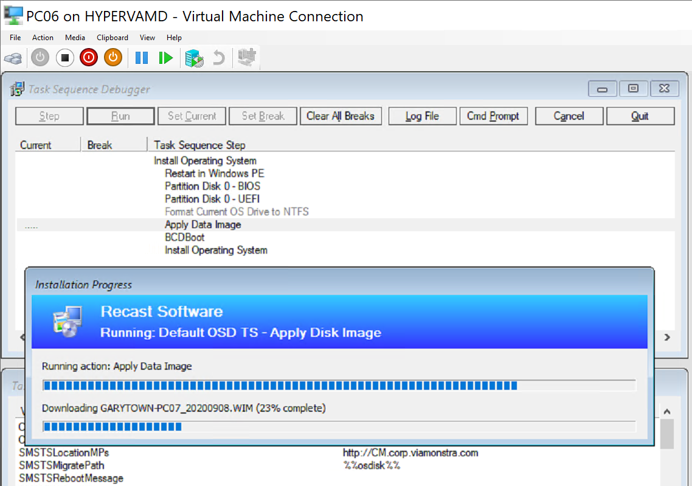
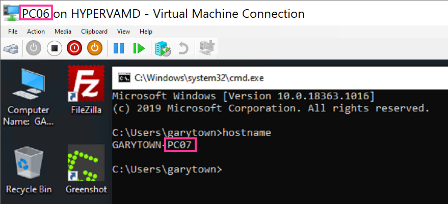
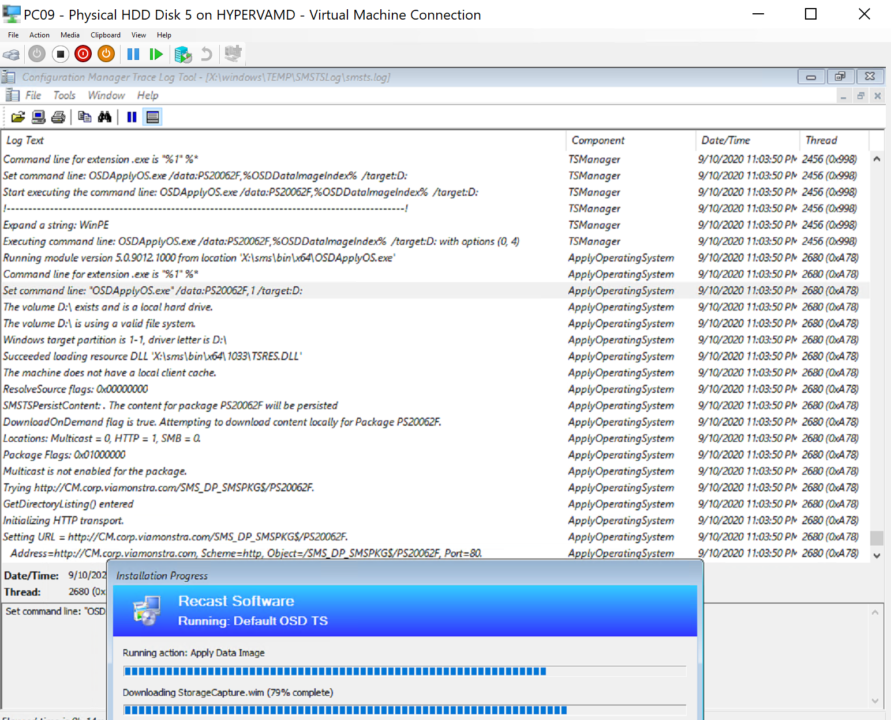

# Apply Disk Image

This step is pretty plain.  It takes a WIM Image and Applies it to a Disk.  It is similar to Apply Operating system in the regard that is will apply a WIM file, however that's where the similarities end.  This step does not add the additional functionality to "Setup" the OS, making it boot able, or having a working machine after you apply the image.  

## MS Docs

<https://docs.microsoft.com/en-us/mem/configmgr/osd/understand/task-sequence-steps#BKMK_ApplyDataImage>

## Variables

- [OSDDataImageIndex](https://docs.microsoft.com/en-us/mem/configmgr/osd/understand/task-sequence-variables#OSDDataImageIndex)
- [OSDWipeDestinationPartition](https://docs.microsoft.com/en-us/mem/configmgr/osd/understand/task-sequence-variables#OSDWipeDestinationPartition)

## PowerShell

- [Get-CMTSStepApplyDataImage](https://docs.microsoft.com/en-us/powershell/module/configurationmanager/Get-CMTSStepApplyDataImage?view=sccm-ps)
- [New-CMTSStepApplyDataImage](https://docs.microsoft.com/en-us/powershell/module/configurationmanager/New-CMTSStepApplyDataImage?view=sccm-ps)
- [Remove-CMTSStepApplyDataImage](https://docs.microsoft.com/en-us/powershell/module/configurationmanager/Remove-CMTSStepApplyDataImage?view=sccm-ps)
- [Set-CMTSStepApplyDataImage](https://docs.microsoft.com/en-us/powershell/module/configurationmanager/Set-CMTSStepApplyDataImage?view=sccm-ps)

## Step Image

  

## Demos

### Demo 1 - Replace Apply OS Image with Apply Data Image

Log:
  
  
  

It applies the WIM fine, but as soon as I get to the Apply Windows Setting, it has problems creating the unattend file, strangely enough, it is the [same issue](https://docs.recastsoftware.com/ConfigMgr-Docs/TaskSequence/SCCM_TaskSequence_Step_ApplyOperatingSystemImage.html#demo-3-simple-osd-apply-os-image-original-os-source-w-no-unattend-file) I had with the Apply Windows Image Step when I set any of the Language variables on the Apply Windows Setting Step.  However in this case, it's expected as we are told in the docs that this step doesn't setup the OS, it just applies an Image, so these steps would by default be confused at this point.  Lets disable and repeat for demo 2:

### Demo 2, The same, but disable Apply Settings Steps

  

This failed too, the Setup Windows & ConfigMgr step is missing critical information to run.

So, lets see what happens when we just run that step and reboot in the next Demo:

### Demo 3, Apply Disk Image then be done  

Still using the MS Base Media from VLSC.  No modifications.
  
  
So right after the step, it rebooted and.. boom, no OS found.  
I was able to fix this by adding a BCDBoot command

After running again, it booted into OOBE, which makes sense since we didn't provide an unattend, and CM doesn't create it in this scenario

So if you can't use this step to install Windows in a completely silent method, what's the point?  I don't really have a good answer for that.

## So what is it good for

Lets experiment with a few ideas that we could use this for.

- Back & Restore of a critical Machine.
- Apply a "Lab Volume" to 2nd Partition.

### Demo 4 - Backup & Restore of Machine

After I experimented with this option, I found this to be a very poor way to do it, completely possible, but adds additional steps.

After writing this, I found that while this might work, it is not supported. [KB Doc](https://support.microsoft.com/en-us/help/935467/you-cannot-use-the-imagex-exe-tool-as-a-backup-tool-for-a-windows-comp) & [Twitter Thread](https://twitter.com/sudhagart/status/1303930733459767296), so while completely possible, use with caution.

Process:

- Capture WIM of Important Machine
  - Make sure you exclude \_SMSTaskSequence
  - I used PC07 to create a WIM Backup

- Import the Captured WIM into "Operating System Images" in ConfigMgr
- Create Task Sequence and Choose that Image
- Deploy that TS to the Target machine 
- Boot up and confirm, PC06 was loaded with the capture of PC07 

While this works, and I did this in my lab to confirm it works fine, this is really a specific use case.  More details about this in another Post about performing a [Volume Backup](SCCM_TaskSequence_HowTo_BackupVolume.md).

### Demo 5 - Deploy Additional Volume (Lab Secenario)

In this demo, I'm going with the idea that you're in need of deploying a large amount of extra data for a lab / classroom experience.  In this Demo, I have a capture of a secondary drive that had labfiles and several virtual machines for a class.

I've already captured the D: drive of the reference machine using a basic dism command from WinPE, if this was a process you would be doing more frequently, you could easily automate this with a task sequence too.  

At this point, I pulled it into CM so I can then use the Apply Disk Image step to "install" it.

You can do some fancy logic in the TS to have it apply to specific machines that have an extra volume, all achievable, but that's a different post. I took the easy route and added the step and said to apply it to drive D for this Demo.

During the Task Sequence you can see the step running:  

The hashing took awhile, I lost patience and launched the command prompt to poke around a bit, as you can see in the log between the hash started and completing 6 minutes later, which feels like eternity when watching.

When it's done and I logon:

Here we show that the secondary volume has applied properly to the "D:" Drive.  

Now if you're fancy, you could enable Hyper-V and then import the Virtual machines into Hyper-V all in your Task Sequence.  But that's way out of scope for this post.

## Issues

- The biggest issue was just the confusion between this step and the "Apply Operating System" Step, as this will take a WIM and apply it, nothing else.  I see very few use cases for this step.

- Making sure you apply the WIM to the correct volume.  You'll have to build some logic into your task sequence if you plan to apply a couple of WIMs to your device.  

**About Recast Software**
1 in 3 organizations using Microsoft Configuration Manager rely on Right Click Tools to surface vulnerabilities and remediate quicker than ever before.  
[Download Free Tools](https://www.recastsoftware.com/?utm_source=cmdocs&utm_medium=referral&utm_campaign=cmdocs#formarea)  
[Request Pricing](https://www.recastsoftware.com/pricing?utm_source=cmdocs&utm_medium=referral&utm_campaign=cmdocs)