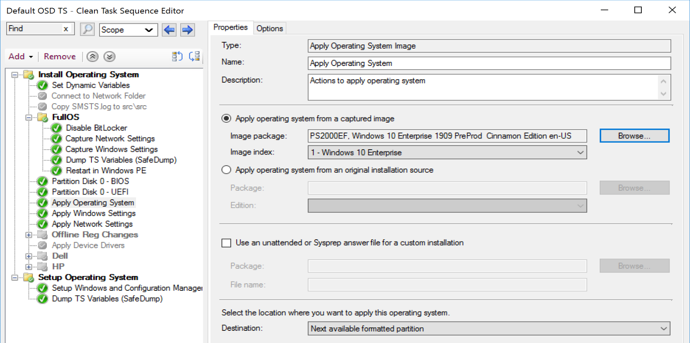

# Apply Operating System Image

This step is one the building blocks of OSD, it takes your Windows Image and applies it to the machine.  You really should read the MS Docs if you're in charge of OSD are your organization.  This step does A LOT!!  It wipes the contents of the drive (leaving your USMT data of course), creates the unattended files needed for silent installation, or merging with your provided files, and gives you options for applying a WIM or Full Media (Upgrade Package).

## MS Docs

<https://docs.microsoft.com/en-us/mem/configmgr/osd/understand/task-sequence-steps#BKMK_ApplyOperatingSystemImage>

## Variables

- [OSDConfigFileName](https://docs.microsoft.com/en-us/mem/configmgr/osd/understand/task-sequence-variables#OSDConfigFileName)
- [OSDImageIndex](https://docs.microsoft.com/en-us/mem/configmgr/osd/understand/task-sequence-variables#OSDImageIndex)
- [OSDTargetSystemDrive](https://docs.microsoft.com/en-us/mem/configmgr/osd/understand/task-sequence-variables#OSDTargetSystemDrive)

## PowerShell

- [Get-CMTSStepApplyOperatingSystem](https://docs.microsoft.com/en-us/powershell/module/configurationmanager/Get-CMTSStepApplyOperatingSystem?view=sccm-ps)
- [New-CMTSStepApplyOperatingSystem](https://docs.microsoft.com/en-us/powershell/module/configurationmanager/New-CMTSStepApplyOperatingSystem?view=sccm-ps)
- [Remove-CMTSStepApplyOperatingSystem](https://docs.microsoft.com/en-us/powershell/module/configurationmanager/Remove-CMTSStepApplyOperatingSystem?view=sccm-ps)
- [Set-CMTSStepApplyOperatingSystem](https://docs.microsoft.com/en-us/powershell/module/configurationmanager/Set-CMTSStepApplyOperatingSystem?view=sccm-ps)

## Task Sequence EXEs

These are the EXEs in the Task Sequence "tools" that do the work behind the scenes to get the OS Applied / Installed

- **OSDApplyOS.exe** (Used in "Apply OS Image" Step)
  - Creates & executes command line to apply the WIM
- **OSDSetupHook.exe** (Used in "Setup Windows & Configuration Manager" Step)
- **OSDSetupWindows.exe** (Used in "Setup Windows & Configuration Manager" Step)
  - Triggers the Windows Setup Engine when using "original installation source" option.

## Related Steps
 - [Setup Windows & ConfigMgr]
 - [Apply Windows Settings]
 - [Apply Network Settings]

## Step Image

  

## Options

- Apply operating system from a captured image (Operating System Image Package)
  - This is the most common option I've seen used, it will take a WIM you supply, either a clean Microsoft WIM, or one you've captured and apply it to a machine, then run [OOBE](https://docs.microsoft.com/en-us/windows-hardware/customize/desktop/unattend/microsoft-windows-shell-setup-oobe).

- Apply operating system from an original installation source. (Operating System Upgrade Package)
  - This uses the content from your upgrade packages to run the Windows setup engine.
  - Takes longer, more files to download, and longer setup time.

- Use an unattended or Sysprep answer file for a custom installation (OPTIONAL)
  - While not required, this gives a way to add a lot of customization into Windows.  However, I found this to also be one of my largest pain points by having settings in the XML file that were not compatible, or causing errors in other ways.  If you use one, keep it simple and test with each build.  I will demo below with an unattend.xml file, so you can see how it gets "merged" with the one CM builds dynamically during OSD. (Demo 1)
  - I'll also demo without, as I ran into issues when I tested this and found I had to tweak things to make this work (Demo 2)

- Location to apply operating system.  
  - Next available formatted partition (default)
  - Specify a disk and partition
  - Specify logical drive letter
  - Logical drive letter stored in a variable.

 

Lets just get down to the seeing this step in action and looking at what is going on in a basic, no frills, OSD

## Demos

These demos were done on CM 2006 and Windows 10 1909.

### Demo 1, Simple OSD, Apply OS Image "from captured image" with Unattend File

  
As we see the step start, it creates the command line based on the step / variables. Here we see that it is applying the OS Image in the Image Package, with the WIM Index we choose in the step.  It applies to the target partition (which was also something we choose in the step), and finally, since we did NOT choose to apply it from network, it specifies that on the command line.
  
Above you can see it downloading the WIM (OS Package) from the DP, then it wipes any files that are on the drive (which is nothing besides what we've downloaded for the Task Sequence since we just formatted the drive), then applies the image based on the command line created above.
  
Above you see, that after it finishes applying the WIM (Image), it mounts the offline registry, grabs information about the WIM Image, creates a bcdboot command line, which it then runs to create the entry in the BCD to allow the system to boot to the new OS you just applied, creates a Windows Update registry key, and unloads the registry. Then below we see it write the unattend.xml file to the panther folder, unmount the wim image (OS Package), and exits the step
  

When we look at the variables in play:

Here is the Unattend file that is generated:
  
It is quite empty with just a few basics.
It gets more items injected into it during the Apply Windows Settings Step, which you can learn about on those pages.

But since we're specifying an XML, it will be merged in.  
  
You can see on that same step that I checked "use an unattended file"
> [!NOTE]
> SkipUserOOBE & SkipMachineOOBE are depreciated, do not use them.

  
The XML from my file is merged with the XML file generated by the step.

### Demo 2, Simple OSD, Apply OS Image "from captured image" NO Unattend File.

In this demo, we're going to run through a very simple TS with NO unattend file and see what happens.

What I've found is that during the "Setup Windows & ConfigMgr" Step, the machine reboots and it eventually gets to a blue screen that says "just a moment", and it hangs there for awhile.  
I'll be honest, I'm unsure why this happens at times, but I've found if I delete the object in CM & in AD and retry, it will typically go on and finish.
Here is the XML generated by the TS:

I really can't give you an exact answer, but for testing, I created a generic OSD TS using the wizard, no changes, just added a "Restart" Step after "Setup Windows & ConfigMgr", and it seems to be working.

### Demo 3, Simple OSD, Apply OS Image "Original OS source." /w Unattend File

NOTE: If you don't use an unattend xml file, this will not be completely silent.  More info later.
You'll see that this goes a bit differently than when you apply just a WIM.  It takes a little longer as it has to download all those extra files, and then runs the setup process.  You'll see it's quite a bit different than the typical method.  The Apply Operating System Image step is less important in setting up Windows in this scenario, as it offloads the heavy lifting to the "Setup Windows & Configuration Manager" Step. 

The Step:  

During OSD: (Showing "Setup Windows & Configuration Manager" Step)

You'll also see the familiar folders windows uses as temporary folders as it installs Windows vs Applying a WIM. The Progress UI states "Apply Upgrade Media"  

Compare Demo 1/2 with 3 - Applying the Upgrade Media vs a WIM takes much longer.

The Left (Upgrade Media) was still on this step and the Apply WIM machine had completely finished and was at the Logon Screen.

Demo 3 logs:  

The Step starts basically the same, relies on the OSDApplyOS.exe CM tool, then determines the volume to install the OS onto, then starts to download the Package.  This is where you'll see a difference as when you apply a WIM, it downloads 1 file whereas here it downloads the entire media. (Download Starts above, goes for about 3 minutes and ends in the image below)

  

Once downloaded, it continues the same way, wipes the drive, checks the WIM, finds the setup.exe then if you specified an unattend file, downloads that.

Once the unattend file is downloaded, it copies it to the SMSTS working directory root to be further modified by the process.
Next it mounts the WIM and applies a few things, which takes a couple seconds, then closes the WIM before loading and modifing the unattend.xml file.

At this point, the Apply Operating System Image step is complete, however it's no where near done installing your OS.  So while this page is covering this step, I've added this below to better show how they work together to finish your OSD.

Right after that, it starts the ccmsetup.exe process (OSDSetupHook)  

### Demo 4, Simple OSD, Apply OS Image "Original OS source." /w NO Unattend File  

This is the exact same demo as 2, except I'm leaving the unattend file out and going to allow the TS to dynamically build one.  One my first test, I found it's not so "zero-touch" when you do this, as it required user interaction:

I then tried to modify the settings in the "Apply Windows Settings" step to see if I could get it to be fully unattended, but I received Errors each time.  I did NOT have this issue when applying a WIM instead of using OS Source.  This seems to only happen in this scenario.  

## Errors / Common issues

While I was writing this, all of my issues revolved around a bad unattend.xml file or leveraging the Apply Windows Settings Step when I was testing the "Original OS source" method.  

Other typical issues with this step involve the [formatting step](SCCM_TaskSequence_Step_FormatandPartitionDisk.md), and making sure you've set the Apply OS to go to the correct partition.  

**About Recast Software**
1 in 3 organizations using Microsoft Configuration Manager rely on Right Click Tools to surface vulnerabilities and remediate quicker than ever before.  
[Download Free Tools](https://www.recastsoftware.com/?utm_source=cmdocs&utm_medium=referral&utm_campaign=cmdocs#formarea)  
[Request Pricing](https://www.recastsoftware.com/pricing?utm_source=cmdocs&utm_medium=referral&utm_campaign=cmdocs)
