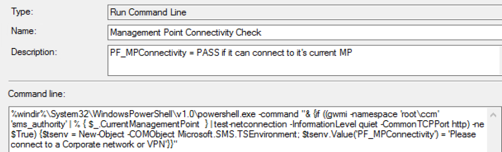

# Check Readiness

Check Readiness was a step introduced when ConfigMgr added the Task Sequence for in place upgrades.  This step too has evolved and at the time of this writing (CM2002), the step has several checks and now reports back variables that can be used for reporting or triggering other steps.  The basic idea for this step is to check several environmental items about the unit the task sequence is running on and make a determination if the task sequence should continue or fail out because the machine doesn't meet the requirements.  This step brings mixed feelings to me, which I'll explain later, but I'm still glad it's here.

## MS Docs: <https://docs.microsoft.com/en-us/mem/configmgr/osd/understand/task-sequence-steps#BKMK_CheckReadiness>

I'm going to highly recommend looking over the docs, they explain step, the options, and the varaibles created along with the return code, so I'm not going to go into that much, what I'll do is give some real world info of implementing this step and some thoughts you'll need to put into the setting values.

## PowerShell

- [Get-CMTSStepPrestartCheck](https://docs.microsoft.com/en-us/powershell/module/configurationmanager/Get-CMTSStepPrestartCheck?view=sccm-ps)
- [New-CMTSStepPrestartCheck](https://docs.microsoft.com/en-us/powershell/module/configurationmanager/New-CMTSStepPrestartCheck?view=sccm-ps)
- [Remove-CMTSStepPrestartCheck](https://docs.microsoft.com/en-us/powershell/module/configurationmanager/Remove-CMTSStepPrestartCheck?view=sccm-ps)
- [Set-CMTSStepPrestartCheck](https://docs.microsoft.com/en-us/powershell/module/configurationmanager/Set-CMTSStepPrestartCheck?view=sccm-ps)

## Step Image

[](media/CheckReadiness01.png)

- **Minimum memory (MB)**  
I will set this to 1900.  We had several cheaper tablets with only 2GB of RAM, but when we set this to 2048, which would be 2GB, we found that on some models, where video memory is shared with RAM, that the system would report back less than 2GB and fail the step.  I've now set it to 1900.  So the idea here is, if you want it to be 4GB, set it to take 4096 and then subtract 128MB or 256MB (give or take a few), to account for systems that share memory.

- **Minimum processor speed (MHz)**  
I will place this at 800Mhz, I've seen odd things where machines running in power savings report a lower Mhz rating than it should.  I've also seen machines that have very very low Mhz which I'm glad fail this, because it's typically meant hardware issues, or BIOS update requirements.  Strangely enough, we had a Dell Model that was reporting wrong due to a loose power connector.  When the AC Cable was remove and then tightly reinserted, it resolved the issue.

- **Minimum free disk space (MB)**  
This might depend on how you cache your content.  We have the Task Sequence set to download all content before running, and by the time we run this step, all content for the upgrade will have been downloaded, so I set this step to 20000 (about 20GB) as I know machine will have enough free storage to perform the upgrade.  If you're running this step before you cache, I'd recommend you figure out the content requirements of your upgrade process (typically 5-7GB) and add that to the 20GB and set it to at last 25GB.

- **Current OS to be refreshed is**  
Your options are Server & Client.  This is an additional safe guard to have the Task Sequence stop before it gets to the upgrade step.  So If you accidentally deployed to a Server, it will fail out at this step.  Remember, even if you didn't have this step, if the media doesn't match the OS you're upgrading, the Setup Engine itself would error out.  If you're NOT pre-caching, this step could be useful in the way that it would have failed the TS before it downloaded the 5GB upgrade content to your server.

- **Architecture of current OS**  
Verify whether the current OS is 32-bit or 64-bit.  This too is just an additional safeguard to help you fail the TS sooner than waiting for the Setup Engine to run and tell you the same thing.

- **Minimum OS version**  
You have the ability to only updated versions of Windows going back "X" far.  Say you want to only upgrade machines 1709 and newer to 1909, anything before, you just want to reimage or replace, this step would be an easy way to make sure you're not inadvertently updating a machine you don't want to.  Example, 10.0.16299 (1709).

- **Maximum OS version**  
This would allow you to set a version of Windows that is the highest level you'd want to upgrade.  Say you're pushing out 1909 upgrades and you only want to upgrade machines 1809 and below, (AKA, you don't want to upgrade 1903 or reattempt 1909), you would set this value to 1809's value (10.0.17763).

- **Minimum client version**  
This is a very important value to set.  Lets say you've updated your CM Servers to 2006, Hotfix Rollup 2, and have used some new functionality that was just released in this hotfix. If you run a Task Sequence on a client that has an older verison, when it gets to the step that was created with a newer version, the task sequence will error.  By setting a minimum value, you can make sure the Task Sequence has the client bits needed to run every step, and if it doesn't, you'll be made aware that you probably have a client issue since the client hasn't updated. Specify the client version in the following format: 5.00.8913.1005.

- **Language of current OS**  
Yet another safeguard that will allow the TS to fail out before you get to the upgrade step which will error if you are trying to apply the wrong language upgrade media.

- **AC power plugged in**  
This is nice, since the upgrade process can take awhile, this gives you the option of exiting if the device isn't plugged in.

- **Network adapter connected**  
You might need to be connected to the network to ensure you can get the content you need during the task sequence, this step is a nice check to get you part of the way to that goal.

- **Device is using UEFI**  
This will determine if the machine is running in UEFI mode. We've had variables with this information before, but now it's nice we can use that same data in the check readiness (Added CM2006)

## Things to Consider  

This step has many checks, and based on the parameters will FAIL the task sequence. You'll want to run this as soon as you can in the process to avoid wasting the end user's time, and prevent additional changes to the machine that you might have to back out.  Ideally Task Sequence would have "Requirements" in the properties of the Task Sequence, similar to Applications, preventing the Task Sequence from even running if those checks were not successful.  I'd rather have a failure to launch due to not meeting requirements, than having it start the upgrade task sequence, then failing out, proving error dialogs and making reporting metrics look bad.  

Currently I have moved most of those checks out of the Task Sequence and using a Baseline of Configuration Item Checks, to ensure the machine is fit to upgrade before we'd allow it to run the upgrade.

I also have a custom "Network Connectivity Check" in which we try to make a connection to the ConfigMgr Management Point Server, to ensure we have more than just network, but actual connections back to CM to pull content and policy during the upgrade.

[](media/CheckReadiness02.png)

```
%windir%\System32\WindowsPowerShell\v1.0\powershell.exe -command "& {if ((gwmi -namespace 'root\ccm' 'sms_authority' | % { $_.CurrentManagementPoint  } | test-netconnection -InformationLevel quiet -CommonTCPPort http) -ne $True) {$tsenv = New-Object -COMObject Microsoft.SMS.TSEnvironment; $tsenv.Value('PF_MPConnectivity') = 'Please connect to a Corporate network or VPN'}}"
```

That will grab the Management Point from the Client it is running on, test the connection, and if it fails the connection, creates a Task Sequence Variable "PF_MPConnectivity" and sets it to "Please connect to a Corporate network or VPN".  Later on, I use that information to create a popup to the end user, hoping they will then connect their device so the upgrade can continue.  [More Info on GARYTOWN](https://garytown.com/waas-1909-ts-download)

## Demo

**Failed Check Readiness Step**
[](media/CheckReadiness03.png)
error code: 0x000010DC

**Corresponding Logs**
[](media/CheckReadiness04.png)
[](media/CheckReadiness05.png)

You can see from the logs, that it captures the important information you'd want.  What Value failed and why it failed.  You can also see that this step will pass the error code: 4316

Here I have dumped out the variables created, you can see that when the check passed, the variable is set to 0, and when it fails, it is set to 1.


Note,  _TS_CRUEFI was added in CM2006

Another nice thing is that they are all pre-fixed with _TS_CR which makes scripting easier.  I wrote a script that will parse these variables and create popups based on the output for our WaaS Process.

## Examples in Scripts

- [Compile Readiness Data - GitHub](https://github.com/gwblok/garytown/blob/master/WaaS/CompatScan_CheckReadinessResults.ps1)
- [Display to User the data - GitHub](https://github.com/gwblok/garytown/blob/master/WaaS/CompatScan_LaunchCustomDialog.ps1)

**About Recast Software**
1 in 3 organizations using Microsoft Configuration Manager rely on Right Click Tools to surface vulnerabilities and remediate quicker than ever before.  
[Download Free Tools](https://www.recastsoftware.com/?utm_source=cmdocs&utm_medium=referral&utm_campaign=cmdocs#formarea)  
[Request Pricing](https://www.recastsoftware.com/pricing?utm_source=cmdocs&utm_medium=referral&utm_campaign=cmdocs)
