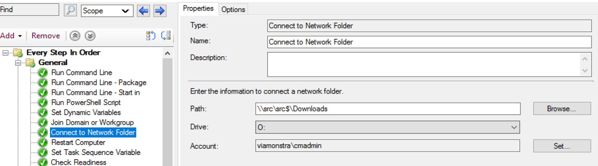

# Connect to Network Folder

This step allows you to map a drive to a network share during the Task Sequence.  This works in WinPE or the Full OS, and requires you to use an account that has permissions to the share you're mapping to.  

## MS Docs

MS Docs: <https://docs.microsoft.com/en-us/mem/configmgr/osd/understand/task-sequence-steps#BKMK_ConnectToNetworkFolder>

PowerShell:

- [Get-CMTSStepConnectNetworkFolder](https://docs.microsoft.com/en-us/powershell/module/configurationmanager/get-cmtsstepconnectnetworkfolder?view=sccm-ps)
- [New-CMTSStepConnectNetworkFolder](https://docs.microsoft.com/en-us/powershell/module/configurationmanager/New-CMTSStepConnectNetworkFolder?view=sccm-ps)
- [Remove-CMTSStepConnectNetworkFolder](https://docs.microsoft.com/en-us/powershell/module/configurationmanager/Remove-CMTSStepConnectNetworkFolder?view=sccm-ps)
- [Set-CMTSStepConnectNetworkFolder](https://docs.microsoft.com/en-us/powershell/module/configurationmanager/Set-CMTSStepConnectNetworkFolder?view=sccm-ps)

Not much to this, it's mapping a drive.  I've used this before others steps that require access to a specific network location for copying logs, or reading a file from the network, or even copying WIMs after updating them with OSD Builder.

## Common Issues

- Typos, a path that doesn't actually exist.
- Credentials, the account has wrong password or no rights to the path you've specified.

**About Recast Software**
1 in 3 organizations using Microsoft Configuration Manager rely on Right Click Tools to surface vulnerabilities and remediate quicker than ever before.  
[Download Free Tools](https://www.recastsoftware.com/?utm_source=cmdocs&utm_medium=referral&utm_campaign=cmdocs#formarea)  
[Request Pricing](https://www.recastsoftware.com/pricing?utm_source=cmdocs&utm_medium=referral&utm_campaign=cmdocs)