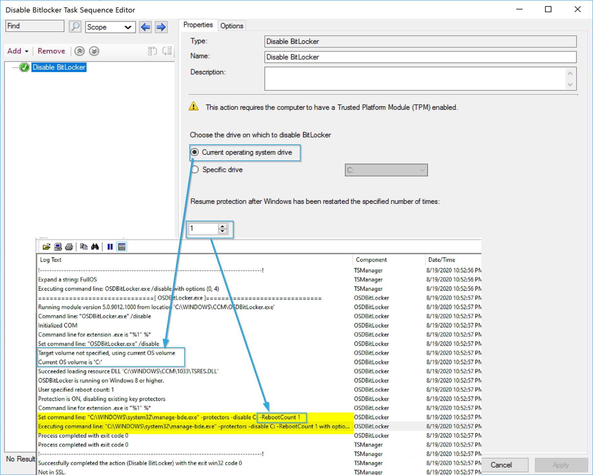
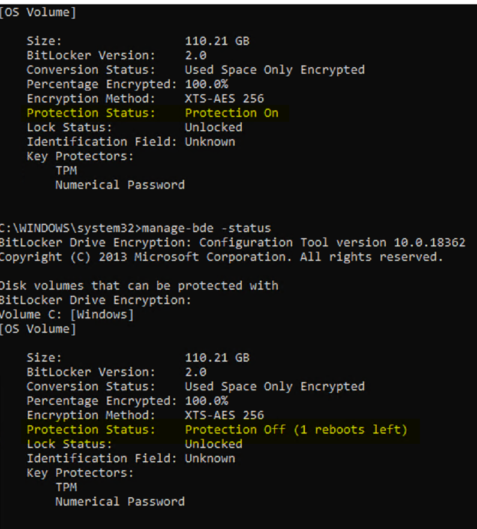

# Disable Bitlocker

This step simply suspends bitlocker. It does not trigger a remove of bitlocker, but only suspends it for the next reboot(s).  This is handy when applying firmware updates, or doing in-place reimaging (refresh).  

## MS Docs

<https://docs.microsoft.com/en-us/mem/configmgr/osd/understand/task-sequence-steps#BKMK_DisableBitLocker>

## Variables for Disable BitLocker

These are used to set the number of reboots to keep Bitlocker suspended. Check out the links for additional details

- [OSDBitLockerRebootCount](https://docs.microsoft.com/en-us/mem/configmgr/osd/understand/task-sequence-variables#OSDBitLockerRebootCount)
  - Accepts 1 - 15 as acceptable input
- [OSDBitLockerRebootCountOverride](https://docs.microsoft.com/en-us/mem/configmgr/osd/understand/task-sequence-variables#OSDBitLockerRebootCountOverride)
  - Can be set to 0 for always suspend bitlocker.

## PowerShell

- [Get-CMTSStepDisableBitLocker](https://docs.microsoft.com/en-us/powershell/module/configurationmanager/Get-CMTSStepDisableBitLocker?view=sccm-ps)
- [New-CMTSStepDisableBitLocker](https://docs.microsoft.com/en-us/powershell/module/configurationmanager/New-CMTSStepDisableBitLocker?view=sccm-ps)
- [Remove-CMTSStepDisableBitLocker](https://docs.microsoft.com/en-us/powershell/module/configurationmanager/Remove-CMTSStepDisableBitLocker?view=sccm-ps)
- [Set-CMTSStepDisableBitLocker](https://docs.microsoft.com/en-us/powershell/module/configurationmanager/Set-CMTSStepDisableBitLocker?view=sccm-ps)

## Demo

### The Step Image

The Step is simple, pick the drive, or have the TS determine the system drive for you, then pick how many reboots to suspend bitlocker for.  
In the log, you can see how the settings relate to the log and how it builds the manage-bde command line.

Here you see a status taken before the step runs, and one after. The difference is the _Protection Status:_ value. After the step runs, the protection is disabled for 1 reboot.

**About Recast Software**
1 in 3 organizations using Microsoft Configuration Manager rely on Right Click Tools to surface vulnerabilities and remediate quicker than ever before.  
[Download Free Tools](https://www.recastsoftware.com/?utm_source=cmdocs&utm_medium=referral&utm_campaign=cmdocs#formarea)  
[Request Pricing](https://www.recastsoftware.com/pricing?utm_source=cmdocs&utm_medium=referral&utm_campaign=cmdocs)