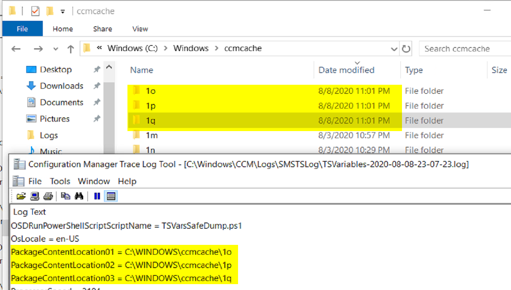
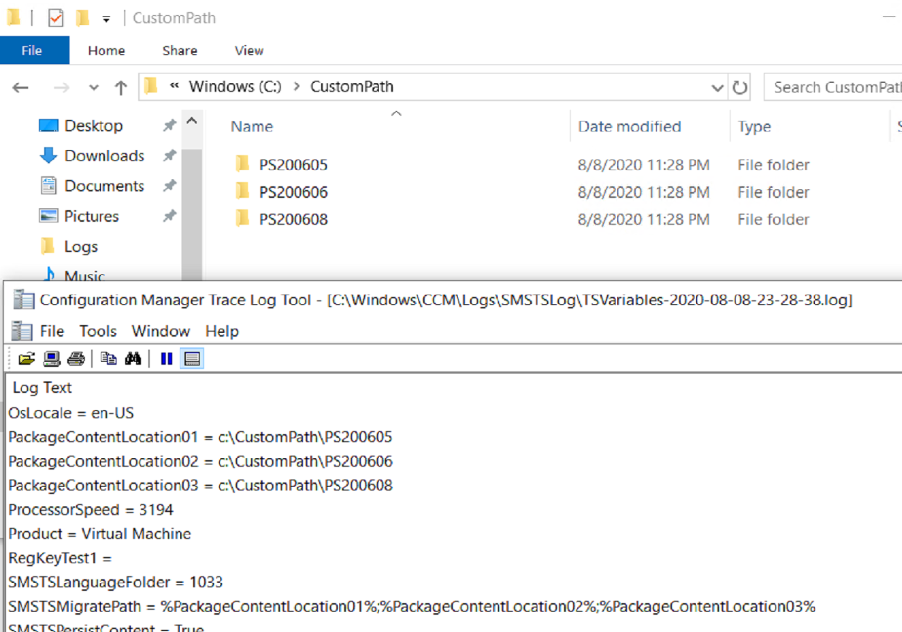

# Download Package Content

Another simple concept, copy the contents of a CM Package to a place on the machine. While the step is simple, it's a valuable step that allows us to think outside the box in creating other solutions.

## MS Docs

<https://docs.microsoft.com/en-us/mem/configmgr/osd/understand/task-sequence-steps#BKMK_DownloadPackageContent>

## PowerShell

- [Get-CMTSStepDownloadPackageContent](https://docs.microsoft.com/en-us/powershell/module/configurationmanager/Get-CMTSStepDownloadPackageContent?view=sccm-ps)
- [New-CMTSStepDownloadPackageContent](https://docs.microsoft.com/en-us/powershell/module/configurationmanager/New-CMTSStepDownloadPackageContent?view=sccm-ps)
- [Remove-CMTSStepDownloadPackageContent](https://docs.microsoft.com/en-us/powershell/module/configurationmanager/Remove-CMTSStepDownloadPackageContent?view=sccm-ps)
- [Set-CMTSStepDownloadPackageContent](https://docs.microsoft.com/en-us/powershell/module/configurationmanager/Set-CMTSStepDownloadPackageContent?view=sccm-ps)

## Options

- Choose the package(s) you want to have the content downloaded.
- Choose where the desired location of the download
  - TS working Directory
  - CM client cache
  - Custom Path
- Save path as a variable

Lets run Demos for those different options so you can see the step in action and see the locations of those options.

## Demos

### Demo 1 - Task Sequence working directory

You can see the options we picked for the test, the packages, the location it gets downloaded to, and you even see it setting the variable for the package that was downloaded.

### Demo 2 - CM Client Cache

In this demo we see that the packages downloaded into the ccmcache folder, the variables were set to point at those folders.

### Demo 3 - Custom Location

Here we see that it created the folder structure we specified in the step, downloaded the content there and created the variables.

## Extra Info

This step leverages the OSDDownloadContent.exe, the exe reads several variables to know what to download.

- OSDDownloadContinueDownloadOnError
- OSDDownloadDownloadPackages
- OSDDownloadDestinationVariable
- OSDDownloadDestinationLocationType

Looking at the log, you can see those being used.

**About Recast Software**
1 in 3 organizations using Microsoft Configuration Manager rely on Right Click Tools to surface vulnerabilities and remediate quicker than ever before.  
[Download Free Tools](https://www.recastsoftware.com/?utm_source=cmdocs&utm_medium=referral&utm_campaign=cmdocs#formarea)  
[Request Pricing](https://www.recastsoftware.com/pricing?utm_source=cmdocs&utm_medium=referral&utm_campaign=cmdocs)