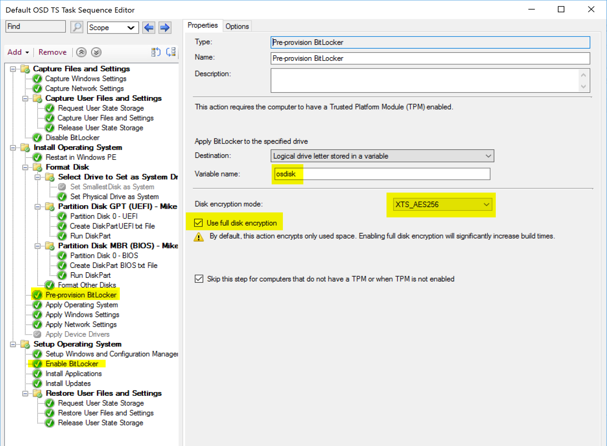
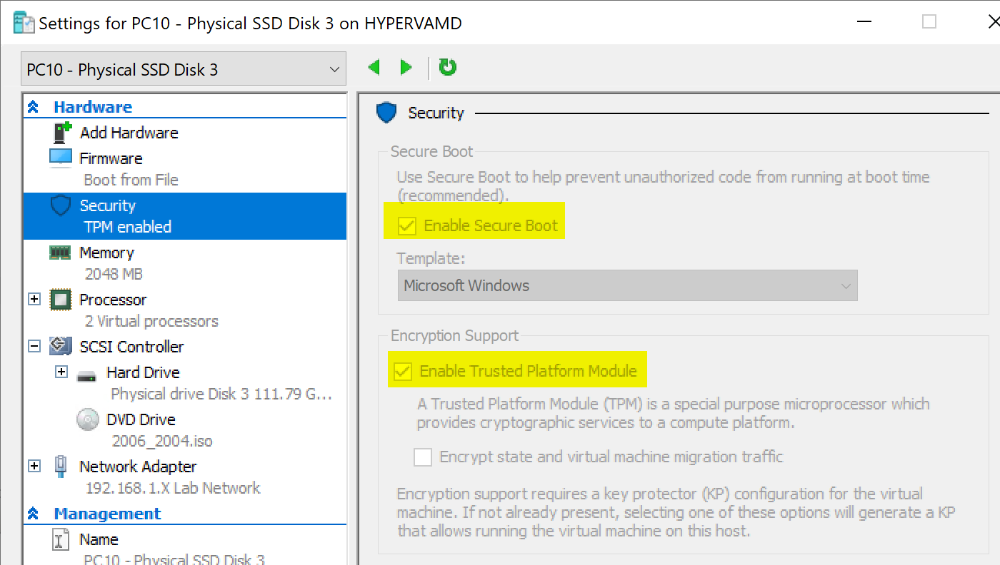

# Enable Bitlocker / Pre-Provision Bitlocker

This step easily lets you turn on Bitlocker while providing several options to let you customize how it gets initiated.  Several enhancements have recently been added to this, which has removed the need to pre-create several registry keys to get the desired outcome.  It just keeps getting easier!  I'm merging the two steps into one, as it just make sense, especially for demos.  I've merged the Enable Bitlocker Step & [Pre-Provision Bitlocker](SCCM_TaskSequence_Step_Pre-provisionBitlocker.md) Step into one page, as they are directly related and demos and test results make sense when used in conjunction.  

## MS Docs

Enable Bitlocker Step: <https://docs.microsoft.com/en-us/mem/configmgr/osd/understand/task-sequence-steps#BKMK_EnableBitLocker>

Pre-Provision Step: <https://docs.microsoft.com/en-us/mem/configmgr/osd/understand/task-sequence-steps#BKMK_PreProvisionBitLocker>

## MS Docs Bitlocker

<https://docs.microsoft.com/en-us/windows/security/information-protection/bitlocker/bitlocker-overview>

## PowerShell

- [Get-CMTSStepEnableBitLocker](https://docs.microsoft.com/en-us/powershell/module/configurationmanager/Get-CMTSStepEnableBitLocker?view=sccm-ps)
- [New-CMTSStepEnableBitLocker](https://docs.microsoft.com/en-us/powershell/module/configurationmanager/New-CMTSStepEnableBitLocker?view=sccm-ps)
- [Remove-CMTSStepEnableBitLocker](https://docs.microsoft.com/en-us/powershell/module/configurationmanager/Remove-CMTSStepEnableBitLocker?view=sccm-ps)
- [Set-CMTSStepEnableBitLocker](https://docs.microsoft.com/en-us/powershell/module/configurationmanager/Set-CMTSStepEnableBitLocker?view=sccm-ps)

## Step Image

[](media/EnableBit01.png)  

## Options

- Choosing the Drive (aka the partition), you'll probably leave this default which picks the drive that the system (windows) is installed on, but you can manually pick a drive letter if you wanted to encrypt a different drive instead of the system drive, or if you have a couple instances of the "Enable Bitlocker" step that you want to run to encrypt several partitions.
- **Encryption Protectors.**
  - **TPM Only** - Most seamless and transparent to the user.
  - **Startup Key on USB Only** - Places Key on USB Drive which needs to be attached to computer to unlock drive.
  - **TPM and Startup Key on USB Only** - TPM & USB Drive required to unlock.
  - **TPM and [PIN](https://docs.microsoft.com/en-us/windows/security/information-protection/bitlocker/bitlocker-device-encryption-overview-windows-10#manage-passwords-and-pins)** - BitLocker locks the normal boot process until the user provides the PIN.
- **Disk encryption mode** (I always use XTS_AES_256, convince me why I shouldn't.)
  - AES_128
  - AES_256
  - XTS_AES_128
  - XTS_AES_256
- **Use Full Disk Encryption**
  - **Checked** = Full Disk, including unused space.  Encrypts entire drive at start, but then you're done.
  - **UnChecked** = [Used Space Only](https://docs.microsoft.com/en-us/windows/security/information-protection/bitlocker/bitlocker-device-encryption-overview-windows-10#used-disk-space-only-encryption), Encrypts as you add files
- **Choose where to create the recovery key:**
  - **Active Directory Domain Services**
  - **Do Not Create** - This would be if you plan to store them in Azure, or MBAM and do not want them in AD as well.
- **Wait for Bitlocker to complete the drive encryption ... before continuing** - I've seen this used when you have to meet compliance polices that ensure a device is 100% encrypted before deployment.
- **Skip this step if computers doesn't have TPM or TPM is disabled.** - This was added as a safeguard to prevent failures when running on a machine the didn't have a TPM (like a VM) or one that didn't have a TPM Setup.  Depending on your situation, you might prefer the task sequence to fail if the machine didn't encrypt.

## DEMOS

### Demo 1 - Full Disk Encryption w/ Pre-Provision

Task Sequence:
[](media/EnableBit01a.png)  

Pre-provision Bitlocker SMSTS Log:
[](media/EnableBit01.png)  
Just after Pre-provision Step runs, you can see the status has the drive already encrypting with the settings we wanted... but no protectors just yet:
[](media/EnableBit03.png)  
Once in Full OS and at the "Enable Bitlocker", the log shows what we'd expect:
[](media/EnableBit04.png)  
It's still encrypting, and it's going to hang out on this step until the encryption is complete, which was started by the pre-provision step.  
[](media/EnableBit05.png)  
Here you can see the Encryption is completed, then the protectors have been added.  The error was caused by having the CD still in the drive when it tried to add the protectors.  

### Demo 2 - Used Space Only with Pre-Provision

This is the same setup as the last test, but we uncheck the "Use full disk encryption box".  In the log for the pre-provision step you'll see the command line has changed from /full:True to /full:False and the manage-bde command set to "used"  
Pre-Provision Step:
[](media/EnableBitPrePro01.png)  
Enable Bitlocker Step:
[](media/EnableBitPrePro02.png)  
In this image of the log, you can see that even though the Enable Bitlocker Step itself is still set to use full disk encryption, because it was already set to used space earlier, the disk stayed in used space only mode.  At this point, if you want to use full disk, you'd have to decrypt and then encrypt again in full disk mode.

### Demo 3 - Full Disk - no Pre-Provision - Enable Wait

[  
This time pre-provision is disabled, the step is set to Full Encryption, and Wait for Encryption to complete.

## Test Results

All Testing was done in HyperV using Gen2 VMs, 2 Virtual CPUs and 2 GB RAM, [120GB PNY Solid State Drive](https://www.bestbuy.com/site/pny-120gb-internal-sata-solid-state-drive/5900260.p?skuId=5900260). (Cheap)  


The Key is to have a dedicated PHYSICAL drive on the host machine for the virtual machine.  For more info, check out this [Blog Post](https://garytown.com/bitlocker-on-hyper-v-virtual-machine)

Tests:

- **Test 1: Full Disk w/ Pre-Provision**
  - Time for OSD: 38 Minutes
  - Bitlocker Encryption: 100% Complete
- **Test 2: Full Disk w/out Pre-Provision w/out Wait Enabled**
  - Time for OSD: 12 Minutes
  - Bitlocker Encryption: 12% Complete
- **Test 3: Full Disk w/out Pre-Provision w/ Wait Enabled**
  - Time for OSD: 39 Minutes
  - Bitlocker Encryption: 100% of Used Space
- **Test 4: Used Disk Only w/ Pre-Provision**
  - Time for OSD: 12 Minutes
  - Bitlocker Encryption: 100% of Used Space
- **Test 5: Used Disk Only w/out Pre-Provision**
  - Time for OSD: 12 Minutes
  - Bitlocker Encryption: 75% of Used Space

 These tests show the importance of enabling pre-provisioning.  

## Other Notes

- Pre-Provision Step
  - Step is NOT Required, it's there to save you time by getting the encryption process starting sooner than later.
  - If using full disk, it will pause the TS process at the "Enable Bitlocker" Step while it waits for encryption to complete to add protectors.
  - Nice to use if you're required to use full disk, as it ensures encryption is complete before OSD is done, and starts it early in the process to save time overall.
- Enable Bitlocker Step
  - Gives complete flexibility of setting up Bitlocker
  - When used without pre-provision, allows you to enable and continue, not slowing down OSD, but leaving the machine in an "Encrypting" state post OSD

- Overall
  - Used Space only will save time, and if your security team is onboard with it, go for it, otherwise full disk doesn't slow it down much based on how you want to configure.
  - So much improvement has gone into the bitlocker experience, I'm at a point where I no longer need "tweaks" to get Bitlocker Setup during OSD to reach my goal, it's all built in native.
  - The biggest consideration is making sure you've got your pre-reqs setup, [TPM setup correctly.](https://docs.microsoft.com/en-us/windows/security/information-protection/bitlocker/bitlocker-overview-and-requirements-faq#which-trusted-platform-modules-tpms-does-bitlocker-support)

## Additional Resources

- Script to Eject CD Media (Run Command Line Step)

```
powershell.exe -NoProfile -Command "(New-Object -ComObject 'Shell.Application').Namespace(17).Items() | Where-Object { $_.Type -eq 'CD Drive' } | foreach { $_.InvokeVerb('Eject') }"
```

- Blog Posts by Niall Brady [FDE closer look](https://www.niallbrady.com/2020/02/25/full-disk-encryption-a-closer-look-on-real-hardware/#:~:text=The%20Pre-Provision%20Bitlocker%20step%20takes%20place%20in%20WinPE,behaviour%20when%20Use%20full%20disk%20encryption%20is%20selected.), very well done, which I read after I wrote this and covers a lot of the same materials, but worth a look to get another eye on the process, his series also goes into other areas I don't plan to get into & [Utilize Bitlocker Management during OSD](https://www.windows-noob.com/forums/topic/21177-how-can-we-utilize-the-bitlocker-management-feature-during-osd-with-endpoint-manager/), another great post to get info about bitlocker and incorporating the management.

- [Recast Bitlocker Management Dashboard](https://docs.recastsoftware.com/features/Enterprise_Tools/RCT_Security_and_Compliance_Dashboards/index.html?utm_source=website&utm_medium=website&utm_campaign=website#bitlocker-compliance-tool): This ConfigMgr integration is really nice to get overall idea how your bitlocker compliance is doing, as well as take action to correct things.
- [Troubleshooting](https://docs.microsoft.com/en-us/windows/security/information-protection/bitlocker/troubleshoot-bitlocker): many of the times I had issues in a TS with enabling bitlocker it was TPM  related, but rarely had an issue as if I had firmware / TPM issues, they would come out earlier in the process.  

**About Recast Software**
1 in 3 organizations using Microsoft Configuration Manager rely on Right Click Tools to surface vulnerabilities and remediate quicker than ever before.  
[Download Free Tools](https://www.recastsoftware.com/?utm_source=cmdocs&utm_medium=referral&utm_campaign=cmdocs#formarea)  
[Request Pricing](https://www.recastsoftware.com/pricing?utm_source=cmdocs&utm_medium=referral&utm_campaign=cmdocs)