# Format and Partition Disk

This is a fundamental step in the OSD process.  Overall it's pretty straight forward, but depending on situations, can get a bit complex.

## MS Docs

<https://docs.microsoft.com/en-us/mem/configmgr/osd/understand/task-sequence-steps#BKMK_FormatandPartitionDisk>

## PowerShell

- [Get-CMTSStepPartitionDisk](https://docs.microsoft.com/en-us/powershell/module/configurationmanager/get-cmtssteppartitiondisk?view=sccm-ps)
- [New-CMTSStepPartitionDisk](https://docs.microsoft.com/en-us/powershell/module/configurationmanager/new-cmtssteppartitiondisk?view=sccm-ps)
- [Remove-CMTSStepPartitionDisk](https://docs.microsoft.com/en-us/powershell/module/configurationmanager/remove-cmtssteppartitiondisk?view=sccm-ps)
- [Set-CMTSStepPartitionDisk](https://docs.microsoft.com/en-us/powershell/module/configurationmanager/set-cmtssteppartitiondisk?view=sccm-ps)

## Variables

There are also several variables that can impact this step, on simple builds not such a big deal, but when doing servers with many drives or arrays, you'll want to leverage these

- [OSDDiskIndex](https://docs.microsoft.com/en-us/mem/configmgr/osd/understand/task-sequence-variables#OSDDiskIndex)
- [OSDGPTBootDisk](https://docs.microsoft.com/en-us/mem/configmgr/osd/understand/task-sequence-variables#OSDGPTBootDisk)
- [OSDPartitions](https://docs.microsoft.com/en-us/mem/configmgr/osd/understand/task-sequence-variables#OSDPartitions)
- [OSDPartitionStyle](https://docs.microsoft.com/en-us/mem/configmgr/osd/understand/task-sequence-variables#OSDPartitionStyle)

Along with those built int variables, you'll typically create your own with those steps which you can then use later on in your TS.

## Step Image

[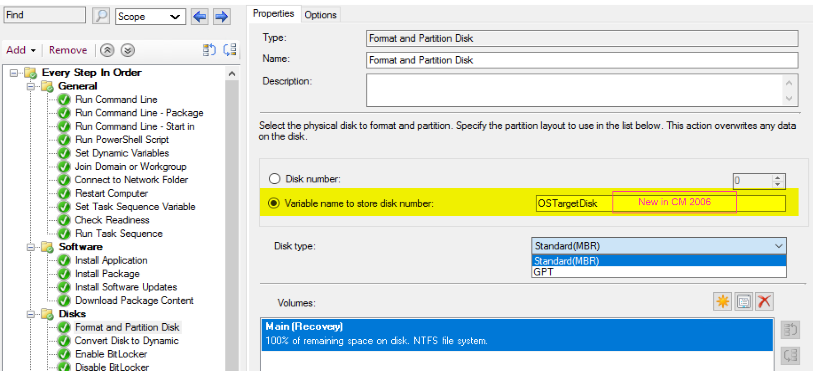](media/FormatDisk01.png)  
If you create the step manually, it's pretty empty and leaves it up to you to set it how you'd like, however if you create a new deployment task sequence, it will create two Format Disk Steps, along with the conditions needed, and the proper disk layout depending if you're machine is running in Legacy BIOS Mode or UEFI mode, as each type requires a different partition layout and drive formatting.

### Legacy BIOS

[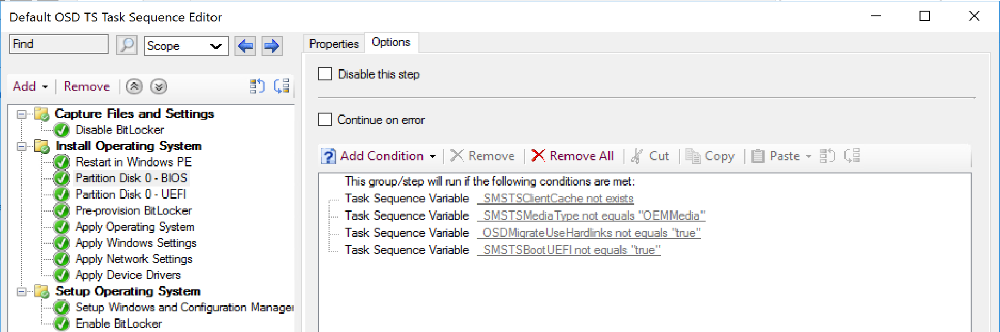](media/FormatDisk02.png)  
Several pre-created conditions are already on the step, mainly the _SMSTSBootUEFI not equals "true"
[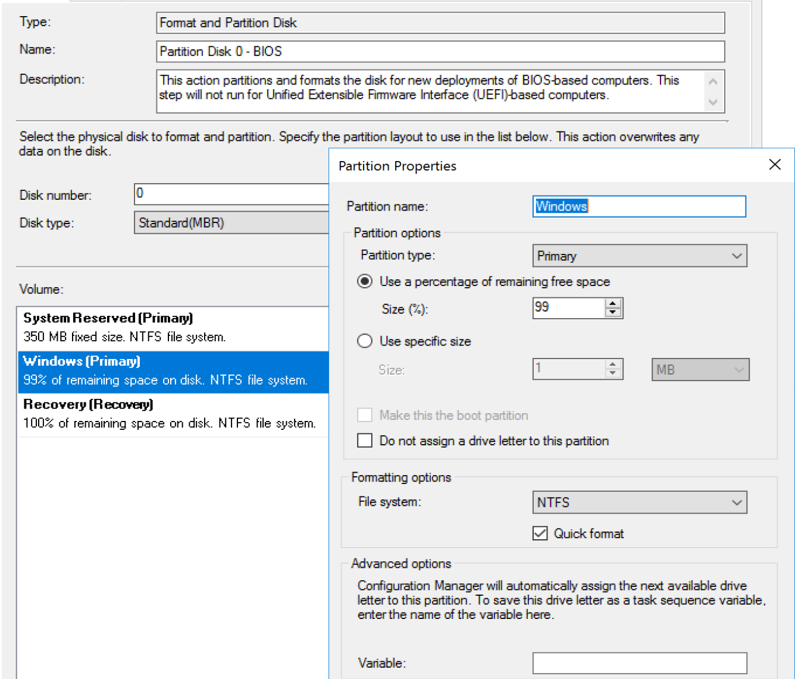](media/FormatDisk03.png)  
There are 3 volumes created, all NTFS.

I'm not going to spend time on this, as hopefully you don't have any machines that you can't convert to UEFI and get the additional security enhancements by doing so.

### Unified Extensible Firmware Interface (UEFI)

[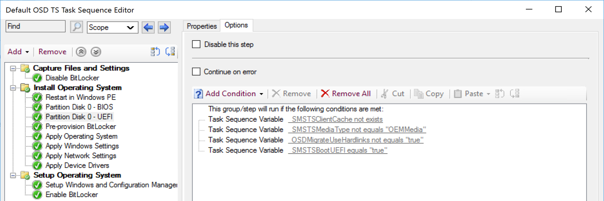](media/FormatDisk04.png)  
[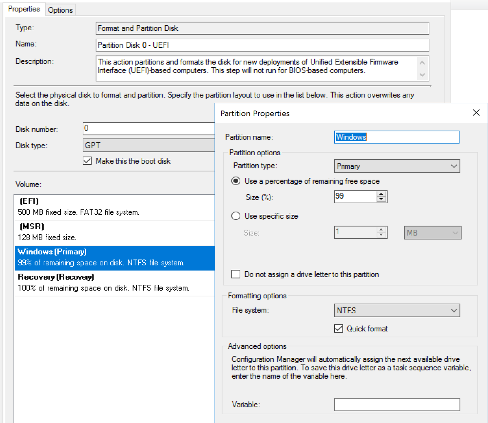](media/FormatDisk05.png)  
Here you can see there are 4 partitions, and the first two are not NTFS.
[The Microsoft Recommended layout](https://docs.microsoft.com/en-us/windows-hardware/manufacture/desktop/configure-uefigpt-based-hard-drive-partitions#partition-layout) consists of the 4 partitions in the arrangement already created for you.


- [EFI](https://docs.microsoft.com/en-us/windows-hardware/manufacture/desktop/configure-uefigpt-based-hard-drive-partitions#system-partition): System Partition, required on GPT, and this is the partition that the machine boots to (which means it would not be encrypted)
  - Recommended 360MB
- [MSR](https://docs.microsoft.com/en-us/windows-hardware/manufacture/desktop/configure-uefigpt-based-hard-drive-partitions#microsoft-reserved-partition-msr): Helps with GPT Partition Management
  - Recommended 128MB
- [Windows (Primary)](https://docs.microsoft.com/en-us/windows-hardware/manufacture/desktop/configure-uefigpt-based-hard-drive-partitions#windows-partition): Minium 300MB (Typically 100% of remaining disk after the other 3 partitions)
  - This is the partition that will hold the OS and user data.
- [Recovery (Recovery)](https://docs.microsoft.com/en-us/windows-hardware/manufacture/desktop/configure-uefigpt-based-hard-drive-partitions#recovery-tools-partition): Minium 300MB
  - Type ID: DE94BBA4-06D1-4D40-A16A-BFD50179D6AC
  - Recommended: 984MB

## Options

[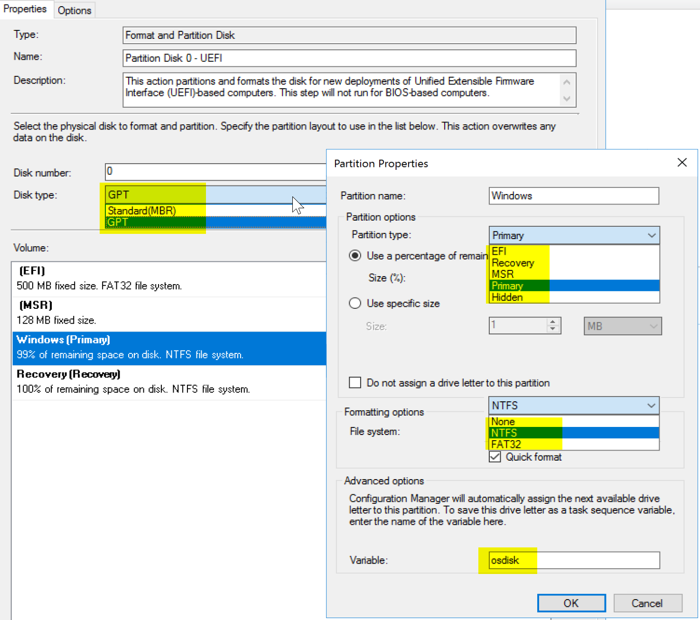](media/FormatDisk06.png)  

- Disk Number: If you have several disks, you can format each one.  This maps to the [OSDDiskIndex](https://docs.microsoft.com/en-us/mem/configmgr/osd/understand/task-sequence-variables#OSDDiskIndex) variable. This is handy if you have an NVMe M.2 Drive, which shows up as Disk 0, but you want to format the SATA SSD as your OS Disk to run Windows one.  You can control which disk is set as your Windows boot volume this way.
- Disk Type:  You get to pick from MBR or GPT
- Partition Properties
  - Partition Name: Just do something that makes sense
  - Partition Type: EFI, Recovery, MSR, Primary, Hidden
  - Use a % of remaining
  - Use a specific size
  - Do not assign a drive letter to this partition.
  - Format File System: None, NTFS, FAT32
  - Variable: Set a variable for the partition, so that later in the process, you can ensure that coping files, or installing items goes to the partition you're expecting.
    - I'll commonly use this when I'm still in PE, and I'm applying the WIM, or copying extra files, I will use %osdisk%\folder\file.ext since while in WinPE you'll probably not know the drive letter.[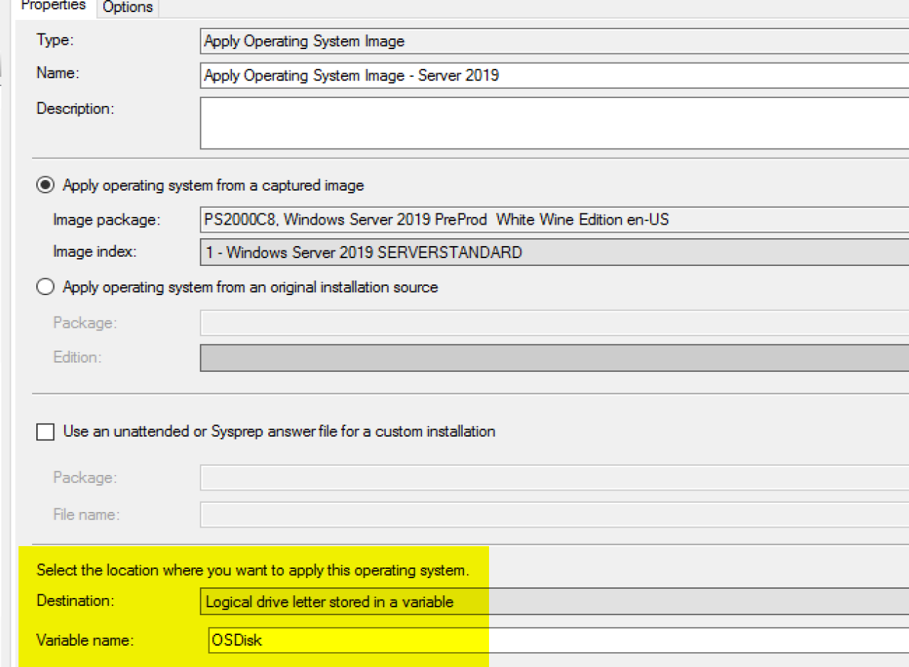](media/FormatDisk07.png)  

## Tips

This is something I learned from Mike Terrill, having the step skip the Recovery Partition creation, then adding it yourself so you can set the actual size instead of leaving it set to 1%, which is the default.
Let's do some quick math, I have a 1 TB NVMe drive
1,000,000 MB - 360 (EFI) - 128 (MSR) = 999,512  
99% of 999,512 = 989,517  
1% Remaining for the Recovery Partition: 9,995 MB

So now we have a nearly 10GB Recovery Partition when we only needed 10% of that?  Waste, Shameful.

I wrote a [handy blog](https://garytown.com/osd-partition-setup-mike-terrill-edition-the-optimized-way) on how to resolve that issue, along with the script and TS Step download.

## Demo

### Demo Legacy BIOS Format

TS Steps:
[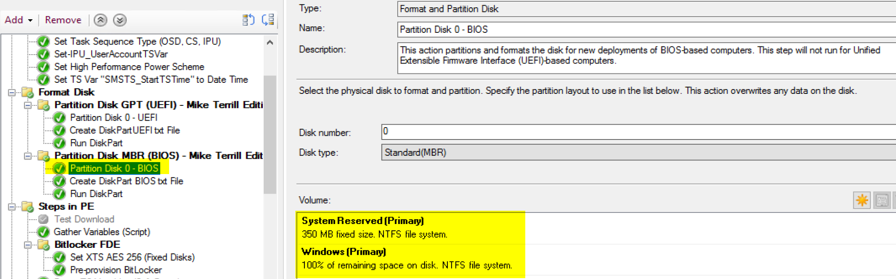](media/FormatDisk11.png)  
Running in the BIOS Mode, I'm using the special steps I blogged about to have better control over the partition sizes.
[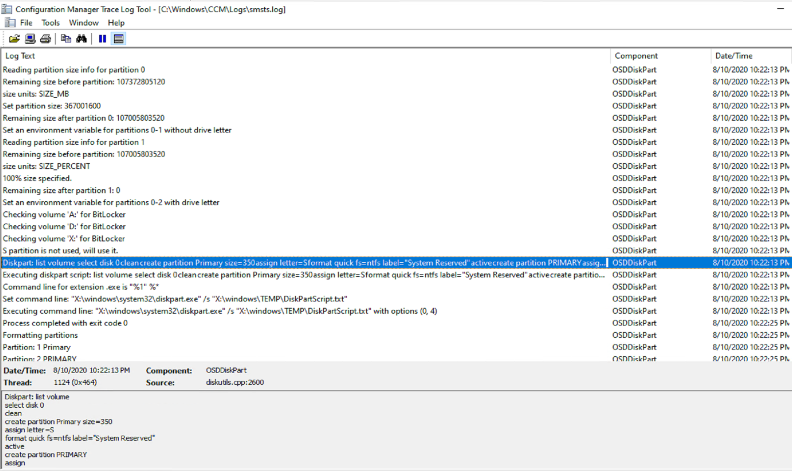](media/FormatDisk08.png)  
[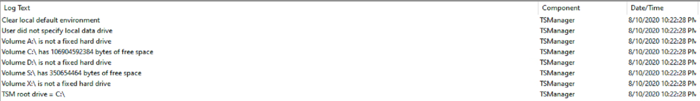](media/FormatDisk09.png)  
You can see from the two images above, that it created the two partitions, assigned the system partition the 350MB and the rest to the primary partition.
[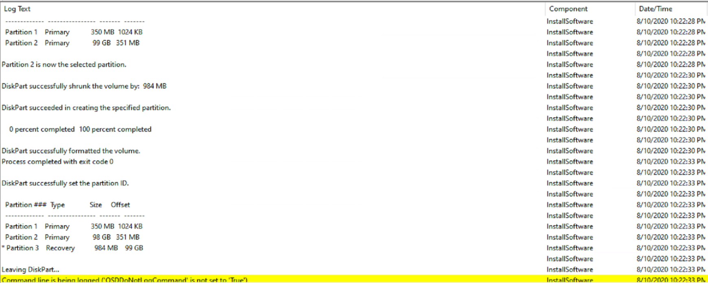](media/FormatDisk10.png)  
Here is the custom step that shrinks the primary partition by 984MB to be used for the recovery partition.
[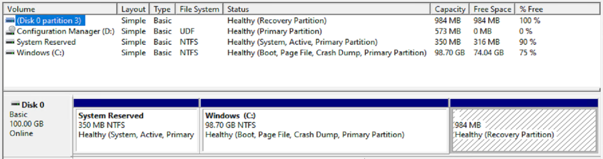](media/FormatDisk12.png)  

### Demo UEFI BIOS Format

TS Steps:
[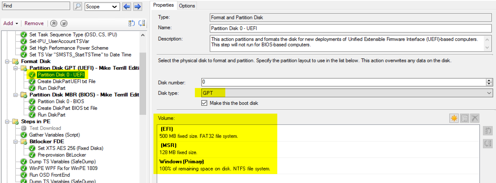](media/FormatDisk13.png)  
Running in the UEFI Mode, once again using the custom steps from my blog post.
[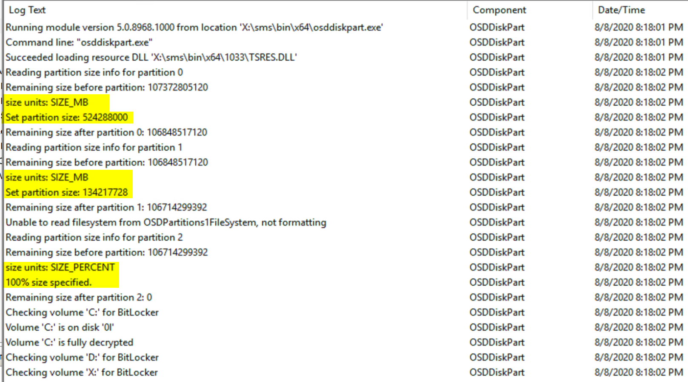](media/FormatDisk14.png)  
[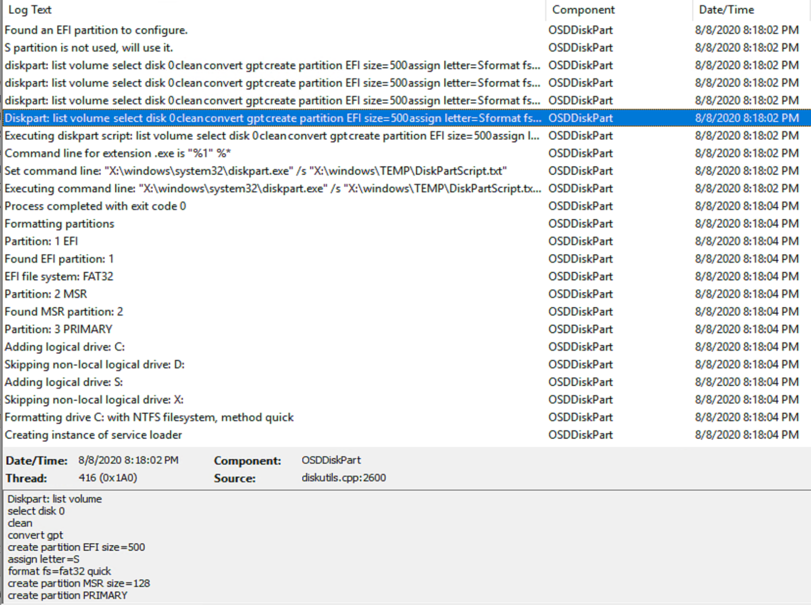](media/FormatDisk15.png)  
[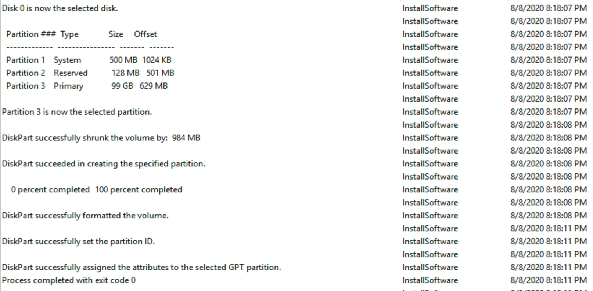](media/FormatDisk16.png)  
[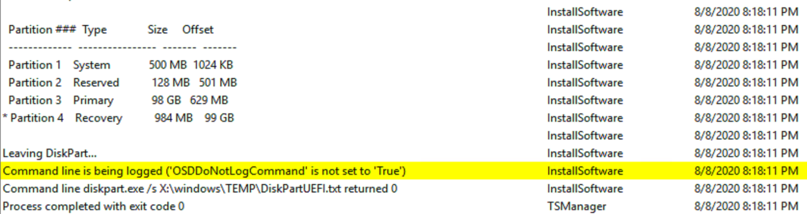](media/FormatDisk17.png)  
From the logs, you can see the 3 partitions that the step made, along with the custom step to create the recovery partition.

[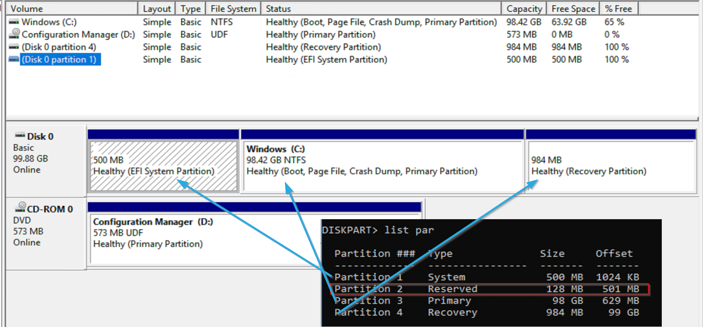](media/FormatDisk18.png)  
From here, you can see that the MSR doesn't show up in disk management, you'll have to use diskpart to show the partitions.

### Demo Several Drives & leverage variables

[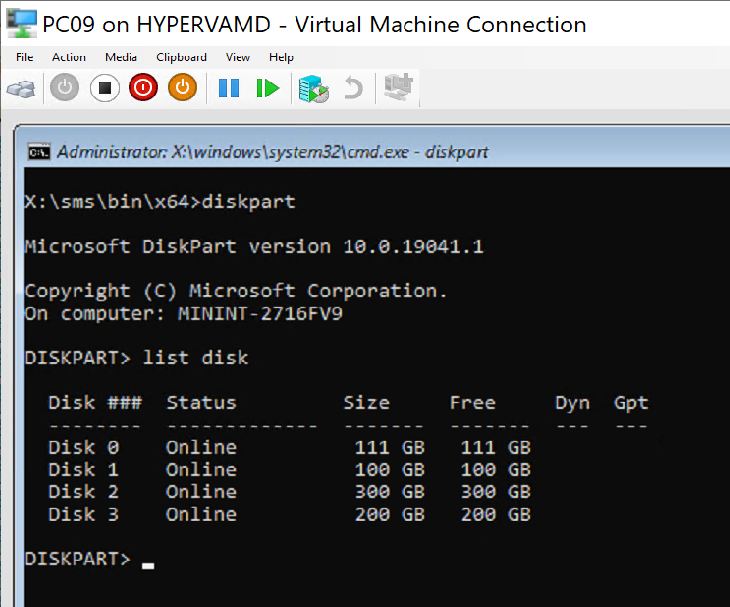](media/FormatDisk19.png)  
In this Demo, I have a Machine with 4 drives, but I want the smallest size drive to be the primary drive that the OS gets installed on, not disk 0.  How do we do that?  Basically by leveraging the variable [OSDDiskIndex](https://docs.microsoft.com/en-us/mem/configmgr/osd/understand/task-sequence-variables#OSDDiskIndex), we can have the format step format any disk we want.
In this demo, I wrote a short powershell script that returns the disk number of the smallest drive, and added it to my TS to set the variable.

```
(get-disk | Where-Object {$_.size -eq ((get-disk).size | measure -Minimum).Minimum}).Number
```

[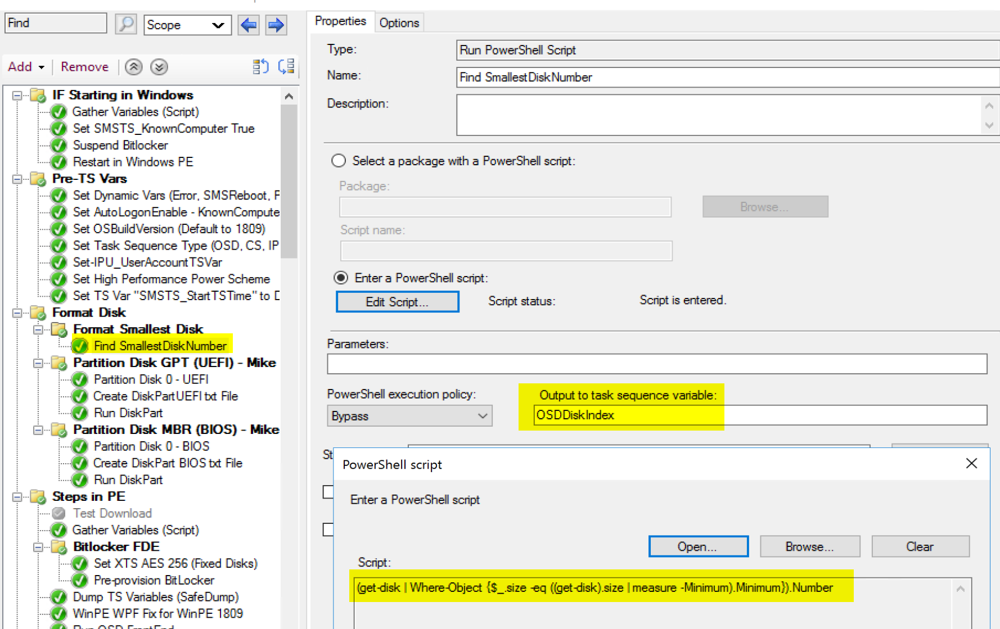](media/FormatDisk20.png)  

Now when I run OSD, it grabs the smallest disk, which happens to be Disk 1, and formats that and sets it as the boot volume.
[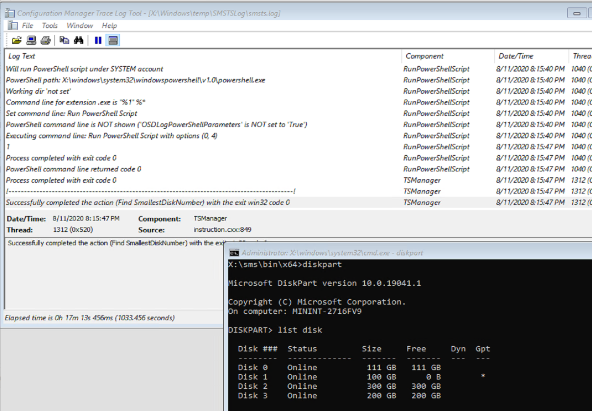](media/FormatDisk21.png)
[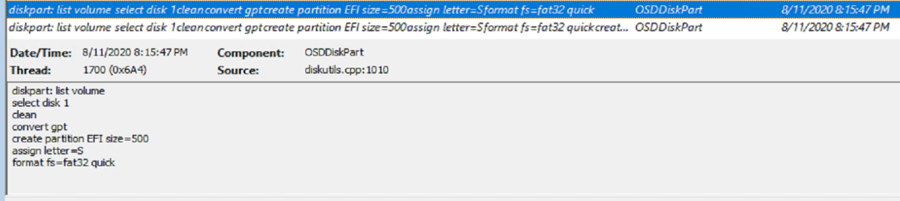](media/FormatDisk22.png)
From the images, you can see it formatted disk 1, instead of 0, which is exactly what I wanted.

Now what about rest of those drives?  Starting with all 4 drives RAW, lets format all of them as well as keep Disk 1 (not 0) as the primary boot drive.
[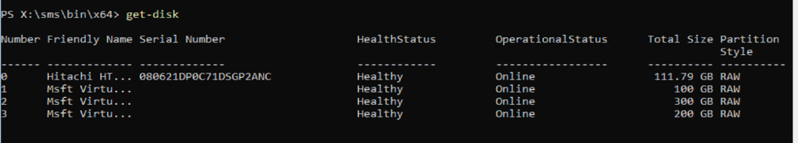](media/FormatDisk23.png)
In WinPE, I've confirmed all drives are RAW, not formatted.  
Starting the TS, it first formats Disk 1 (as shown above), then I have a step that formats the rest in simple single partition drives as shown in the images below.
[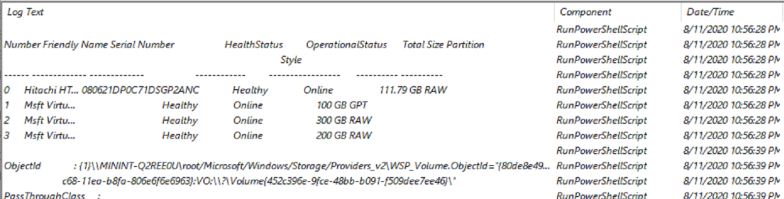](media/FormatDisk24.png)
[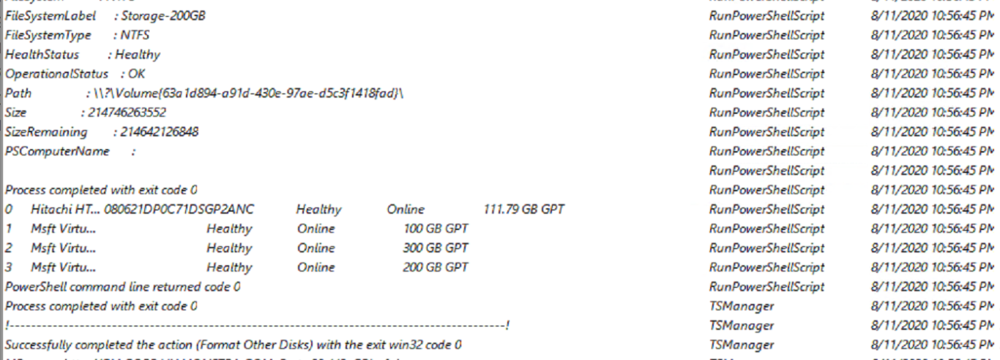](media/FormatDisk25.png)
At the start of the step it records the disk status, which has just the primary drive used for the OS partitioned and formatted, but by the end of the step, all the drives are GPT Partitioned and NTFS formatted.

[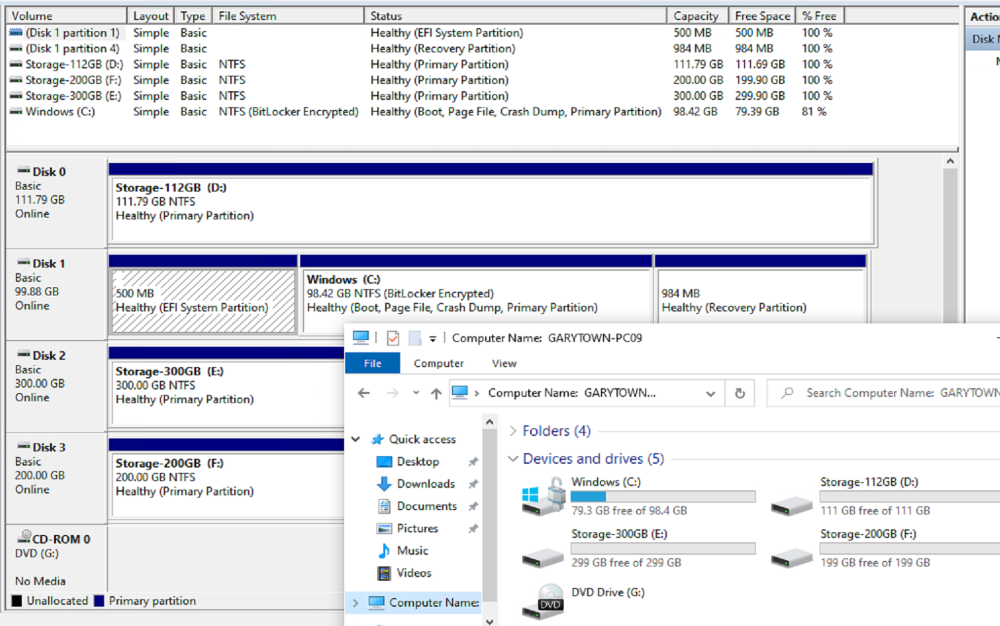](media/FormatDisk26.png)
In Windows, you can see that all of the drives are formatted and the CD Drive is set to the next available drive letter, this was accomplished by the custom step "Format Other Disk".

## Scripts

Script used to format additional drives

```
get-disk

#Change CD Drive to A Drive temporary
$cd = Get-WMIObject -Class Win32_CDROMDrive -ErrorAction Stop
$driveletter = $cd.drive
$DriveInfo = Get-CimInstance -class win32_volume | Where-Object {$_.DriveLetter -eq $driveletter} |Set-CimInstance -Arguments @{DriveLetter='A:'}

#Get RAW Disks and Format
$RAWDisks = get-disk | Where-Object {$_.PartitionStyle -eq "RAW"}
foreach ($Disk in $RAWDisks)#{}
    {
    $Size = [math]::Round($Disk.size / 1024 / 1024 / 1024)
    Initialize-Disk -PartitionStyle GPT -Number $Disk.Number
    New-Partition -DiskNumber $Disk.Number -AssignDriveLetter -UseMaximumSize |
    Format-Volume -FileSystem NTFS -NewFileSystemLabel "Storage-$($size)GB" -Confirm:$false
    }

#Set CD to next available Drive Letter
$AllLetters = 67..90 | ForEach-Object {[char]$_ + ":"}
$UsedLetters = get-wmiobject win32_logicaldisk | select -expand deviceid
$FreeLetters = $AllLetters | Where-Object {$UsedLetters -notcontains $_}
$CDDriveLetter = $FreeLetters | select-object -First 1
$DriveInfo = Get-CimInstance -class win32_volume | Where-Object {$_.DriveLetter -eq "A:"} |Set-CimInstance -Arguments @{DriveLetter=$CDDriveLetter}

get-disk
```

Script (steps) used to create Recovery Partition UEFI - Requires you set OSDDiskIndex, or the step fails.

```
cmd.exe /c echo select disk %OSDDiskIndex% >> %temp%\diskpartUEFI.txt && cmd.exe /c echo list partition >> %temp%\diskpartUEFI.txt && cmd.exe /c echo select partition 3 >> %temp%\diskpartUEFI.txt && cmd.exe /c echo shrink desired=984 minimum=984 >> %temp%\diskpartUEFI.txt && cmd.exe /c echo create partition primary >> %temp%\diskpartUEFI.txt && cmd.exe /c echo format quick fs=ntfs label=Recovery >> %temp%\diskpartUEFI.txt && cmd.exe /c echo set id="de94bba4-06d1-4d40-a16a-bfd50179d6ac" >> %temp%\diskpartUEFI.txt && cmd.exe /c echo gpt attributes=0x8000000000000001 >> %temp%\diskpartUEFI.txt && cmd.exe /c echo list partition >> %temp%\diskpartUEFI.txt && cmd.exe /c echo exit >> %temp%\diskpartUEFI.txt
```

Legacy BIOS:

```
cmd.exe /c echo select disk %OSDDiskIndex% >> %temp%\diskpartBIOS.txt && cmd.exe /c echo list partition >> %temp%\diskpartBIOS.txt && cmd.exe /c echo select partition 2 >> %temp%\diskpartBIOS.txt && cmd.exe /c echo shrink desired=984 minimum=984 >> %temp%\diskpartBIOS.txt && cmd.exe /c echo create partition primary >> %temp%\diskpartBIOS.txt && cmd.exe /c echo format quick fs=ntfs label=Recovery >> %temp%\diskpartBIOS.txt && cmd.exe /c echo set id 27 >> %temp%\diskpartBIOS.txt && cmd.exe /c echo list partition >> %temp%\diskpartBIOS.txt && cmd.exe /c echo exit >> %temp%\diskpartBIOS.txt
```

Run DiskPart Step

```
diskpart.exe /s %temp%\DiskPartBIOS.txt
```

As I write this CM2006 was just released, which makes the step  more versatile if you want to do some fancy formatting with the other volumes. I've honestly never had a reason to do more than one partition on the extra drives, but if you do, the new variable feature they added makes that easily done.  If you'd like more info about leveraging that, hit me up on Twitter and I'll expand these docs, and I'd be interested to hear your use cases.

## Troubleshooting

### _SMSTSBootUEFI Issues
I noticed on Reddit several folks saying that_SMSTSBootUEFI isn't working.  I quickly tested on Gen 1 VM, which it worked and it was set to False, and a Gen 2 VM, which it worked and was set to True.  So rest assured, it is working (ADK 2004 / CM 2006).

Johan had some comments about similar bugs with older versions of MDT / CM [Posted on his Blog](https://deploymentresearch.com/making-mdt-work-with-windows-adk-2004-for-bios-machines/)

I then went to the physical realm, and tested on a very old Dell Latitude D830, which was created long before UEFI was a thing.  OSD worked fine, it was tagged as legacy (_SMSTSBootUEFI = False), if formatted the disk properly and finsihed with a nice Windows 10 Build.

Then I went with a newer model, and this is where I think the issues have come in for folks.

#### Test: Latitude E7470 in LEGACY mode

- SecureBoot Disabled
- Legacy ROM Enabled
- BootMode = Legacy

At Boot up, I see several options for both Legacy & UEFI.
[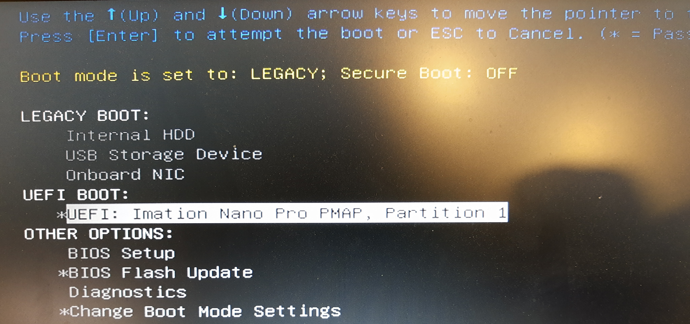](media/FormatDisk27.png)

##### **OSD Booting from LEGACY USB Option**

- _SMSTSBootUEFI = False
- OSD completes Successful

##### **OSD Booting from UEFI USB Option**

- _SMSTSBootUEFI = True
- OSD Fails.
  - Applies OS and Drivers
  - Starts "Setup Windows & ConfigMgr" Step
  - Restarts, it comes back up with "No Boot Device Found", then tries to PXE boot or boot to USB.
  - If I try to boot from the Disk, I get "Selected Boot Device Failed"

So.. lesson here, if you're using a newer device, and you're trying to still use it in Legacy Mode instead of UEFI, make sure you're telling it to boot from a Legacy option.

### Future Test of Issue

You have something that's hanging you up? Hit me up on twitter and If available, I'll see what I can do, and maybe have more items to update here.

**About Recast Software**
1 in 3 organizations using Microsoft Configuration Manager rely on Right Click Tools to surface vulnerabilities and remediate quicker than ever before.  
[Download Free Tools](https://www.recastsoftware.com/?utm_source=cmdocs&utm_medium=referral&utm_campaign=cmdocs#formarea)  
[Request Pricing](https://www.recastsoftware.com/pricing?utm_source=cmdocs&utm_medium=referral&utm_campaign=cmdocs)