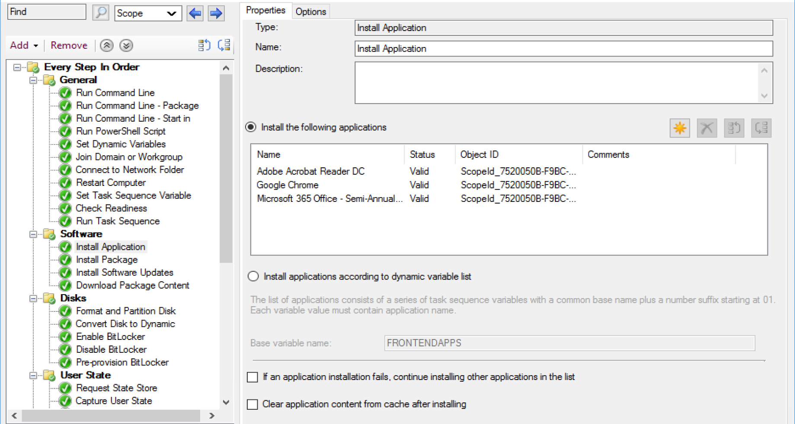
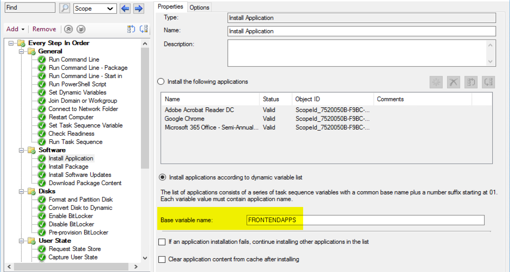
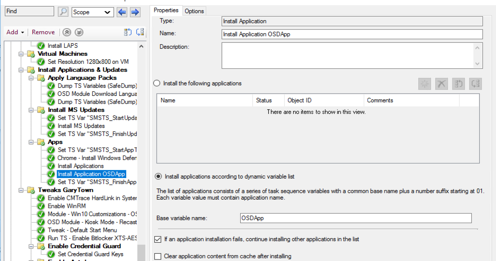
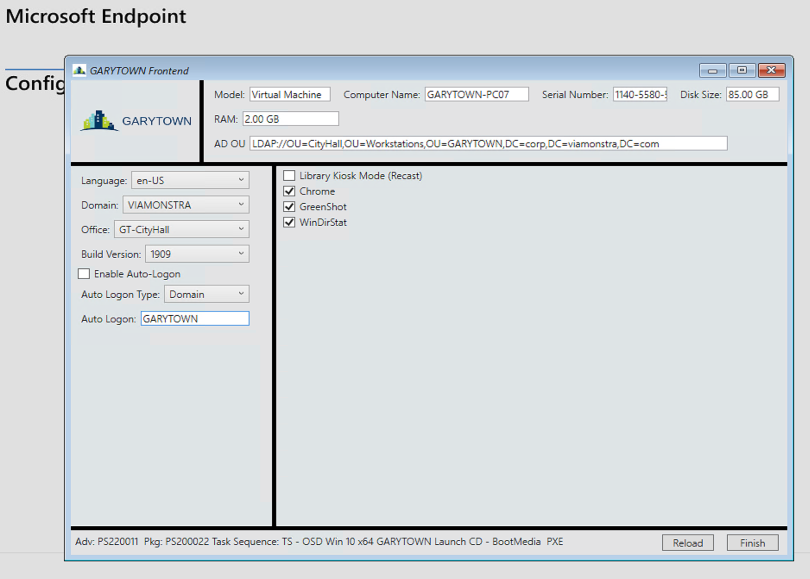
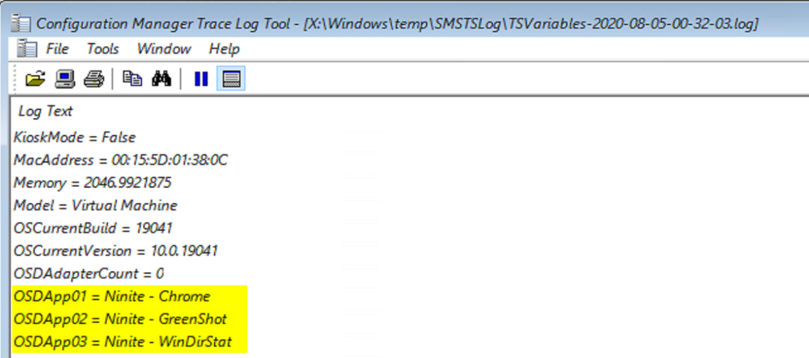
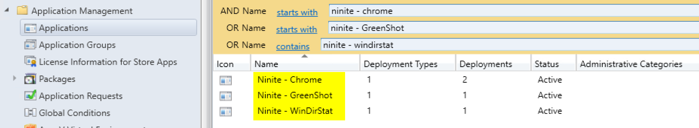
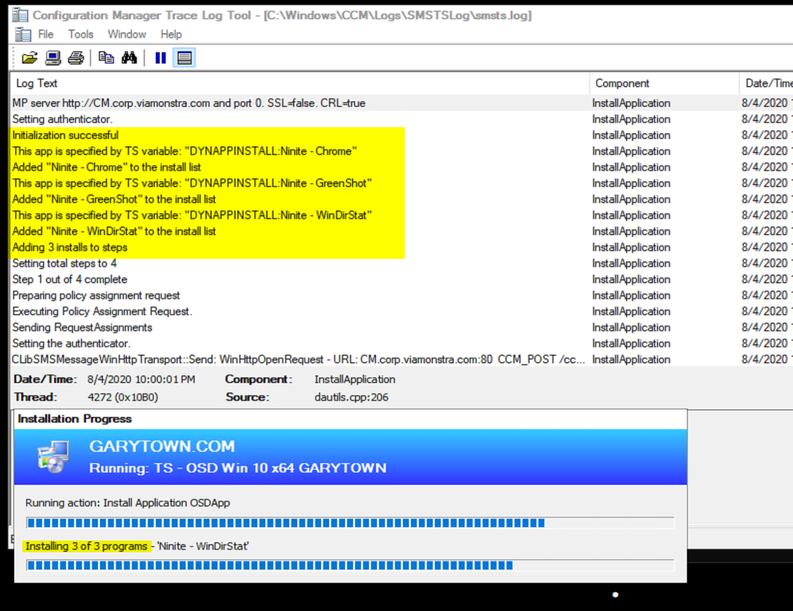
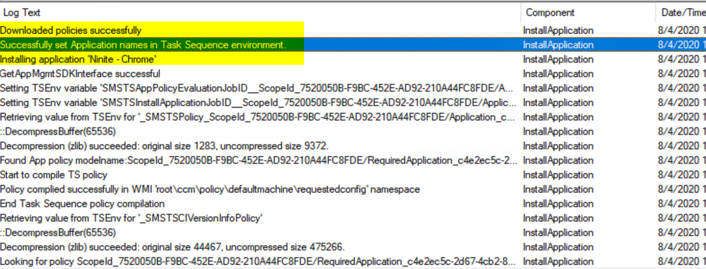
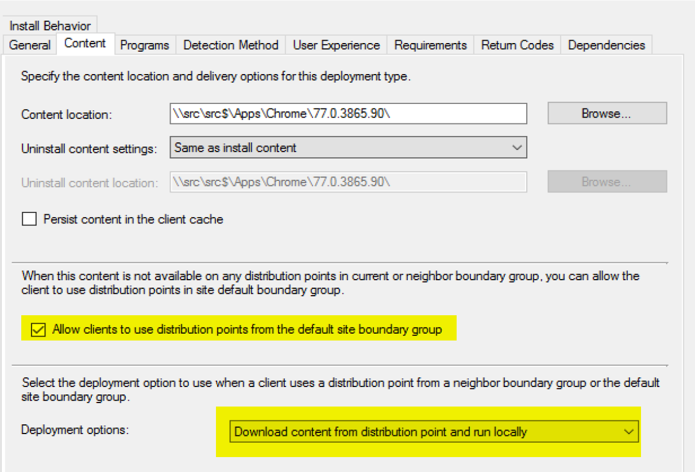
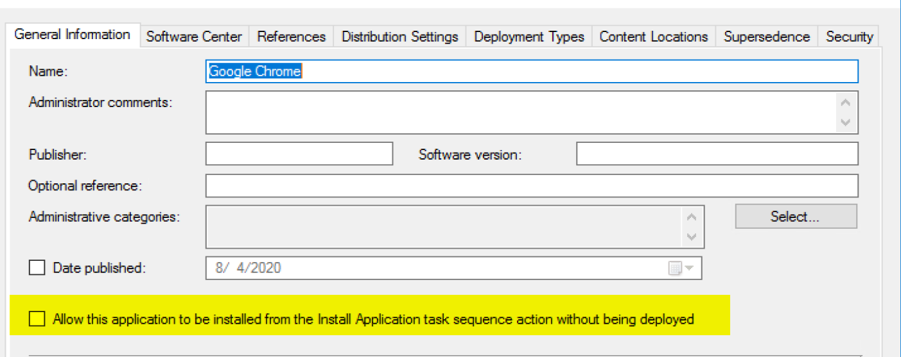

# Install Application

Use this step to install an application or set of applications you've created in CM during the task sequence. This has to run in the full OS and requires the CM Client to do the heavy lifting.  Just as if you were installing an application outside of the task sequence, you'll want to monitor other logs to understand what is happening for the Application installs.

## MS Docs - Application Step Docs

<https://docs.microsoft.com/en-us/mem/configmgr/osd/understand/task-sequence-steps#BKMK_InstallApplication>

## MS Docs - Application Docs

- [App Model Related Log Files](https://docs.microsoft.com/en-us/mem/configmgr/core/plan-design/hierarchy/log-files#BKMK_AppManageLog)
- [App Model Deployment Troubleshooting](https://docs.microsoft.com/en-us/mem/configmgr/apps/deploy-use/troubleshoot-application-deployment)
- [MS Blog on App Deployments using Task Sequence](https://techcommunity.microsoft.com/t5/configuration-manager-blog/video-tutorial-task-squences-application-deployment-part-11/ba-p/1475691)

## PowerShell

- [Get-CMTSStepInstallApplication](https://docs.microsoft.com/en-us/powershell/module/configurationmanager/get-cmtsstepinstallapplication?view=sccm-ps)
- [New-CMTSStepInstallApplication](https://docs.microsoft.com/en-us/powershell/module/configurationmanager/new-cmtsstepinstallapplication?view=sccm-ps)
- [Remove-CMTSStepInstallApplication](https://docs.microsoft.com/en-us/powershell/module/configurationmanager/remove-cmtsstepinstallapplication?view=sccm-ps)
- [Set-CMTSStepInstallApplication](https://docs.microsoft.com/en-us/powershell/module/configurationmanager/set-cmtsstepinstallapplication?view=sccm-ps)

## Step Image

**Static List of Applications**

The static list is quite simple, pick from the applications available when you click the "Yellow Star"  

**Dynamic List of Applications**

Using the base variable to dyanmically install applications is a bit more tricky.  You'll have to have a way to setup those variables for the task sequence to consume.  Typically this is done via Machine or Collection Variables, or using a Front End that you can then select several applications from a list and the front end will create the variables.  For example, the community front end project UI++ has [documentation](http://uiplusplus.configmgrftw.com/docs/actionconfig/apptree.html) for how it needs you to setup the step to work properly with it's front end.

## Demo Dynamic Application Install during OSD

**Task Sequence Step**
 
In my OSD TS, I'm using the variable "OSDApp"

**Front End**

In my front end, I have a static list of applications that I can pick and choose from.  Some Front Ends can have web call back to a database to populate a list of available apps, you can really get as fancy as you want.

**Variables Created**
[  
At the close of the front end, it creates the required variables for the task seqeunce to consume and then install the applications.  

How does it know which apps to call? It's a direct mapping of the variable to the Application Name

In the running Task Sequence

## Common Issues

- Content not available
  - Boundaries or not having the content distributed for the dynamically called applications.
  - Check your boundaries, and check the boxes in the App DT
  

- Missing Check Box on Application to have policy avaialble during Task Sequence

## Related Content

- [Blog Post - SCCMentor - Dynamic Packages and Applications in TS](https://sccmentor.com/2015/03/12/dynamically-deploying-packages-and-applications-to-computers-using-a-task-sequence-via-powershell-in-configmgr-2012/)
- [Blog Post - Installing Applications Dynamically in the SCCM Task Sequence](https://techwithandrew.blogspot.com/2018/01/installing-applications-dynamically-in.html)

**About Recast Software**
1 in 3 organizations using Microsoft Configuration Manager rely on Right Click Tools to surface vulnerabilities and remediate quicker than ever before.  
[Download Free Tools](https://www.recastsoftware.com/?utm_source=cmdocs&utm_medium=referral&utm_campaign=cmdocs#formarea)  
[Request Pricing](https://www.recastsoftware.com/pricing?utm_source=cmdocs&utm_medium=referral&utm_campaign=cmdocs)