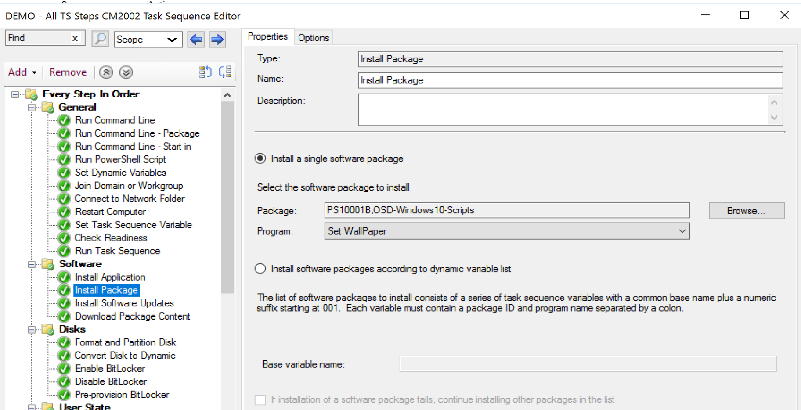
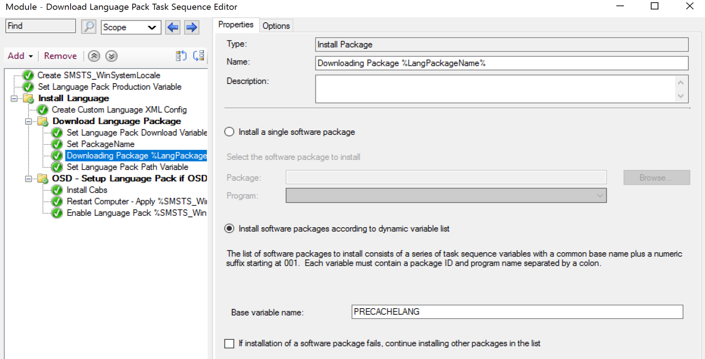
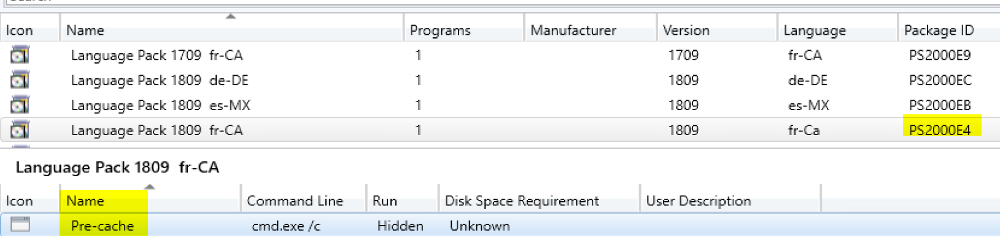

# Install Package

This step used to install a Package (Program).  Similar to the [Install Application Step](SCCM_TaskSequence_Step_InstallApplication.md), you can set a static list, or dynamic list.  I personally rely on this step to make dynamically downloading and installing drivers, BIOS, Language packs all possible.  I'll include examples of how I use it, along with general details.  This step relates to the [Download Package Content](SCCM_TaskSequence_Step_DownloadPackageContent.md) but differs in how it will run a program and do an install, but limits you to one package / at a time.

## MS Docs

<https://docs.microsoft.com/en-us/mem/configmgr/osd/understand/task-sequence-steps#BKMK_InstallPackage>

## PowerShell

- [Get-CMTSStepInstallSoftware](https://docs.microsoft.com/en-us/powershell/module/configurationmanager/get-cmtsstepinstallsoftware?view=sccm-ps)
- [New-CMTSStepInstallSoftware](https://docs.microsoft.com/en-us/powershell/module/configurationmanager/new-cmtsstepinstallsoftware?view=sccm-ps)
- [Remove-CMTSStepInstallSoftware](https://docs.microsoft.com/en-us/powershell/module/configurationmanager/remove-cmtsstepinstallsoftware?view=sccm-ps)
- [Set-CMTSStepInstallSoftware](https://docs.microsoft.com/en-us/powershell/module/configurationmanager/set-cmtsstepinstallsoftware?view=sccm-ps)

**Static Package Program Install**
  
You can choose a specfic Package, then one of the programs that are associated with it.  I'll be honest, I rarely use this feature, I'll often use the [Run Command Step](SCCM_TaskSequence_Step_RunCommandLine.md) instead.

**Dynamic List of Packages**

Here, you specify a base variable, and the task sequence will look for any variables that start with it and go ahead and trigger the programs.

## Things to remember

- This task sequence step runs only in the full OS. It doesn't run in Windows PE.
  - If you took time to develop something nifty that relied on this step for your in-place upgrades, say dynamically downloading drivers and BIOS, you can't reuse the same process during OSD, because you'd want to download the drivers while in PE to apply it to your machine when it's installing the OS.

- The variable needs to reference the package and the program.
    Ex: In the Image, the variable base name is PRECACHELANG, which means it will look for the values of the varaibles PRECACHELANG001, PRECACHELANG002 and so on.  In the PRECACHELANG001, you will then have to have both a package and a program.
    Variable = PACKAGE1:ProgramName
    PRECACHELANG001 = PS1000E4:Pre-cache
    

## References

- [Blog Post on GARYTOWN - Dynamicly download Drivers](https://garytown.com/driver-pack-mapping-and-pre-cache-v2)

**About Recast Software**
1 in 3 organizations using Microsoft Configuration Manager rely on Right Click Tools to surface vulnerabilities and remediate quicker than ever before.  
[Download Free Tools](https://www.recastsoftware.com/?utm_source=cmdocs&utm_medium=referral&utm_campaign=cmdocs#formarea)  
[Request Pricing](https://www.recastsoftware.com/pricing?utm_source=cmdocs&utm_medium=referral&utm_campaign=cmdocs)