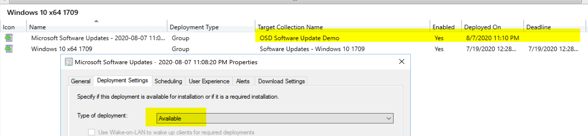
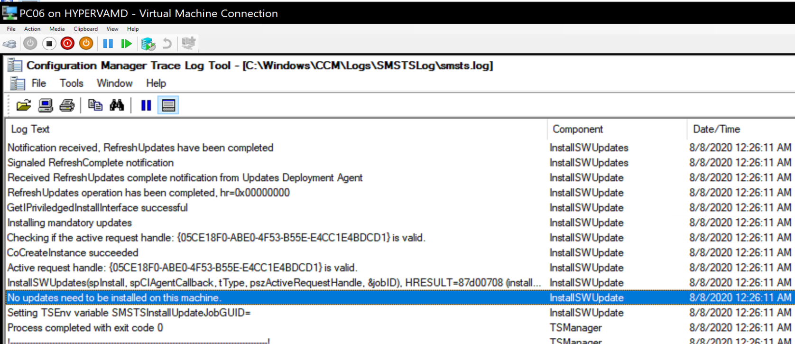

# Install Software Updates

This step is simple in nature but one I've had the most issue troubleshooting.  It's pretty much always worked in my simple labs, but in complicated production environments, it has been a difficult time.  I've placed some references to troubleshooting later on.

## MS Docs

- Summary: <https://docs.microsoft.com/en-us/mem/configmgr/osd/understand/task-sequence-steps#BKMK_InstallSoftwareUpdates>
- Detailed process flow: <https://docs.microsoft.com/en-us/mem/configmgr/osd/understand/install-software-updates>

That last page was added more recently and really helps when you're running into issues with this step.  If you running into problems, before you start googling, you'll want to read that doc to get a good grasp of the process as well as the logs you'll want to check out.

- UpdatesDeployment.log
- UpdatesHandler.log
- UpdatesStore.log
- wuahandler.log
- WindowsUpdate.log

## PowerShell

- [Get-CMTSStepInstallUpdate](https://docs.microsoft.com/en-us/powershell/module/configurationmanager/get-cmtsstepinstallupdate?view=sccm-ps)
- [New-CMTSStepInstallUpdate](https://docs.microsoft.com/en-us/powershell/module/configurationmanager/new-cmtsstepinstallupdate?view=sccm-ps)
- [Remove-CMTSStepInstallUpdate](https://docs.microsoft.com/en-us/powershell/module/configurationmanager/remove-cmtsstepinstallupdate?view=sccm-ps)
- [Set-CMTSStepInstallUpdate](https://docs.microsoft.com/en-us/powershell/module/configurationmanager/set-cmtsstepinstallupdate?view=sccm-ps)

### The Step

For the software updates to install, they have to be deployed to the machine you're building. If you've created an object, or are re-imaging a machine that has an object, you need to have the Updates deployed to a collection that machine is in.
If you're deploying OSD to unknown computers, then you need to have updates deployed to the unknown computers collection.

## Options

- Required for installation - Mandatory software updates only.
  - This will install only updates that are deployed to this machine that are required, additional updates will not be applied.
- Available for installation - All software updates
  - This will install any updates that are set to available and are deployed to the machine.

The Step is setting the variable _SMSInstallUpdateTarget_ to **mandatory** or **all** based on the radio button you choose.

## Demos

### Demo 1 - No Updates Deployed to Machine

Machine has no updates that are needed during OSD.  The Step still takes several minutes for it to compile all of the policy to determine there are no updates for the machine.

This machine has 3 software updates, but for Edge browser, which isn't even installed at the point the install software update step runs.

You can see from the logs during OSD, that it didn't find any updates to apply.

### Demo 2 & 3 - Available Updates Deoloyed

I've deployed several Windows 10 updates to the collection my demo machine is in, and set it as an available deployment.

Here you can see several Windows 10 1709 updates are available to the machine, so during OSD, it should get patched

### Demo 2 - TS Setup - Install Available

Machine has several updates **available** and the TS is set to install all **available** Updates.

Nice, it's installing.  Another nice thing, the SMSTS.LOG file tells you the logs to monitor!

### Demo 3 - TS Step - Install Required

Machine has several updates **available** (same as last demo run) and the TS is set to install all **required** Updates.

So in this demo the only change was the TS Step going from available update to required updates.  During the Task Sequence, it didn't evaluate any of the available updates as required and skipped them all.

### Demo 4 & 5 - Required Updates Deployed

Lets change the deployment from available to required, and keep the task sequence to install required deployments.

### Demo 4 - TS Step Available

So this test, **Required** Deployment of Updates, and TS Step set to **Available**.
Ok... running test and boom, updates installing, which is what I was expecting.

Here the log shows it is _"Installing all updates targetted for this computer"_

### Demo 5 - TS Step Required

So this test, **Required** Deployment of Updates, and TS Step set to **Required**.

As we expected, it is installing the 5 required updates.

### Things to note from the Demos

- SMSTSlog
  - When TS Step set to Required, the Log says _"Installing mandatory updates"_
  - When TS Step set to Available, the Log says _"Installing all updates targeted for this computer"_
- Install Order: The Updates Handler (UpdatesHandler.log) shows that the process keeps track of the updates and flags a servicing stack update, which will then apply that first.

## Final Thoughts

Overall, this step is pretty robust, and if you have a smaller environment which you keep clean, you probably won't run into any issues with this step.  The biggest issue is ensuring that the updates you need are deployed to the machines you're running task sequence on.

**About Recast Software**
1 in 3 organizations using Microsoft Configuration Manager rely on Right Click Tools to surface vulnerabilities and remediate quicker than ever before.  
[Download Free Tools](https://www.recastsoftware.com/?utm_source=cmdocs&utm_medium=referral&utm_campaign=cmdocs#formarea)  
[Request Pricing](https://www.recastsoftware.com/pricing?utm_source=cmdocs&utm_medium=referral&utm_campaign=cmdocs)

**About Recast Software**
1 in 3 organizations using Microsoft Configuration Manager rely on Right Click Tools to surface vulnerabilities and remediate quicker than ever before.  
[Download Free Tools](https://www.recastsoftware.com/?utm_source=cmdocs&utm_medium=referral&utm_campaign=cmdocs#formarea)  
[Request Pricing](https://www.recastsoftware.com/pricing?utm_source=cmdocs&utm_medium=referral&utm_campaign=cmdocs)