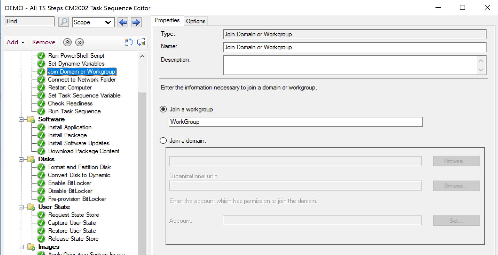
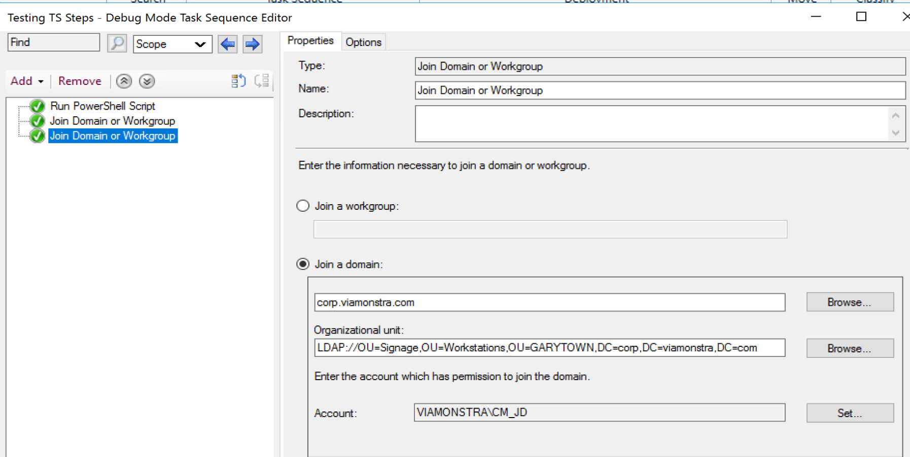
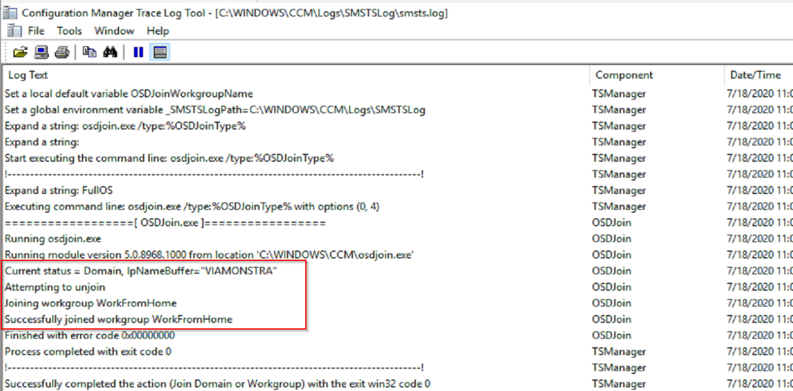
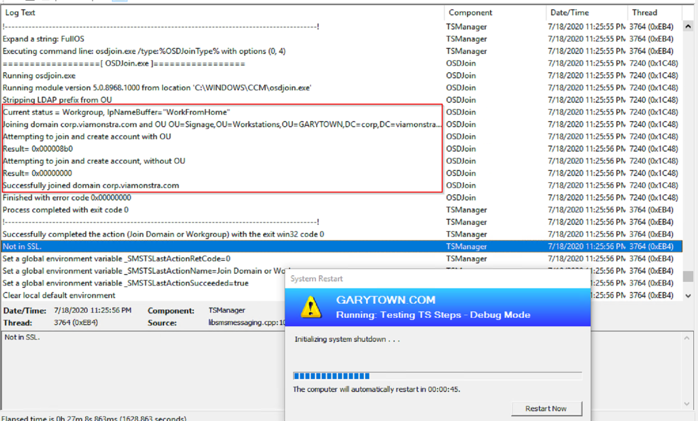
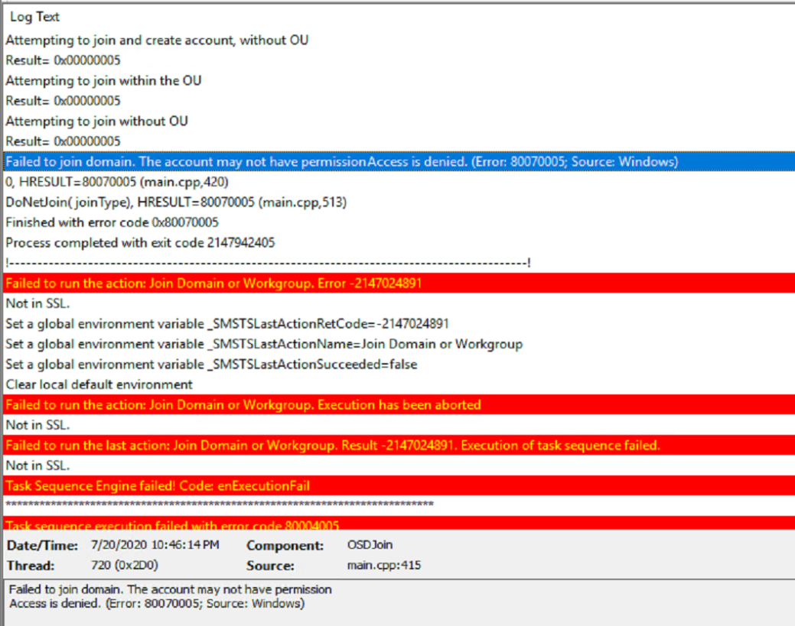
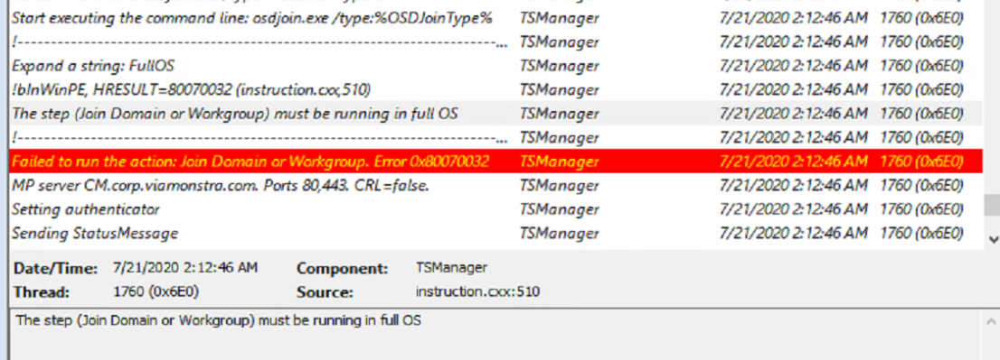

# Join Domain or Workgroup

MS Docs: <https://docs.microsoft.com/en-us/mem/configmgr/osd/understand/task-sequence-steps#BKMK_JoinDomainorWorkgroup>

This step will join the machine to a Domain or Workgroup, which I feel that the name of the step really summarizes it quite well.  

Couple things to note, this is NOT the same step that you typically would use in OSD by default, which is: Apply Network Settings

Related to Variable: **OSDJoinSkipReboot** - By Default this step will reboot to apply the change, but if you want to forgo that reboot, you can use that variable (set to TRUE) to avoid the reboot, and then call the reboot when works for you.

This step is used in the Full OS, and I'll be honest, I've never had a need for this step.  I could see if you're moving machines from one domain to another domain, this could come in handy, or if for some reason, during OSD, you need to wait until you're in the Full OS to join the domain vs set the setting the attributes that would be consumed in the customsettings.ini file.

  

Things to consider and have ready ahead of time are the OU in the Domain you want the machine  to be created in, and then the account which has the permissions to join that OU.

## Demo

In this Demo I run a TS that Take a machine currently joined my domain and disjoins the domain and sets the workgroup.  The next step joins it back to the domain.
  
Logs:
  
The machine then automatically rebooted
  
When it came back up, it joined the domain again, then automatically triggered the reboot.

## Common Issues

- Permissions:  The Account you're using doesn't have the proper permissions to join the domain, or to the OU you've requested to have it added to. (Error Code: 2147942405 / -2147024891)
  
- Using in WinPE instead of Full OS
  

**About Recast Software**
1 in 3 organizations using Microsoft Configuration Manager rely on Right Click Tools to surface vulnerabilities and remediate quicker than ever before.  
[Download Free Tools](https://www.recastsoftware.com/?utm_source=cmdocs&utm_medium=referral&utm_campaign=cmdocs#formarea)  
[Request Pricing](https://www.recastsoftware.com/pricing?utm_source=cmdocs&utm_medium=referral&utm_campaign=cmdocs)