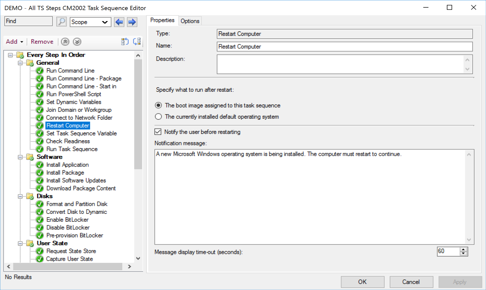
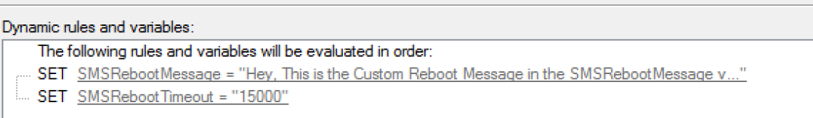
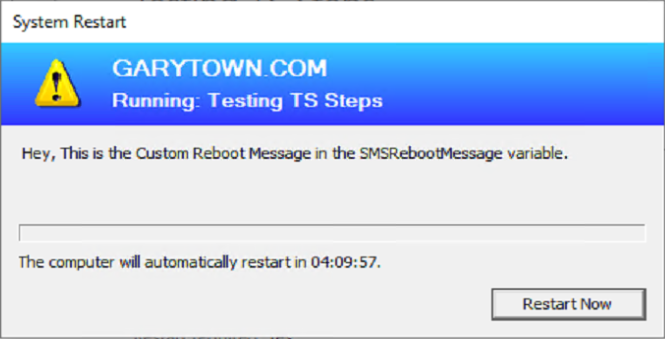
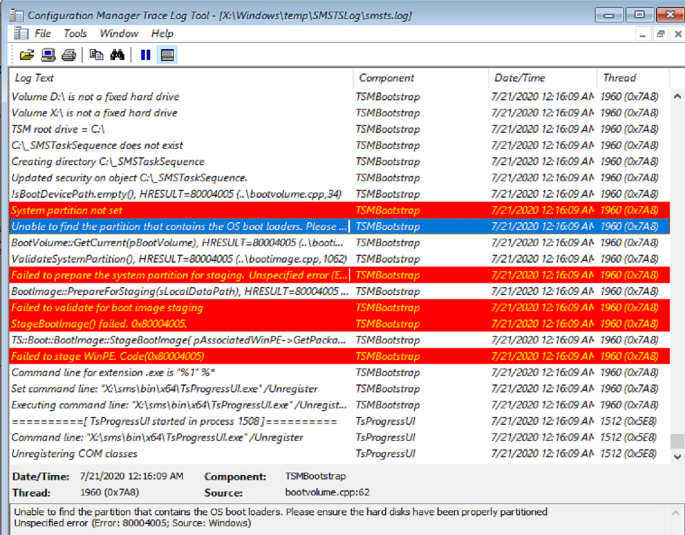

# Restart Computer

## MS Docs

MS Docs: <https://docs.microsoft.com/en-us/mem/configmgr/osd/understand/task-sequence-steps#BKMK_RestartComputer>

PowerShell:

- [Get-CMTSStepReboot](https://docs.microsoft.com/en-us/powershell/module/configurationmanager/Get-CMTSStepReboot?view=sccm-ps)
- [New-CMTSStepReboot](https://docs.microsoft.com/en-us/powershell/module/configurationmanager/New-CMTSStepReboot?view=sccm-ps)
- [Remove-CMTSStepReboot](https://docs.microsoft.com/en-us/powershell/module/configurationmanager/Remove-CMTSStepReboot?view=sccm-ps)
- [Set-CMTSStepReboot](https://docs.microsoft.com/en-us/powershell/module/configurationmanager/Set-CMTSStepReboot?view=sccm-ps)

The Restart Computer Step does just that, restarts the computer.  But it's also a gateway between WinPE and the Full OS.  
  
Related Variables:

- SMSRebootMessage
- SMSRebootTimeout

### Demo

In this example, I left the step alone, but set the two variables.
  
  

### Common Issues

- Choosing the wrong option for the where you end up after the reboot.
  - I've done this so many times, I'll be watching a machine reboot after an install, and it comes up in WinPE instead of the Full OS.
- Not having a formatted drive to download the Media to when rebooting.
  - When you're early in WinPE, on a new disk that isn't formatted yet, so there is nowhere for the Boot Media to actually download.
  
  
  **About Recast Software**
1 in 3 organizations using Microsoft Configuration Manager rely on Right Click Tools to surface vulnerabilities and remediate quicker than ever before.  
[Download Free Tools](https://www.recastsoftware.com/?utm_source=cmdocs&utm_medium=referral&utm_campaign=cmdocs#formarea)  
[Request Pricing](https://www.recastsoftware.com/pricing?utm_source=cmdocs&utm_medium=referral&utm_campaign=cmdocs)