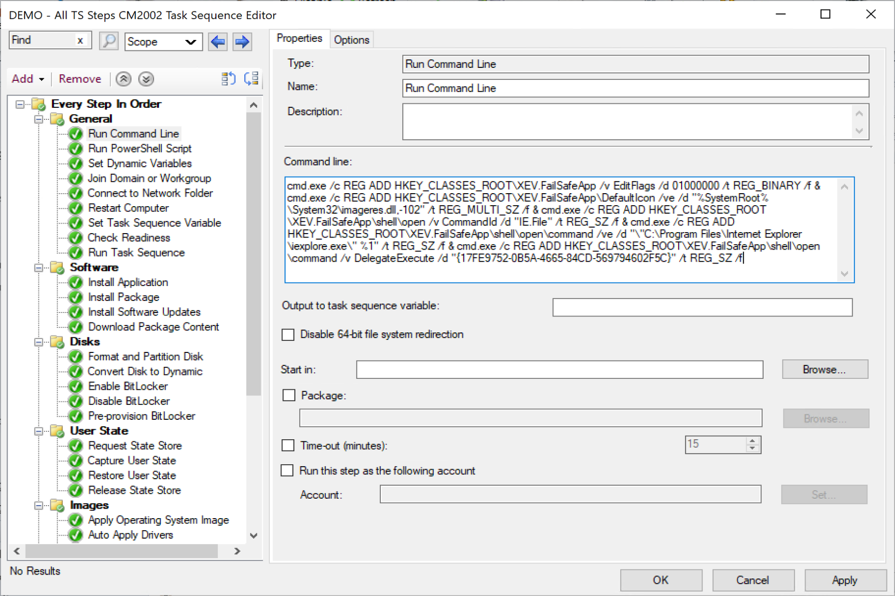
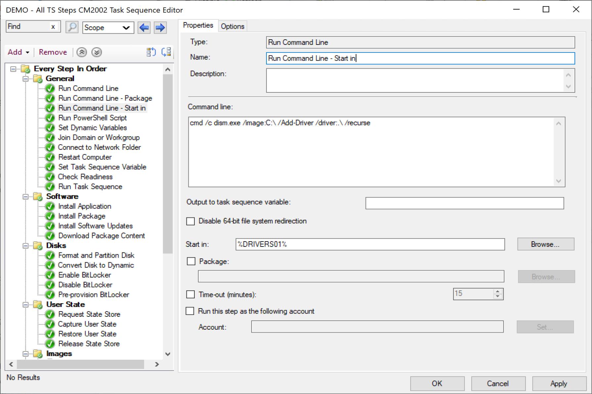
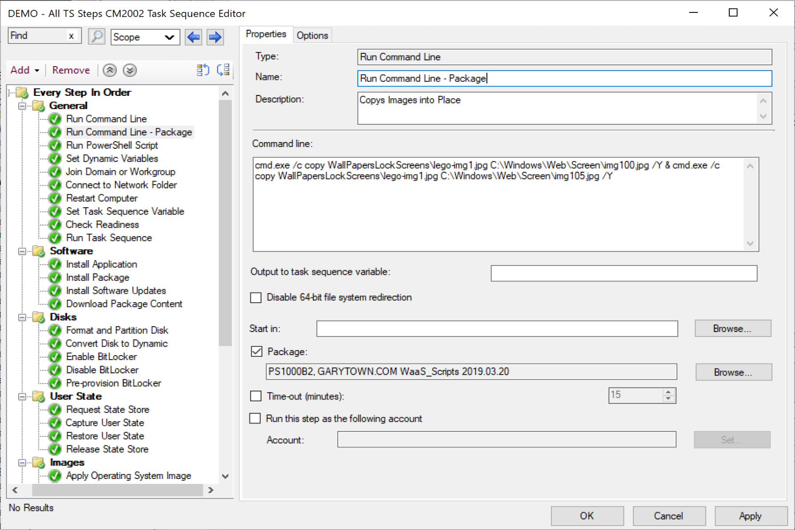
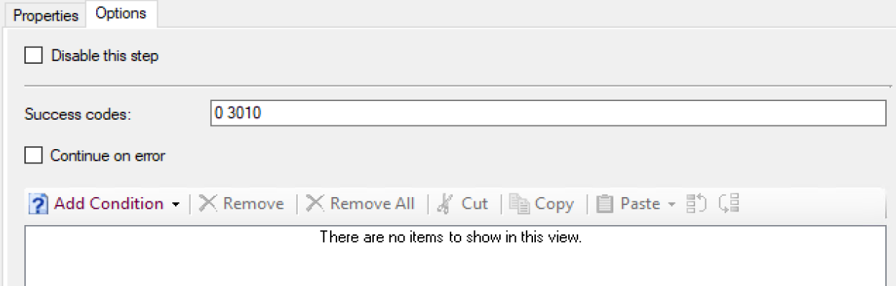

# Run Command Line

This step is documented pretty well, my goal is to add examples and relate some real world use cases vs just the straight up doc material.

## MS Docs

MS Docs: <https://docs.microsoft.com/en-us/mem/configmgr/osd/understand/task-sequence-steps#BKMK_RunCommandLine>  

Powershell:

- [Get-CMTSStepRunCommandLine](https://docs.microsoft.com/en-us/powershell/module/configurationmanager/Get-CMTSStepRunCommandLine?view=sccm-ps)
- [New-CMTSStepRunCommandLine](https://docs.microsoft.com/en-us/powershell/module/configurationmanager/New-CMTSStepRunCommandLine?view=sccm-ps)
- [Remove-CMTSStepRunCommandLine](https://docs.microsoft.com/en-us/powershell/module/configurationmanager/Remove-CMTSStepRunCommandLine?view=sccm-ps)
- [Set-CMTSStepRunCommandLine](https://docs.microsoft.com/en-us/powershell/module/configurationmanager/Set-CMTSStepRunCommandLine?view=sccm-ps)

The Run Command Line Step is like the swiss army knife of the TS Steps.  This is the equivalent of running a command in a command prompt, with elevated rights (Runs in the system context as does the entire Task Sequence).  
List of commands built into window you can leverage: <https://docs.microsoft.com/en-us/windows-server/administration/windows-commands/windows-commands>

### Other Options

**Output to task sequence variable:**  Whatever information is returned from the command is placed into the variable.
Examples:  
Ex variable field: "machinename"  
Ex Command Line: cmd.exe /c hostname  
The Variable would then have the return from that command (the computer name) and place it into the task sequence variable machinename.  

**Disable 64-bit file system redirection:** Disables the system from defaulting back to 32-bit windows exe's.  I've honestly never had to use this, but it's something to keep in your back pocket when troubleshooting why your step might not be working.

**Start in:**  Provides the ability to choose the "context" of where the command you're running will run against.  Let's say you've had a folder of c:\company\usefulstuff with a bunch of your tools in it, including MyUtil.exe.  You could set that folder as your "start in:" location, and then your command line could be "MyUtil.exe" instead of the full path.  
Example of how I use it is for applying drivers during OSD.  The Path of where the Drivers are located on the system are in a variable, and we then set the start in to that path:

**Package:**  A Standard Package of Files
Sometimes you need to have outside content, like a batch file, executable, you can place the contents in a package, then reference it in the step.  In this example the package referenced has some image files that are being copied over.

**Time-out (minutes):**
This is a protective measure to protect your task sequence from a runaway process.  Sometimes even with a lot of testing, a command you run hangs, and of course you're going to want to troubleshoot that and resolve the issue, but at the same point, if you're running an in place upgrade, the step is fairly insignificant for the overall process, you'll want it to continue on and not hang your TS and fail out.

**Run this step as the following account:**
The Task Sequence runs as the system account, if you're having the task sequence reach out to any network systems, unless the security is setup in a very insecure way, the task sequence isn't going to have any permissions to active your goals.  You'll need to provide an account that has the rights to do what you need.  Make sure you put some thought into using this feature, follow the least privilege method.

**Options Tab:**

The success codes are pre-populated with 0 and 3010.

### Common Failures

- Command line syntax:
  - Misspelled words
  - Copy and paste quotes
  - Not using cmd.exe /c in front of your command
    - Many command you run do not have an EXE associated with them, but are built in shell commands, if you try to run these without calling the command prompt first, the step will fail.
    - Ex: copy, move, echo, exit (see example in image above)
    - Link to more info: <https://docs.microsoft.com/en-us/archive/blogs/inside_osd/inside-the-run-command-line-action>
- Package issues
  - If you've associated a package with your step and are leveraging content from the package, there are several other things you'll need to keep your eyes on
    - File names and paths of files in the package
      - If you have subfolders in your package, make sure you use the relative path.  In my example above, I have a subfolder called "WallPaperLockScreens" and inside several images.  You can see in the syntax that I had to put the relative path to the image files so the copy command could find them.
    - Making sure the contents in the package match what you think. :-)
      - Often I'll make a change to a script or file, then forget to update the content and the step continues to fail.  Checking the file that was downloaded into the TS working directory to confirm it has the updates is a good way to troubleshoot if the script keeps failing.
    - File / Content not found, you'll see an error similar to this if you perhaps misspelled the file name, the path to the file, or if the file wasn't in your content.  On a rare occasion, I've had to recreate a package, and use that instead of the original if it wasn't updating properly.  

### Useful Tips

- I use the Command line step for troubleshooting.  Pausing the Task Sequence for testing.  This allows you to use the command prompt in a TS environment to test your scripts or syntax exactly like it would run in the TS.
  - WinPE: cmd.exe /c start /wait cmd.exe
  - Full OS: (Requires Package with ServiceUI) ServiceUI.exe -process:explorer.exe %SYSTEMROOT%\System32\WindowsPowershell\v1.0\powershell.exe -command (new-object -ComObject Microsoft.SMS.TsProgressUI).CloseProgressDialog() ; start-process -wait -filepath %SYSTEMROOT%\system32\cmd.exe
  - For Deeper Dive: <https://www.recastsoftware.com/blog/a-week-of-task-sequence-tips-day-02>  

**About Recast Software**
1 in 3 organizations using Microsoft Configuration Manager rely on Right Click Tools to surface vulnerabilities and remediate quicker than ever before.  
[Download Free Tools](https://www.recastsoftware.com/?utm_source=cmdocs&utm_medium=referral&utm_campaign=cmdocs#formarea)  
[Request Pricing](https://www.recastsoftware.com/pricing?utm_source=cmdocs&utm_medium=referral&utm_campaign=cmdocs)