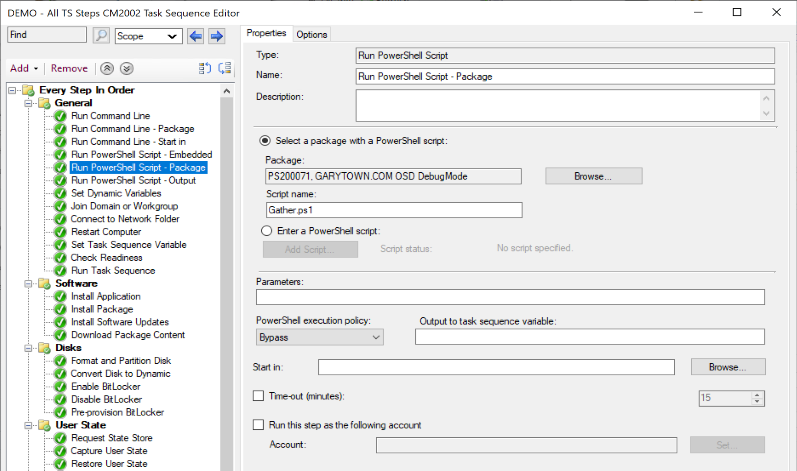
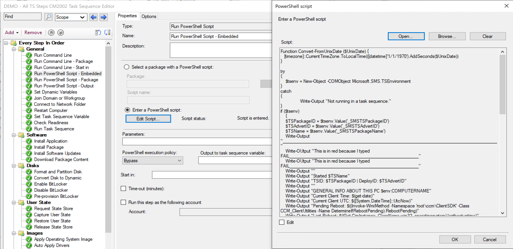
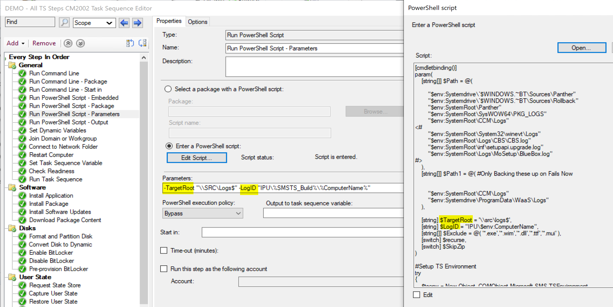
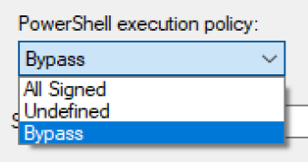
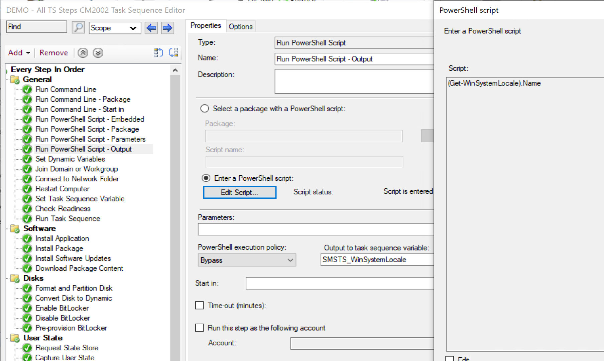
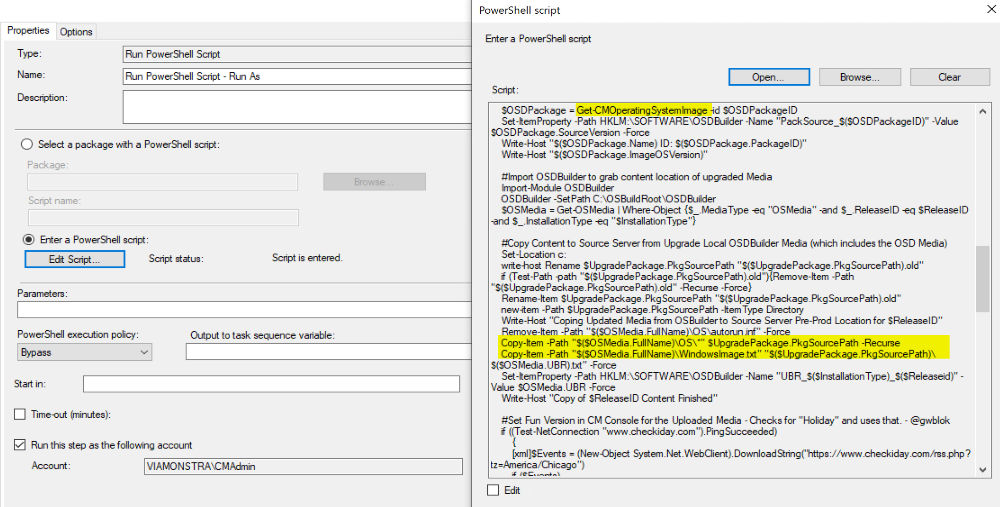
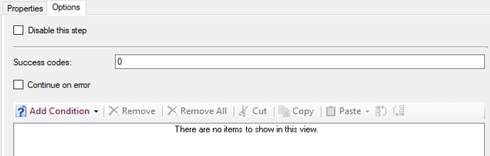
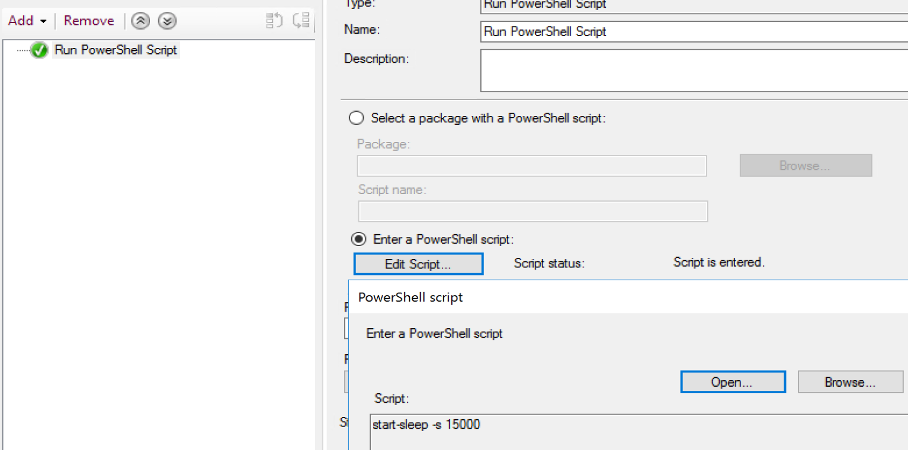
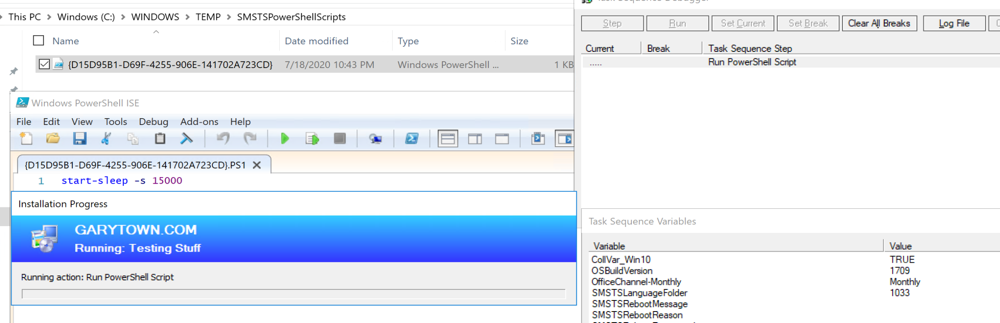

# Run PowerShell Script

This step is newer and pulled a lot of heavy lifting off of the run command line step.  Previously you had to call powershell.exe and then a file or command, now we can directly call a script, or embed a script.

## MS Docs

MS Docs: <https://docs.microsoft.com/en-us/mem/configmgr/osd/understand/task-sequence-steps#BKMK_RunPowerShellScript>

PowerShell:

- [Get-CMTSStepRunPowerShellScript](https://docs.microsoft.com/en-us/powershell/module/configurationmanager/Get-CMTSStepRunPowerShellScript?view=sccm-ps)
- [New-CMTSStepRunPowerShellScript](https://docs.microsoft.com/en-us/powershell/module/configurationmanager/New-CMTSStepRunPowerShellScript?view=sccm-ps)
- [Remove-CMTSStepRunPowerShellScript](https://docs.microsoft.com/en-us/powershell/module/configurationmanager/Remove-CMTSStepRunPowerShellScript?view=sccm-ps)
- [Set-CMTSStepRunPowerShellScript](https://docs.microsoft.com/en-us/powershell/module/configurationmanager/Set-CMTSStepRunPowerShellScript?view=sccm-ps)

**Important File Path:** c:\Windows\TEMP\SMSTSPowerShellScripts (make sure this is excluded from your AV rules)

This step too is documented very well on the docs site, but I'll continue to give examples of how it is used.  
Things to note, the embedded scripts feature, while it's super nice not having to associate a step with a package, there are still good reasons to NOT embed a script like the size of the script, or how it is used.  

- Size, typically if the script is getting much over 100 lines, I don't embed.  The longer the scripts and the more scripts you embed can cause your TS Policy to become too large and break things.  Check out this info on ideas of how to keep your TS Policy size smaller. [More Info on MS Docs](https://docs.microsoft.com/en-us/mem/configmgr/core/get-started/2020/technical-preview-2004#how-to-reduce-the-size-of-task-sequence-policy)
- Organization.  Let's say you use the same powershell script in several spots in a single or multiple task sequences, if you embed the script, you have to make sure you update each location, whereas if you reference a script, you only need to update the single script in the source, and all of the steps that rely on it are now updated.  
Those are things you'll need to think about as you leverage this powerful step.

### Step Settings

**Package with PowerShell Script:**

This is the basic functionality of the step when it was first released, point to a script in a package and you're done.  Since they have added additional options, which are great, but this is still a very important piece. Remember to set the PowerShell execution policy to bypass, unless you've had it signed.  In the example above, this is a step that I use in many task sequences to gather additional items, similar to MDT Gather, but without integrating MDT.  More info about this example can be found here: <https://garytown.com/so-long-mdt-native-cm-for-me>  
Because I use it in several places, I keep it a script so as I need to update the script to gather additional items, it updates all of my Task Sequences.

**Embedded PowerShell Script:**

Being able to Embed a script is super handy, and I've moved to doing this whenever it makes sense.  I started to go overboard then found it didn't make sense to embed everything, like in the example above.  It's nice to embed scripts as you no longer need to worry about distributing content.  Say you've found a bug in your script, a quick change to the script in the TS, and you can test again quickly vs changing the script in a package, updating the DPs and then running the TS again.  

**Parameters:**

If you use a script in a package or if you embed the script, you can use parameters.  The example above is an embedded script I use to copy logs to a server.  The location is in a parameter, and I even am able to leverage task sequence variables in the parameters (%SMSTS_Build% & %ComputerName%) to feed into the script.  You can see how powerful this can be, as you can then use the same script in different task sequences for different purposes, by feeding the scripts parameters.

**PowerShell execution policy:**  

I don't take time to sign my scripts and I've never been called out on it, so I don't bother, I always put this on bypass to make my life easy.  [More Info on MS Docs](https://docs.microsoft.com/en-us/mem/configmgr/osd/understand/task-sequence-steps#powershell-execution-policy)  

**Output to task sequence variable:**

Whatever information is returned from the command is placed into the variable.  In the example above, I'm running a simple powershell command (in an embedded script) which will output the system locale into a variable.  I use this in my upgrade task sequence to grab the language pack info, so I can re-apply it after upgrade.

**Time-out (minutes):**
This is a protective measure to protect your task sequence from a runaway process.  Sometimes even with a lot of testing, a command you run hangs, and of course you're going to want to troubleshoot that and resolve the issue, but at the same point, if you're running an in place upgrade, the step is fairly insignificant for the overall process, you'll want it to continue on and not hang your TS and fail out.

**Run this step as the following account:**
The Task Sequence runs as the system account, if you're having the task sequence reach out to any network systems, unless the security is setup in a very insecure way, the task sequence isn't going to have any permissions to active your goals.  You'll need to provide an account that has the rights to do what you need.  Make sure you put some thought into using this feature, follow the least privilege method.   In the example above, I'm running ConfigMgr powershell commands and doing file copies, so the account I'm using need to have permissions in both the CM Console and on the file system where I'm copying files.  

#### Options Tab

The success codes are pre-populated with 0 (not with 3010 like the run command line step)

### Demo

**Embedded Script in Action:**
Step: Embedded Script: start-sleep -s 15000

**When running:**

When running that step that has an embedded Script, it builds the PowerShell script in c:\Windows\TEMP\SMSTSPowerShellScripts, as shown in the image above.  Note, I used the Task Sequence Debugger to easily step through the Task Sequence.

### Common Failures

- Script Errors
  - Testing a script in a TS is very important, as how a PowerShell script acts when you're building it in your editor, vs running the script in a TS can be quite different.  You can spend a lot of trial and error in testing scripts which rely on different TS Vars.
- WinPE
  - By Default, the Windows PE in ConfigMgr doesn't support PowerShell, you'll need to add several optional components to support your scripts, and based on what you're doing, you'll need additional things.  Check the Windows PE PowerShell Support page for how to add requirements to your WinPE boot image to support PowerShell.
- Package issues
  - Make sure you've called the files by the right names and paths to match what are in your packages.
  - The Content in the package didn't update before you ran your test.

### Useful Tips

When I'm creating PowerShell Script to use in a Task Sequence, I typically test and develop from a paused task sequence environment. I'll pause a task sequence, launch ISE and test, test, test.  Once I get the output from the script I want, I run it in the Task Sequence process and see what happens, but being able to debug a PowerShell script in the task sequence environment can save a lot of time.  

### More information

- [Recast Blog - Run PowerShell Step](https://www.recastsoftware.com/blog/a-week-of-task-sequence-tips-day-07)
- [Recast Blog - Task Sequence Pause](https://www.recastsoftware.com/blog/a-week-of-task-sequence-tips-day-02)
- [Recast Blog - Variables Gather and Capture](https://www.recastsoftware.com/blog/a-week-of-task-sequence-tips-day-03)

**About Recast Software**
1 in 3 organizations using Microsoft Configuration Manager rely on Right Click Tools to surface vulnerabilities and remediate quicker than ever before.  
[Download Free Tools](https://www.recastsoftware.com/?utm_source=cmdocs&utm_medium=referral&utm_campaign=cmdocs#formarea)  
[Request Pricing](https://www.recastsoftware.com/pricing?utm_source=cmdocs&utm_medium=referral&utm_campaign=cmdocs)