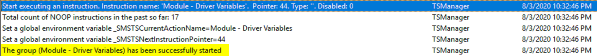

# Run Task Sequence

This step came about in the past couple of year, and totally changed the way we build task sequences.  It allows us to redesign our task sequences in a more logical, modular way.  Previously, you'd have a large task sequence, and you might have the same group of identical steps in several task sequences, and you'd have to go back an update each task sequence when you make a change to one to make sure they would stay in sync.  Now, along comes "Run Task Sequence", and we can pull out functions or groups of steps that might be leveraged in several other task sequences, or just a way to keep things organized.

## MS Docs

<https://docs.microsoft.com/en-us/mem/configmgr/osd/understand/task-sequence-steps#child-task-sequence>

## PowerShell

- [Get-CMTSStepRunTaskSequence](https://docs.microsoft.com/en-us/powershell/module/configurationmanager/get-cmtsstepruntasksequence?view=sccm-ps)
- [New-CMTSStepRunTaskSequence](https://docs.microsoft.com/en-us/powershell/module/configurationmanager/new-cmtsstepruntasksequence?view=sccm-ps)
- [Remove-CMTSStepRunTaskSequence](https://docs.microsoft.com/en-us/powershell/module/configurationmanager/remove-cmtsstepruntasksequence?view=sccm-ps)
- [Set-CMTSStepRunTaskSequence](https://docs.microsoft.com/en-us/powershell/module/configurationmanager/set-cmtsstepruntasksequence?view=sccm-ps)

[Example in script - GitHub](https://github.com/gwblok/garytown/blob/master/CreateCopyExportTS.ps1) - this script make a copy of a parent TS, looks through the parent, finds any "Run Task Sequence" Steps, and makes copies of all of those Task Sequences, then replaces the Parent TS Copy with the copies of all the Child Task Sequences, so you have a completely new set of Task Sequences for exporting or testing without worrying about modifying any of the original task sequences.

## Step Image

  

There are some things to consider, the one that typically gets me is that you can't call a task sequence that has associated boot media. Example of how I worked around this.
Recently I wanted to take a working OSD Task Sequence, and add a "Debug" Mode Front End to the Task Sequence without effecting the main production task sequence.  I created a new Task Sequence called "OSD Debug", then tried to add the primary OSD Task Sequence to it, but could not, because it had boot media associated with it.  Work-around.  Remove the Boot Media from the Main Task Sequence.  Create 2 New Task Sequences, OSD Production and OSD Debug.  Both have the Boot Media associated with them.  OSD Production was one step, Run Task Sequence and pointed at the Primary OSD Task Sequence.  OSD Debug added several steps, including a front end to create several variables to test the task sequences condition logic.  This worked great.

There are several other limitations list in the docs, so if you're wondering why something might not be behaving the way you expect, check that the [step limitations](https://docs.microsoft.com/en-us/mem/configmgr/osd/understand/task-sequence-steps#specifications-and-limitations-for-run-task-sequence)

## The Logs

  
  

You see in the logs, that it's not the most easy thing to pick out Child Task Sequences, as they are reported as Groups.  You will have to know the name of the Step, to find the information in logs.

## Potential Fixes

When I've had issues with odd things happening, content not showing properly, items in the child task sequence not working properly even though I know I made a change, a quick fix that has been good to me, in the parent, remove the "Run Task Sequence" step, save the Parent, go back in, and add the Step back.  That will refresh the policy and seems to resolve most of the issues I have with this step.

## Image of the Step in Production

  

**About Recast Software**
1 in 3 organizations using Microsoft Configuration Manager rely on Right Click Tools to surface vulnerabilities and remediate quicker than ever before.  
[Download Free Tools](https://www.recastsoftware.com/?utm_source=cmdocs&utm_medium=referral&utm_campaign=cmdocs#formarea)  
[Request Pricing](https://www.recastsoftware.com/pricing?utm_source=cmdocs&utm_medium=referral&utm_campaign=cmdocs)