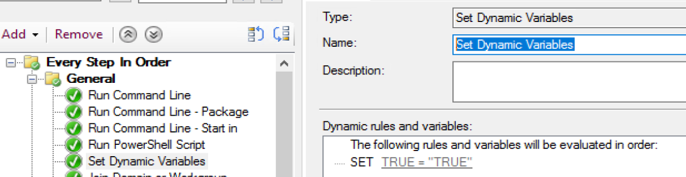
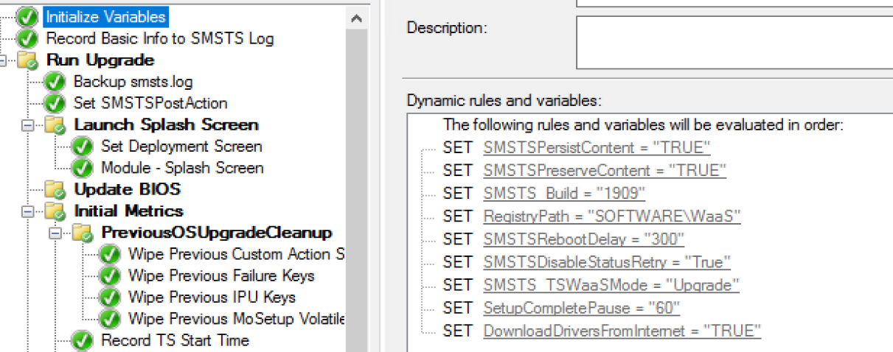
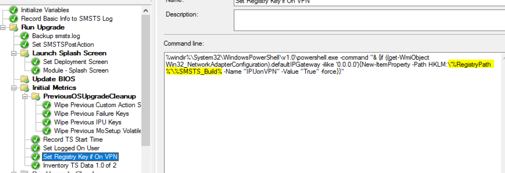
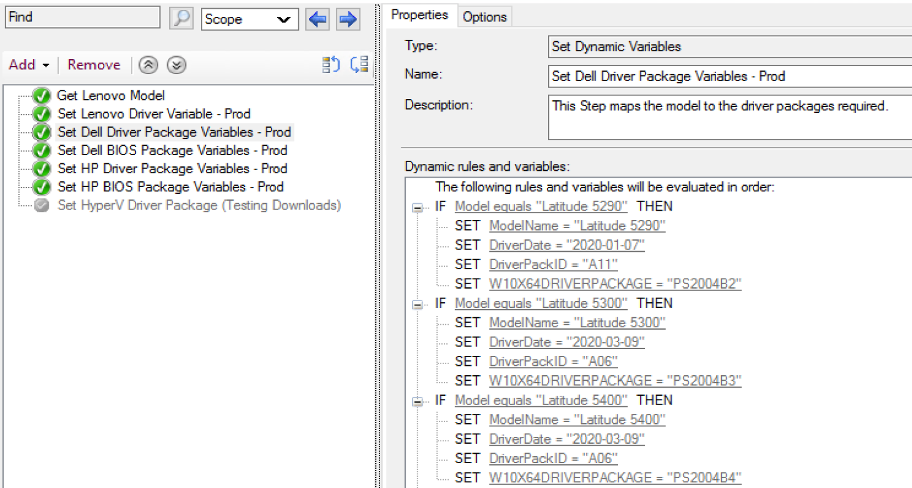

# Set Dynamic Variables

## MS Docs

MS Docs: <https://docs.microsoft.com/en-us/mem/configmgr/osd/understand/task-sequence-steps#BKMK_SetDynamicVariables>

PowerShell:

- [Get-CMTSStepSetDynamicVariable](https://docs.microsoft.com/en-us/powershell/module/configurationmanager/Get-CMTSStepSetDynamicVariable?view=sccm-ps)
- [New-CMTSStepSetDynamicVariable](https://docs.microsoft.com/en-us/powershell/module/configurationmanager/New-CMTSStepSetDynamicVariable?view=sccm-ps)
- [Remove-CMTSStepSetDynamicVariable](https://docs.microsoft.com/en-us/powershell/module/configurationmanager/Remove-CMTSStepSetDynamicVariable?view=sccm-ps)
- [Set-CMTSStepSetDynamicVariable](https://docs.microsoft.com/en-us/powershell/module/configurationmanager/Set-CMTSStepSetDynamicVariable?view=sccm-ps)

[PowerShell Example on GitHub](https://github.com/gwblok/garytown/blob/master/hardware/UpdateTSVariables_BIOS_Drivers.ps10)

Image:
  

This step allows you to set several variables all at the same time.  You can set several static variables, or use rules inside the step to set variables based on other criteria.

## Demos

### Example 1: Static

I will typically use one of these steps at the start of a task sequenced to get several things setup that will be used throughout the process.  Here is an example below from my in place upgrade task sequence of items that I set in the beginning.
  
Some of the Variables are built in ConfigMgr variables to control the task sequence behavior, and several are custom ones I created to make rest of the process more dynamic.  Like in this step below, I'm using two variables to set where the information will be written to in the registry.
  
Throughout the Task Sequence, I'll leverage those variables in different steps or scripts used in the process so then when we move from 1809 to 1909 to 2009, etc, all I have to do is come in here to this SMSTS_Build variable and change it, and all of my steps and scripts are updated automatically without a need to check out the code.

### Example 2: Rule Based

In this example, I have 4 unique variables that will be set to different things based on attributes of the machine it is running on.  The steps themselves have conditions to run based on the manufacturer of the machine, then based on the model of the machine, it will set additional variables.
  

### Nice to Know

This step, by just running it, will also activate several other variables that aren't lit by default in the task sequence, including the make & model variables. This is another reason I'll run this step at the start of the TS, to enable additional variables that can be leveraged later.

### More information

- [Recast Blog - Task Sequence Pause](https://www.recastsoftware.com/blog/a-week-of-task-sequence-tips-day-02)
- [Recast Blog - Variables Gather and Capture](https://www.recastsoftware.com/blog/a-week-of-task-sequence-tips-day-03)

For more information about variables, check out the [Variables Help Doc](Variables.md) I've created.

**About Recast Software**
1 in 3 organizations using Microsoft Configuration Manager rely on Right Click Tools to surface vulnerabilities and remediate quicker than ever before.  
[Download Free Tools](https://www.recastsoftware.com/?utm_source=cmdocs&utm_medium=referral&utm_campaign=cmdocs#formarea)  
[Request Pricing](https://www.recastsoftware.com/pricing?utm_source=cmdocs&utm_medium=referral&utm_campaign=cmdocs)