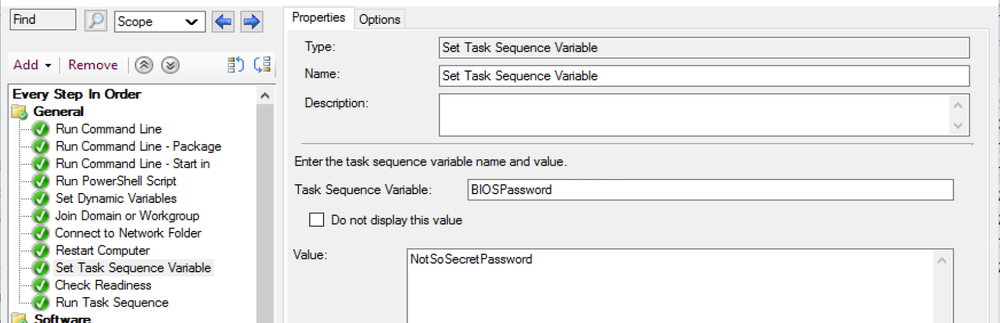
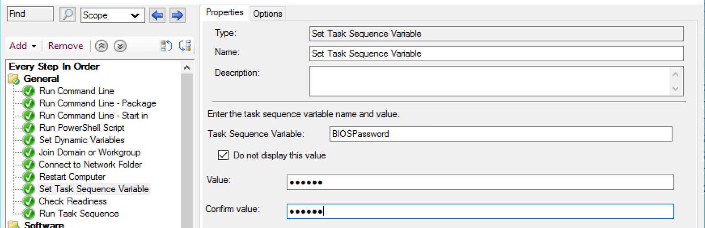

# Set Task Sequence Variable

## MS Docs

MS Docs: <https://docs.microsoft.com/en-us/mem/configmgr/osd/understand/task-sequence-steps#BKMK_SetTaskSequenceVariable>

PowerShell:

- [Get-CMTSStepSetVariable](https://docs.microsoft.com/en-us/powershell/module/configurationmanager/Get-CMTSStepSetVariable?view=sccm-ps)
- [New-CMTSStepSetVariable](https://docs.microsoft.com/en-us/powershell/module/configurationmanager/New-CMTSStepSetVariable?view=sccm-ps)
- [Remove-CMTSStepSetVariable](https://docs.microsoft.com/en-us/powershell/module/configurationmanager/Remove-CMTSStepSetVariable?view=sccm-ps)
- [Set-CMTSStepSetVariable](https://docs.microsoft.com/en-us/powershell/module/configurationmanager/Set-CMTSStepSetVariable?view=sccm-ps)

Use this step to set a single task sequence variable. This step allows you assign additional attributes to the variable that the dynamic variable step does not allow.

You can have the value visable or hidden to keep it more secure in the console.
  
  

While the variable might be hidden in the console, it is not hidden to the Task Sequence, and someone with access to the machine during deployment, if F8 console access is allowed could still dump the variables and find the information.

To use these variables, you can use powershell to pull them into your scripts via the com object, or using the command line step, you can call a varable much line in Windows. %TaskSequenceVariable%  

The Variables will also be shown in the SMSTS log when being used in a command line, so if you don't want some steps to record what is going on, you can use the variable [**OSDDoNotLogCommand**](https://docs.microsoft.com/en-us/mem/configmgr/osd/understand/task-sequence-variables#OSDDoNotLogCommand) to prevent it from being recorded.  

### Common Issues

I typically never see issues when running this step, as it's only setting a variable, and the Task Sequence really doesn't care what variable you're making or what you're setting it to.  The problem comes in when you're setting a varaiable to trigger something later on in the process, and it never triggers.  When that happens you'll have to confirm that the step ran to create the variable, and that it set it to what you're expecting.  The most common reason it doesn't get set is due to a condition on the step it self, or in a higher level group that the step is in.  If I run into problems with not having a variable set to what I'm expecting, I'll dump variables via a script after the step, use a pause, or enable task sequence debugger.  

### More Information

- [Recast Blog Docs - Variables](Variables.md)
- [Recast Blog - Task Sequence Pause](https://www.recastsoftware.com/blog/a-week-of-task-sequence-tips-day-02)
- [Recast Blog - Variables Gather and Capture](https://www.recastsoftware.com/blog/a-week-of-task-sequence-tips-day-03)

**About Recast Software**
1 in 3 organizations using Microsoft Configuration Manager rely on Right Click Tools to surface vulnerabilities and remediate quicker than ever before.  
[Download Free Tools](https://www.recastsoftware.com/?utm_source=cmdocs&utm_medium=referral&utm_campaign=cmdocs#formarea)  
[Request Pricing](https://www.recastsoftware.com/pricing?utm_source=cmdocs&utm_medium=referral&utm_campaign=cmdocs)