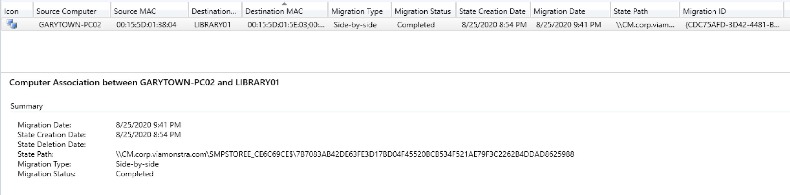
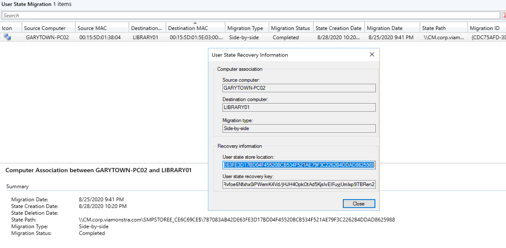
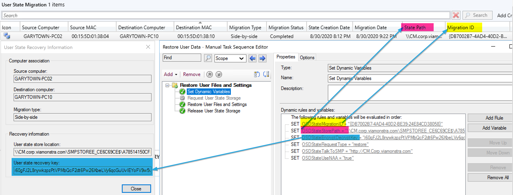

# User State

These four steps go together, and it's difficult to work with one without the others.  Demos will require all four working together, so I'm going to merge these four into a single page, which will get long.

Requirements for CM Backup: State Migration Point. [MS Docs](https://docs.microsoft.com/en-us/mem/configmgr/develop/osd/how-to-create-a-state-migration-point-role)  
USMT Info: [MS Docs](https://docs.microsoft.com/en-us/windows/deployment/usmt/usmt-requirements)

---

## Request State Store

This step will reach out to your ConfigMgr Environment, request a location to capture the user data to.  
**[MS Docs](https://docs.microsoft.com/en-us/mem/configmgr/osd/understand/task-sequence-steps#BKMK_RequestStateStore)**

### Variables

- [OSDStateFallbackToNAA](https://docs.microsoft.com/en-us/mem/configmgr/osd/understand/task-sequence-variables#OSDStateFallbackToNAA)
- [OSDStateSMPRetryCount](https://docs.microsoft.com/en-us/mem/configmgr/osd/understand/task-sequence-variables#OSDStateSMPRetryCount)
- [OSDStateSMPRetryTime](https://docs.microsoft.com/en-us/mem/configmgr/osd/understand/task-sequence-variables#OSDStateSMPRetryTime)
- [OSDStateStorePath](https://docs.microsoft.com/en-us/mem/configmgr/osd/understand/task-sequence-variables#OSDStateStorePath)

### PowerShell

- [Get-CMTSStepRequestStateStore](https://docs.microsoft.com/en-us/powershell/module/configurationmanager/Get-CMTSStepRequestStateStore?view=sccm-ps)
- [New-CMTSStepRequestStateStore](https://docs.microsoft.com/en-us/powershell/module/configurationmanager/New-CMTSStepRequestStateStore?view=sccm-ps)
- [Remove-CMTSStepRequestStateStore](https://docs.microsoft.com/en-us/powershell/module/configurationmanager/Remove-CMTSStepRequestStateStore?view=sccm-ps)
- [Set-CMTSStepRequestStateStore](https://docs.microsoft.com/en-us/powershell/module/configurationmanager/Set-CMTSStepRequestStateStore?view=sccm-ps)

---

## Capture User State

This is the step that does the heavy lifting, it downloads the USMT Package, then runs the command to grab the items specified in the xml.

**[MS Docs](https://docs.microsoft.com/en-us/mem/configmgr/osd/understand/task-sequence-steps#BKMK_CaptureUserState)**

### Variables

- _OSDMigrateUseHardlinks - Used for condition on Format Step
- [_OSDMigrateUsmtPackageID](https://docs.microsoft.com/en-us/mem/configmgr/osd/understand/task-sequence-variables#OSDMigrateUsmtPackageID)
- [OSDMigrateAdditionalCaptureOptions](https://docs.microsoft.com/en-us/mem/configmgr/osd/understand/task-sequence-variables#OSDMigrateAdditionalCaptureOptions)
- [OSDMigrateConfigFiles](https://docs.microsoft.com/en-us/mem/configmgr/osd/understand/task-sequence-variables#OSDMigrateConfigFiles)
- [OSDMigrateContinueOnLockedFiles](https://docs.microsoft.com/en-us/mem/configmgr/osd/understand/task-sequence-variables#OSDMigrateContinueOnLockedFiles)
- [OSDMigrateEnableVerboseLogging](https://docs.microsoft.com/en-us/mem/configmgr/osd/understand/task-sequence-variables#OSDMigrateEnableVerboseLogging)
- [OSDMigrateMode](https://docs.microsoft.com/en-us/mem/configmgr/osd/understand/task-sequence-variables#OSDMigrateMode)
- [OSDMigrateSkipEncryptedFiles](https://docs.microsoft.com/en-us/mem/configmgr/osd/understand/task-sequence-variables#OSDMigrateSkipEncryptedFiles)
- [OSDStateStorePath](https://docs.microsoft.com/en-us/mem/configmgr/osd/understand/task-sequence-variables#OSDStateStorePath)

### PowerShell

- [Get-CMTSStepCaptureUserState](https://docs.microsoft.com/en-us/powershell/module/configurationmanager/Get-CMTSStepCaptureUserState?view=sccm-ps)
- [New-CMTSStepCaptureUserState](https://docs.microsoft.com/en-us/powershell/module/configurationmanager/New-CMTSStepCaptureUserState?view=sccm-ps)
- [Remove-CMTSStepCaptureUserState](https://docs.microsoft.com/en-us/powershell/module/configurationmanager/Remove-CMTSStepCaptureUserState?view=sccm-ps)
- [Set-CMTSStepCaptureUserState](https://docs.microsoft.com/en-us/powershell/module/configurationmanager/Set-CMTSStepCaptureUserState?view=sccm-ps)

---

## Restore User State

 This is the step that restores the data you captured earlier.

**[MS Docs](https://docs.microsoft.com/en-us/mem/configmgr/osd/understand/task-sequence-steps#BKMK_RestoreUserState)**

### Variables

- [_OSDMigrateUsmtRestorePackageID](https://docs.microsoft.com/en-us/mem/configmgr/osd/understand/task-sequence-variables#OSDMigrateUsmtRestorePackageID)
- [OSDMigrateAdditionalRestoreOptions](https://docs.microsoft.com/en-us/mem/configmgr/osd/understand/task-sequence-variables#OSDMigrateAdditionalRestoreOptions)
- [OSDMigrateContinueOnRestore](https://docs.microsoft.com/en-us/mem/configmgr/osd/understand/task-sequence-variables#OSDMigrateContinueOnRestore)
- [OSDMigrateEnableVerboseLogging](https://docs.microsoft.com/en-us/mem/configmgr/osd/understand/task-sequence-variables#OSDMigrateEnableVerboseLogging)
- [OSDMigrateLocalAccounts](https://docs.microsoft.com/en-us/mem/configmgr/osd/understand/task-sequence-variables#OSDMigrateLocalAccounts)
- [OSDMigrateLocalAccountPassword](https://docs.microsoft.com/en-us/mem/configmgr/osd/understand/task-sequence-variables#OSDMigrateLocalAccountPassword)
- [OSDStateStorePath](https://docs.microsoft.com/en-us/mem/configmgr/osd/understand/task-sequence-variables#OSDStateStorePath)

### PowerShell

- [Get-CMTSStepRestoreUserState](https://docs.microsoft.com/en-us/powershell/module/configurationmanager/Get-CMTSStepRestoreUserState?view=sccm-ps)
- [New-CMTSStepRestoreUserState](https://docs.microsoft.com/en-us/powershell/module/configurationmanager/New-CMTSStepRestoreUserState?view=sccm-ps)
- [Remove-CMTSStepRestoreUserState](https://docs.microsoft.com/en-us/powershell/module/configurationmanager/Remove-CMTSStepRestoreUserState?view=sccm-ps)
- [Set-CMTSStepRestoreUserState](https://docs.microsoft.com/en-us/powershell/module/configurationmanager/Set-CMTSStepRestoreUserState?view=sccm-ps)

---

## Release State Store

**[MS Docs](https://docs.microsoft.com/en-us/mem/configmgr/osd/understand/task-sequence-steps#BKMK_ReleaseStateStore)**

### Variables

- [OSDStateStorePath](https://docs.microsoft.com/en-us/mem/configmgr/osd/understand/task-sequence-variables#OSDStateStorePath)

### PowerShell

- [Get-CMTSStepReleaseStateStore](https://docs.microsoft.com/en-us/powershell/module/configurationmanager/Get-CMTSStepReleaseStateStore?view=sccm-ps)
- [New-CMTSStepReleaseStateStore](https://docs.microsoft.com/en-us/powershell/module/configurationmanager/New-CMTSStepReleaseStateStore?view=sccm-ps)
- [Remove-CMTSStepReleaseStateStore](https://docs.microsoft.com/en-us/powershell/module/configurationmanager/Remove-CMTSStepReleaseStateStore?view=sccm-ps)
- [Set-CMTSStepReleaseStateStore](https://docs.microsoft.com/en-us/powershell/module/configurationmanager/Set-CMTSStepReleaseStateStore?view=sccm-ps)

---

## LogFiles

There are several logs to use to follow the process of USMT, the overall would be the SMSTS.log file, but while the SMSTS.log sits on one line "Executing command line.... scanstate.exe / loadstate.exe...." there are several things going on behind the scenes, so you'd look for the approprate log.  The log will be in the SMSTSLOG subfolder while the TS is running, or merged in after. More info on [MS Docs](https://docs.microsoft.com/en-us/windows/deployment/usmt/usmt-log-files#scanstate-and-loadstate-logs)

- SMSTS.log
- scanstate.log
- scanstateprogress.log
- loadstate.log
- loadstateprogress.log

## State Migration Point

[](media/UserState01.png)
[](media/UserState02.png)

## Demos

### Demo - Standard Setup, Defaults, Same Computer (Wipe & Load)

Here is what MS creates when you build a TS using the wizard:
[](media/UserState04.png)
And here it is in action:  
[](media/UserState03.png)
You can see that it executes the scanstate.exe with a custom command line.
Then below you'll see it restoring the data after the machine was reimaged (Wipe and Load)
[](media/UserState05.png)

Request State Store:
[](media/UserState09.png)

Capture User State:
[](media/UserState07.png)
[](media/UserState10.png)
Here the step initiates the download of the USMT Package, builds the scanstate commandline based on the variables (based on the options in the steps), makes the connection to server based on the request state store information, and triggers the user state backup to the server.

Release State Store:
[](media/UserState11.png)
[](media/UserState12.png)
This step removes the connection to the server

Variables used in TS, the store path gets wiped after you release the state store.
[](media/UserState06.png)

On the Server:
[](media/UserState13.png)
[](media/UserState14.png)
The Console shows that it both Backed up and Restored (Migration Status).  Provides vital information about the user backup. Going to the path, you can see it created a USMT.MIG file

### Demo  - Leveraging OSDMigrateAdditionalCaptureOptions Variable

In this demo, I'm adding some command line syntax, while this example doesn't make logical sense, as I'll explain, it's just an example.

- /uel:30 = Only Capture Profiles that have been active in the past 30 days  
- /ue **\\\** /ui:viamonstra\recast = exclude all user accounts EXCEPT the recast account in the viamonstra domain.
- Additonal info for the command line syntax on [MS Docs](https://docs.microsoft.com/en-us/windows/deployment/usmt/usmt-scanstate-syntax)  

Since I'm specifically telling the scan tool to grab only one profile, there really isn't a point in telling it to avoid profiles older than 30 days.  But I added it just to show how you can add several extra parameters to the command.

In this image, the variable has been set before I run the capture step.
[](media/UserState51.png)

This is the scanstateprogress.log
[](media/UserState52.png)
It shows that it ignores all profiles but the one I told it to grab.

### Demo - Standard Setup, Defaults, Replacement Computer (Side-by-Side)

Making the Connection in the Console:  
[](media/UserState15.png)
[](media/UserState21.png)

The Capture Task Sequence:  
[](media/UserState17.png)
Triggering TS on Source Machine:
[](media/UserState18.png)
Checking the Console Now:
[](media/UserState22.png)
You can see that it updated the information, it has the store path, and time it was captured. Now lets run the OSD TS on the Destination PC and updated to "In Progress"

Starting OSD on the Destination Computer:
[](media/UserState20.png)  
The Machine Installs the OS and when it gets to the restore state, it reaches out to the MP and finds that there was user data to transfer, then copies it over creating the profile for the users that were backed up on the old machine.

[](media/UserState23.png)
[](media/UserState24.png)
[](media/UserState25.png)

So there we see the results of a successful transfer.  The Console has updated, the destination has the files from the source, and the source has the scanstate logs, and the destination the loadstate logs.

### Demo - Refresh - Keep USMT Data on local drive

This process is nice if you don't have a fast connection back to the State Migration Point Server, and you need to keep the data local the entire time. It speeds up the entire process by keeping the data local.  If you're going to use this method, I recommend reading this [MS Doc](https://docs.microsoft.com/en-us/windows/deployment/usmt/usmt-hard-link-migration-store)

The Task Sequence Step: Capture locally by using links
[](media/UserState28.png)
[](media/UserState34.png)
For local hardlinks, make sure you disable the Request & Release User State Storage Steps, or you'll get errors.

Make sure your format step has the condition on it!
[](media/UserState29.png)
And you can pick the location for USMT with a variable.  
[](media/UserState31.png)
When it kicks off the Capture, you can see our location is being used.
[](media/UserState3.png)
Below on the Apply Image step, you can see it performs a few extra things: Wiping C:\, Setting areas not to be wiped, then starting the wipe process.
[](media/UserState32.png)
Once the Wipe is complete, it starts to apply the image to the drive.
[](media/UserState33.png)
After it applies the OS, it installs the CM Client and reboots into the full os, shortly after it runs the step to restore the user data.
[](media/UserState36.png)

On the Machine after logon, you can see the files have been restored.  The USMTDemo folder was also cleaned up after the migration.
[](media/UserState37.png)

### Demo - Side by Side - Recovering from Failed Transfer on new machine  

In this demo, we'll simulate an OSD Failure on the destination machine. We'll look at the results, then see what we can do to recover.
Setup: Source = PC02 | Destination = PC10
[](media/UserState38.png)

I Ran the Capture TS on PC02:
[](media/UserState39.png)

Alright, so now lets start OSD on PC10.
And for this Demo, I'll let the Restore Complete, then Kill OSD.  
[](media/UserState40.png)
Now lets Restart OSD and see how CM Responds to the Same Computer Requesting the Data backup the second time.
[](media/UserState41.png)
You can see, even though th console says complete, it's running the restore without a problem.  So that's good news.  It did finish successfully.

### Demo - Capture User Data in WinPE

You can run this step in WinPE, however I had to make a couple changes to make this work.  
First, I had to check the box to allow it to use the Network Access Account:
[UserState 53](media/UserState53.png)](media/UserState53.png)

And update the OSDMigrateAdditionalCaptureOptions

```
/offlinewindir:c:\windows
```

[](media/UserState54.png)
[](media/UserState55.png)

When Completed:
[](media/UserState56.png)

Make sure you deal with any encryption before rebooting into WinPE if you want to backup the data!

### Demo - Manually Extracting the .MIG file

Lets say you ran the capture process, and it uploaded to the server, and you restored it, but for whatever reason you find yourself needing to grab some individual files from the backup.  In the USMT package, there is an exe called usmtutils.exe which you can use to extract the MIG file. [MS Docs](https://docs.microsoft.com/en-us/windows/deployment/usmt/usmt-utilities#bkmk-extractoptions)

Requirements:

- Files: (Taken from the USMT Package)
  - usmtutils.exe
  - migcore.dll
  - migstore.dll
  - unbcl.dll
- Encryption Key (Taken from CM Console)
- Mig File Location (Take from CM Console)
- Administrator Rights

Command line example:  

```
usmtutils.exe /extract c:\usmt.mig c:\usmtextract /decrypt /key:73k3hn3k3k1kasdfkljhe1
```

In this demo, I grabbed the information from the CM Console
[](media/UserStateTrouble04.png)
I copied the 4 files into a folder (c:\USMT)  
I wrote a simple script to plug in the values and trigger usmtutils:  
[](media/UserStateTrouble03.png)
After the extract finished:
[](media/UserStateTrouble05.png)
Now you can grab the files you need without restoring to a computer during the TS.

## Cheat the System - Restoring Data

### Demo: Restore the data from State Migration Point to another computer using the Restore TS Steps

In this situation, the recovery was already complete, but I wanted redirect the backup to a completely different computer.  
I started by using several of the variables not in the docs to create the settings needed.

Required Variables:  

- **OSDStateMigrationID** - From CM Console
- **OSDStateStorePath** - From CM Console: The location of the USMT.MIG backup.
- **OSDStateEncryptDecryptKey** - From CM Console
- **OSDStateRequestType** - set to Restore
- **OSDStateTalkToSMP** - Server Name of the Migration Point
- **OSDStateUseNAA** - Set to True*  (Talked about more shortly)

[](media/UserState47.png)

Attempt 1 was with OSDStateUseNAA = False: FAILED, Access Denied to Storage  
Attempt 2 was with OSDStateUseNAA = True: FAILED, Access Denied to Storage  
Attempt 3 added my NAA Account to have Read permissions on the State Migration Point Share.
  

Once I did that, I decided to run the restore on PC08  
[](media/UserState46.png)
[](media/UserState45.png)

### Demo: Restore data by coping Local and running Restore Steps

If you don't want to add NAA to your Restore Point, this is another option, and overall, it might be easier.  

- **OSDStateStorePath** - Manually Set to C:\USMTDemo
- **OSDStateEncryptDecryptKey** - From CM Console
- **OSDStateRequestType** - set to Restore

Copy the USMT File from the Migration Point local, for this demo I used C:\USMTDemo (C:\USMTDemo\USMT\USMT.mig)  
I then setup my TS
[](media/UserState49.png)
You will still need to grab the Key from the Server for the backup you want to restore.  
Then I pick my Demo machine, one I haven't used before (PC06) and copy the USMT file local and trigger the new Restore Task Sequence. You can see below, that it grabs the variables, finds the USMT file and restores it.  
[](media/UserState48.png)
After complete, I can see it added the cmadmin account folders and populated the files from the USMT.
[](media/UserState50.png)

While these demos wouldn't be a normal thing to do, in a pinch if you need to restore the data to another machine, you now have another option besides using straight up command lines.

## Errors

When I was testing, I ran into a few problems, mostly around keeping the data local (Demo 3) as I had learned I needed to disable the request and release state storage steps, or you get an error like so, USMT: 0x00000006  TS:0x00004005
[](media/UserStateTrouble02.png)
Another error I received was forgetting to skip the format step.  The machine errored when trying to format the drive as the USMT Folder created with the local storage transfer (hardlinking) was set to protected, and I received this error: 0x00000005 (Code 5)
[](media/UserStateTrouble01.png)
To Resolve, I ran diskpart clean to reset my test, then I added the condition on the format section of the TS to skip by setting the condition with _OSDMigrateUseHardlinks

## Tips

This tip from Herman van Drie
(@hvandrie), "My experience with USMT hard-linked is you definitely want to run chkdsk before running usmt scan."

**About Recast Software**
1 in 3 organizations using Microsoft Configuration Manager rely on Right Click Tools to surface vulnerabilities and remediate quicker than ever before.  
[Download Free Tools](https://www.recastsoftware.com/?utm_source=cmdocs&utm_medium=referral&utm_campaign=cmdocs#formarea)  
[Request Pricing](https://www.recastsoftware.com/pricing?utm_source=cmdocs&utm_medium=referral&utm_campaign=cmdocs)
