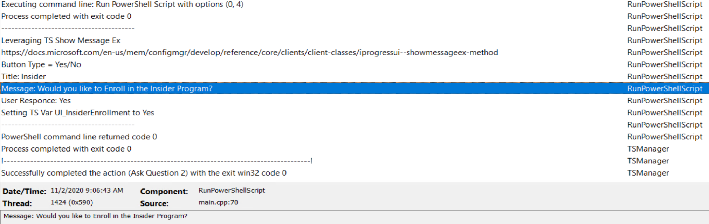

# Task Sequence COM Object

There are a couple of COM Objects you might use in your scripts while creating your Task Sequence.  The most Common on is connecting to the Task Sequence Environment.

The other would be connecting to the Progress UI and using it to display custom error messages or popping a question up for user interaction.

## Progress UI

### MS Docs

<https://docs.microsoft.com/en-us/mem/configmgr/develop/reference/core/clients/client-classes/progressui-client-com-automation-class>

For custom error reporting, I start with a script by Noah Swanson, which he hosts on GitHub:

- [Script Blog](https://ndswanson.wordpress.com/2016/01/02/task-sequence-powershell-module/)
- [Github Script](https://github.com/sombrerosheep/TaskSequenceModule/blob/master/SCCM-TSEnvironment.psm1)

I make minor modifications and leverage it for several things, some error messages and some just for user notification summary.

This script will allow you to leverage these different items:

- Error Reporting
- Notifications
- Progress Bar | Action Bar (Sub bar)
- Variables

New in CM2006
 This release adds the IProgressUI::ShowMessageEx method. This new method is similar to the existing method, but also includes a new integer result variable, pResult.

 <https://docs.microsoft.com/en-us/mem/configmgr/develop/reference/core/clients/client-classes/iprogressui--showmessageex-method>

 ```PowerShell
#Connect to TS Progress UI
$TaskSequenceProgressUi = New-Object -ComObject "Microsoft.SMS.TSProgressUI"
#Close Progress Bar
$TaskSequenceProgressUi.CloseProgressDialog()  
#Trigger Message Dialog
$TaskSequenceProgressUi.ShowMessageEx($Message, $Title, $Type, [ref]$Output)  
#Launches TS Error Dialog Box
$TaskSequenceProgressUi.ShowErrorDialog($OrganizationName, $TSPackageName, $CustomTitle, $ErrorMessage, $ErrorCode, $TimeoutInSeconds, $Reboot)  
 ```

When you run Get-Member on the COMObject, you can see all of your options and the required inputs.  Gives you a nice starting point to start testing.

 ``` Output
PS D:\_SMSTaskSequence\Packages\PS200071> $TaskSequenceProgressUi | Get-Member


   TypeName: System.__ComObject#{b64d758a-01c2-4bf0-9f17-621efb9cf697}

Name                           MemberType Definition
----                           ---------- ----------
CloseProgressDialog            Method     void CloseProgressDialog ()
ShowActionDetailedProgress     Method     void ShowActionDetailedProgress (string, string, string, string, uint, uint, string, uint, uint, uint)
ShowActionProgress             Method     void ShowActionProgress (string, string, string, string, uint, uint, string, uint, uint)
ShowErrorDialog                Method     void ShowErrorDialog (string, string, string, string, uint, uint, int, string)
ShowMessage                    Method     void ShowMessage (string, string, uint)
ShowMessageEx                  Method     void ShowMessageEx (string, string, uint, int)
ShowRebootDialog               Method     void ShowRebootDialog (string, string, string, string, uint)
ShowSwapMediaDialog            Method     void ShowSwapMediaDialog (string, uint)
ShowTSDetailedProgress         Method     void ShowTSDetailedProgress (string, string, string, string, uint, uint, uint)
ShowTSDetailedProgressComplete Method     void ShowTSDetailedProgressComplete (string, string, string, string, uint, uint, uint)
ShowTSProgress                 Method     void ShowTSProgress (string, string, string, string, uint, uint)
ShowTSProgressComplete         Method     void ShowTSProgressComplete (string, string, string, string, uint, uint)
 ```

## Task Sequence Environment

 One that is used most often is connecting to the environment, so you can grab or create task sequence variables.

### MS Docs

 <https://docs.microsoft.com/en-us/mem/configmgr/develop/osd/how-to-use-task-sequence-variables-in-a-running-task-sequence>

```PowerShell
#Connect to TS Environment
$TSEnv = New-Object -ComObject "Microsoft.SMS.TSEnvironment"  
#Set TS Variable to the value in $Output  
$TSEnv.Value("$TSVarName") = $Output  
# Set PS Variable $Model to TS Variable Value _SMSTSModel
$Model = $TSEnv.Value("_SMSTSModel")  

 ```

 ``` Output
PS D:\_SMSTaskSequence\Packages\PS200071> $TSEnv | Get-Member


   TypeName: System.__ComObject#{063b1ab6-598f-49d9-9b6d-68163476355f}

Name         MemberType            Definition
----         ----------            ----------
Clear        Method                void Clear ()
Create       Method                void Create ()
GetVariables Method                Variant GetVariables ()
Value        ParameterizedProperty string Value (string) {get} {set}
 ```

### Demo 1 - Custom Script - Pop Message, Capture Feedback to TS Variable

Code Example Step on my [GitHub](https://github.com/gwblok/garytown/blob/master/CM_PowerShell_Snips/TS_ProgressUI_showmessageex.ps1), the code from that script is in a "Run PowerShell Script" Step and everything else is controlled via Parameters.  

Options for Button Types:

- 0 - Ok
- 1 - Ok/Cancel
- 2 - Abort/Retry/Ignore
- 3 - Yes/No/Cancel
- 4 - Yes/No
- 5 - Retry/Cancel
- 6 - Cancel/Try Again/Continue

Output by Button: (Return Values)

- 1 = OK
- 2 = Cancel
- 4 = Retry
- 6 = YES
- 7 = NO
- 10 = Try Again
- 11 = Continue

The script needs you to provide the Button Type (0-6), Title, Message, and the name of the Variable you want the output placed into.

I have 2 steps which both call the same script with different parameters to display different message types
[](media/ComObject01.png)
[](media/ComObject02.png)

Step "Ask Question 1" displays:  
  

And writes this information to the log:
[](media/ComObject04.png)

Step "Ask Question 2" displays:  
  

And writes this information to the log:
[](media/ComObject06.png)  

The Step (Script) records information to the SMSTS Log to assist with troubleshooting.

[](media/ComObject07.png)

Here the variables confirm what the Dialog Boxes have output.  You could then take action by running additional groups or steps based on that user interaction.
You could also create conditions on those popup messages to only run in some situations, like if a user is logged on.

### Demo 2 - Custom Error Dialog by leveraging Noah's script from GitHub

This script is quite nice, and just reading it over will give you a lot of insights.  Here is the function I use most of the time, and for this example:
[](media/ComObject08.png)
[](media/ComObject09.png)
[](media/ComObject11.png)

What I'm using it for is displaying information at the end of a Task Sequence.  I collect several important data points, and have it launch at the end, to provide the info.

Another way that I've leveraged the error dialog was using Adam's method, populating the variables and launching it via a command prompt, see his [post on his Blog](https://www.asquaredozen.com/2018/12/14/building-an-even-better-task-sequence/).

## ProgressUI | Show Action Progress

### MS Docs

<https://docs.microsoft.com/en-us/mem/configmgr/develop/reference/core/clients/client-classes/iprogressui--showactionprogress-method>

This code was copied from: <https://github.com/sombrerosheep/TaskSequenceModule/blob/master/SCCM-TSEnvironment.psm1>

This first function sets up the TaskSequence Progress UI

``` PowerShell
function Confirm-TSProgressUISetup(){
    if ($Script:TaskSequenceProgressUi -eq $null){
        try{$Script:TaskSequenceProgressUi = New-Object -ComObject Microsoft.SMS.TSProgressUI}
        catch{throw "Unable to connect to the Task Sequence Progress UI! Please verify you are in a running Task Sequence Environment. Please note: TSProgressUI cannot be loaded during a prestart command.`n`nErrorDetails:`n$_"}
        }
    }
```

This next function sets up the TaskSequence Environment

``` PowerShell
function Confirm-TSEnvironmentSetup(){
    if ($Script:TaskSequenceEnvironment -eq $null){
        try{$Script:TaskSequenceEnvironment = New-Object -ComObject Microsoft.SMS.TSEnvironment}
        catch{throw "Unable to connect to the Task Sequence Environment! Please verify you are in a running Task Sequence Environment.`n`nErrorDetails:`n$_"}
        }
    }
```

Those first two help setup this one, the one that allows you to simply trigger the Action.

``` PowerShell
function Show-TSActionProgress()
{

    param(
        [Parameter(Mandatory=$true)]
        [string] $Message,
        [Parameter(Mandatory=$true)]
        [long] $Step,
        [Parameter(Mandatory=$true)]
        [long] $MaxStep
    )

    Confirm-TSProgressUISetup
    Confirm-TSEnvironmentSetup

    $Script:TaskSequenceProgressUi.ShowActionProgress(`
        $Script:TaskSequenceEnvironment.Value("_SMSTSOrgName"),`
        $Script:TaskSequenceEnvironment.Value("_SMSTSPackageName"),`
        $Script:TaskSequenceEnvironment.Value("_SMSTSCustomProgressDialogMessage"),`
        $Script:TaskSequenceEnvironment.Value("_SMSTSCurrentActionName"),`
        [Convert]::ToUInt32($Script:TaskSequenceEnvironment.Value("_SMSTSNextInstructionPointer")),`
        [Convert]::ToUInt32($Script:TaskSequenceEnvironment.Value("_SMSTSInstructionTableSize")),`
        $Message,`
        $Step,`
        $MaxStep)
}
```

The Code used in a Script in a Task Sequence, just a small portion.  In this example I'm statically changing the status of the Action Bar to allow the person watching to see that this script is making progress and give a little insight into what is going on in the script.  This isn't needed, it's more like icing.

```PowerShell
Write-Output "Starting Download Process"
if (!(test-path "$DriverPath")){New-Item -Path $DriverPath -ItemType Directory | Out-Null}
Remove-Item -path $DriverPath -Recurse -Force
New-Item -Path $DriverPath -ItemType Directory | Out-Null
if (test-path "$ExpandPath"){Remove-Item -Path $ExpandPath -Force -Recurse}
New-Item -Path $ExpandPath -ItemType Directory | Out-Null
Show-TSActionProgress -Message "Downloading $Model Drivers" -Step 3 -MaxStep 10
Invoke-WebRequest -Uri $TargetLink -OutFile $TargetFilePathName -UseBasicParsing
Write-Output "Starting Expand Process"
Show-TSActionProgress -Message "Expanding Drivers for $Model" -Step 6 -MaxStep 10
$Expand = expand $TargetFilePathName -F:* $ExpandPath
Write-Output "Completed Expand Process"
Show-TSActionProgress -Message "Complete with $Model Drivers" -Step 10 -MaxStep 10
```

[](media/ComObject12.png)
[](media/ComObject13.png)
[](media/ComObject14.png)

Another Example is having it automatically move the counter forward in a loop.  In this example, I kick off the SetupDiag process and monitor for when it ends.  During the process I add 20 "ticks" to the counter with a max set to 400.  

This isn't perfect, since I honestly don't know how long the process will last, but at least users will see the progress bar moving, unless the SetupDiag process lasts longer than 400 seconds, then the bar would just hang out at the 100% mark.

``` PowerShell
$Seconds = 20
DO
      {
         if(Get-Process "SetupDiag" -ErrorAction SilentlyContinue)
         {
         Write-Output "    Setup Diag Running"
         $RuningSetupDiag = $true

         $Step += $Seconds
         Show-TSActionProgress -Message "Running Setup Diag" -Step $Step -MaxStep 400
         Start-Sleep -Seconds $Seconds
         }
      Else
         {
         Write-Output "  Setup Diag Finished"
         $RuningSetupDiag = $false
         Show-TSActionProgress -Message "Finished Setup Diag" -Step 400 -MaxStep 400
         }
      } Until ($RuningSetupDiag -eq $false)
```

[](media/ComObject15.png)
[](media/ComObject16.png)
[](media/ComObject17.png)

For testing of the script, I paused the task sequence, launched PowerShell ISE, and tested scripts.

**About Recast Software**
1 in 3 organizations using Microsoft Configuration Manager rely on Right Click Tools to surface vulnerabilities and remediate quicker than ever before.  
[Download Free Tools](https://www.recastsoftware.com/?utm_source=cmdocs&utm_medium=referral&utm_campaign=cmdocs#formarea)  
[Request Pricing](https://www.recastsoftware.com/pricing?utm_source=cmdocs&utm_medium=referral&utm_campaign=cmdocs)
