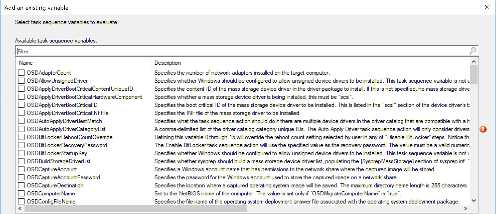
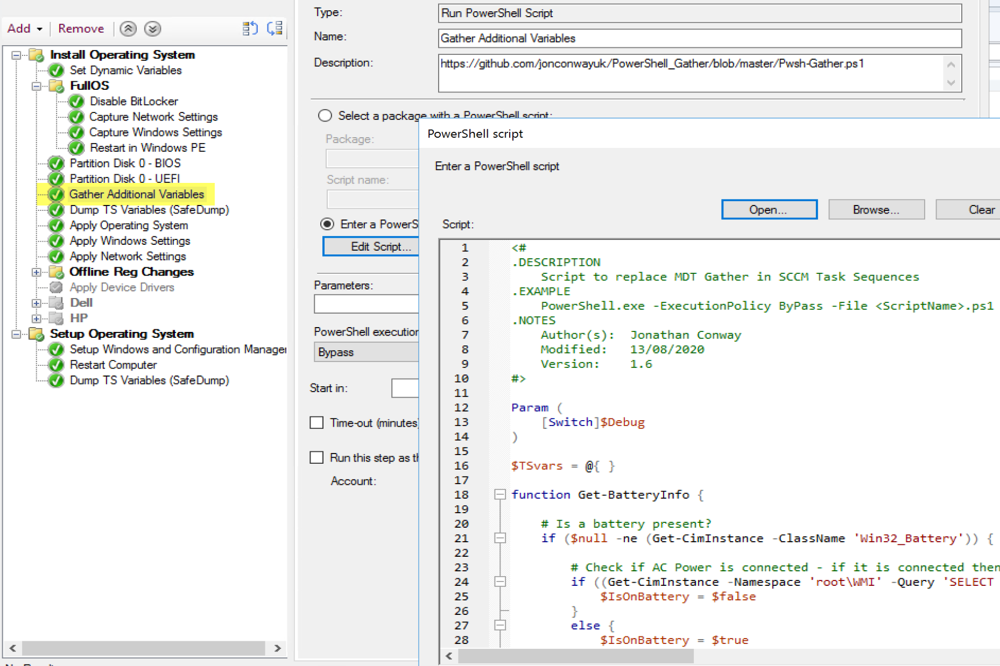
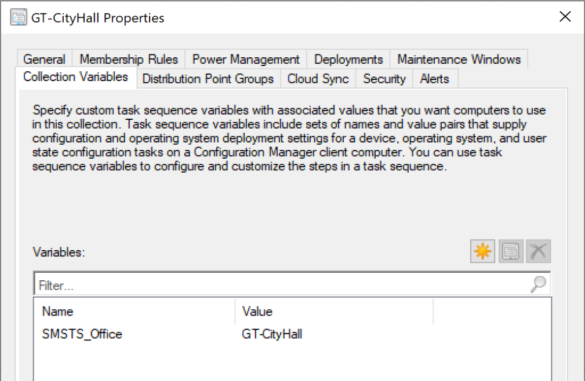
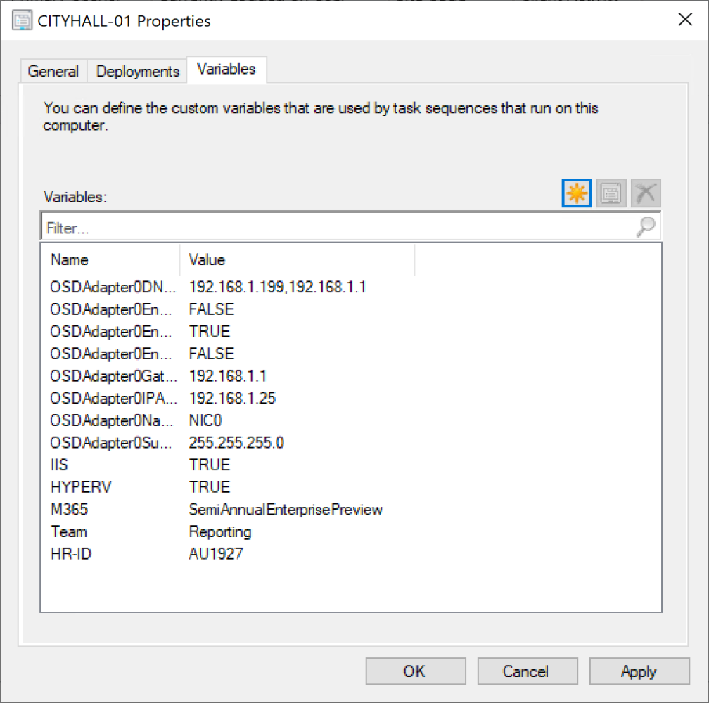
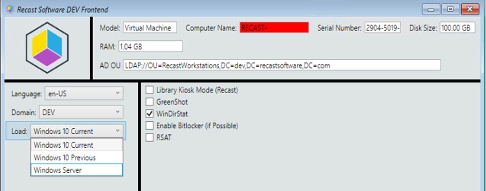
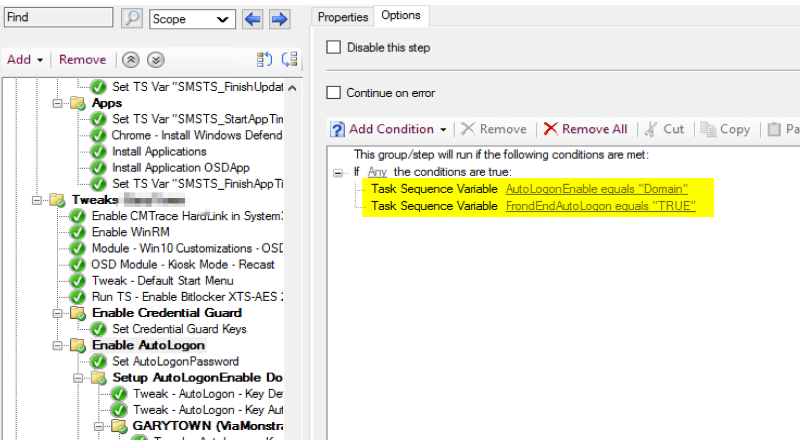

# Variables

## MS Docs

MS Docs (Using Variables): <https://docs.microsoft.com/en-us/mem/configmgr/osd/understand/using-task-sequence-variables>  
MS Docs (List of Variables): <https://docs.microsoft.com/en-us/mem/configmgr/osd/understand/task-sequence-variables>  

### Task Sequence Variables

  
ConfigMgr has many built in Variables, which are used constantly during OSD by default.  They determine how your drive will be formatted, what the computer will be names, if the machine is in winpe or the full os, and so much more.

> [!NOTE]
> To enable some Variables, you need to run the [Set Dynamic Variable Step](https://docs.microsoft.com/en-us/mem/configmgr/osd/understand/task-sequence-steps#variables-for-set-dynamic-variables).  
 [_SMSTSMake](https://docs.microsoft.com/en-us/mem/configmgr/osd/understand/task-sequence-variables#SMSTSMake) | [_SMSTSModel](https://docs.microsoft.com/en-us/mem/configmgr/osd/understand/task-sequence-variables#SMSTSModel) | [_SMSTSMacAddresses](https://docs.microsoft.com/en-us/mem/configmgr/osd/understand/task-sequence-variables#SMSTSMacAddresses) | [_SMSTSIPAddresses](https://docs.microsoft.com/en-us/mem/configmgr/osd/understand/task-sequence-variables#SMSTSIPAddresses) | [_SMSTSSerialNumber](https://docs.microsoft.com/en-us/mem/configmgr/osd/understand/task-sequence-variables#SMSTSSerialNumber) | [_SMSTSAssetTag](https://docs.microsoft.com/en-us/mem/configmgr/osd/understand/task-sequence-variables#SMSTSAssetTag) | [_SMSTSUUID](https://docs.microsoft.com/en-us/mem/configmgr/osd/understand/task-sequence-variables#SMSTSUUID)

Once you start getting past the basics, you'll find that you need more to make your process more dynamic.  Why have several OSD task sequences that basically do the same thing, when you can have one, which can cover each scenario dynamically.

Personally I start with a community script that pulls in several more variables: <https://github.com/jonconwayuk/PowerShell_Gather>  
This would include some of those MDT standard variables you might rely on like: IsLaptop, IsDesktop, IsVM, and so many more.  Check out the link for the full list of variables the script creates.

Adding Community Script to TS to gather variables:
  

If you want to do zero touch imaging which accounts for several situations, variables are your answer.

Typical uses for extra variables:

- Model Specific Drivers / BIOS
- Language Packs
- Applying Roles
  - Different Applications
  - Different Settings
  - Different Windows Features

### Collection Variables

  
On a collection, you can go to the collection variables tab and create a Name & Value.  In this example I've created a variable for the office location, so while the machine is imaging, it will get the correct OU, and other settings for this office.

### Machine Variables

In this example I've added several variables to this machine to assign networking information during OSD.  I've also set it up to install specific Windows Features, the M365 Channel, and specific line of business information to determine start menu and other items.

### Front End

Other methods for creating Variables is via a "Front end"

This front end will create the variables to place the machine in a specific OU, provide the name, pick a domain for which it will be placed, pick apps and windows features, and even the OS build to install.  Front Ends are great for customizing a deployment, but removes the ability for zero touch.

### In the Task Sequence

In this example I'm running a group in the Task Sequence based on a couple of different variables.  If either of those variables match, then the group would run.  In another doc, I'll go over conditions.

Reading Variables during a running Task Sequence
During development and debug stages of creating a task sequence, I will often dump variables or run in debug mode to monitor the variables as I step through the task sequence.

### Undocumented Variables

- SMSTSNextInstructionPointer : This variable will contain the name of the next step that is going to take place in the Task Sequence.

### More information

To get a better look at which variables are in your TS, I use a Variable "dump" Script, which writes the variables to a log file at the time the script runs.  You can find out more about that here:

- [Recast Blog - Variables Gather and Capture](https://www.recastsoftware.com/blog/a-week-of-task-sequence-tips-day-03)

To pause and test variables on the fly, I recommend pausing the TS:

- [Recast Blog - Task Sequence Pause](https://www.recastsoftware.com/blog/a-week-of-task-sequence-tips-day-02)

Or leveraging the TS Debugger

- [Recast ConfigMgr Docs - Debug Mode](SCCM-TaskSequence-Debugger.md)

**About Recast Software**
1 in 3 organizations using Microsoft Configuration Manager rely on Right Click Tools to surface vulnerabilities and remediate quicker than ever before.  
[Download Free Tools](https://www.recastsoftware.com/?utm_source=cmdocs&utm_medium=referral&utm_campaign=cmdocs#formarea)  
[Request Pricing](https://www.recastsoftware.com/pricing?utm_source=cmdocs&utm_medium=referral&utm_campaign=cmdocs)
