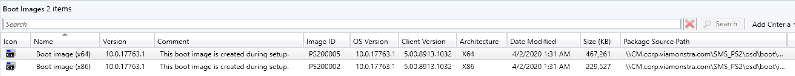
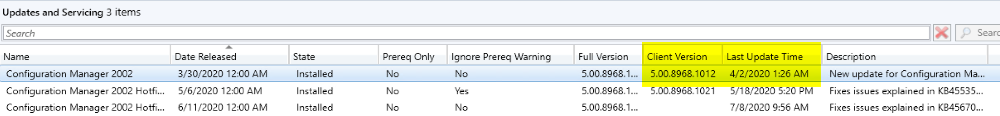
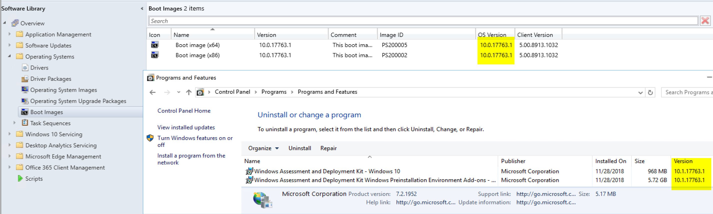
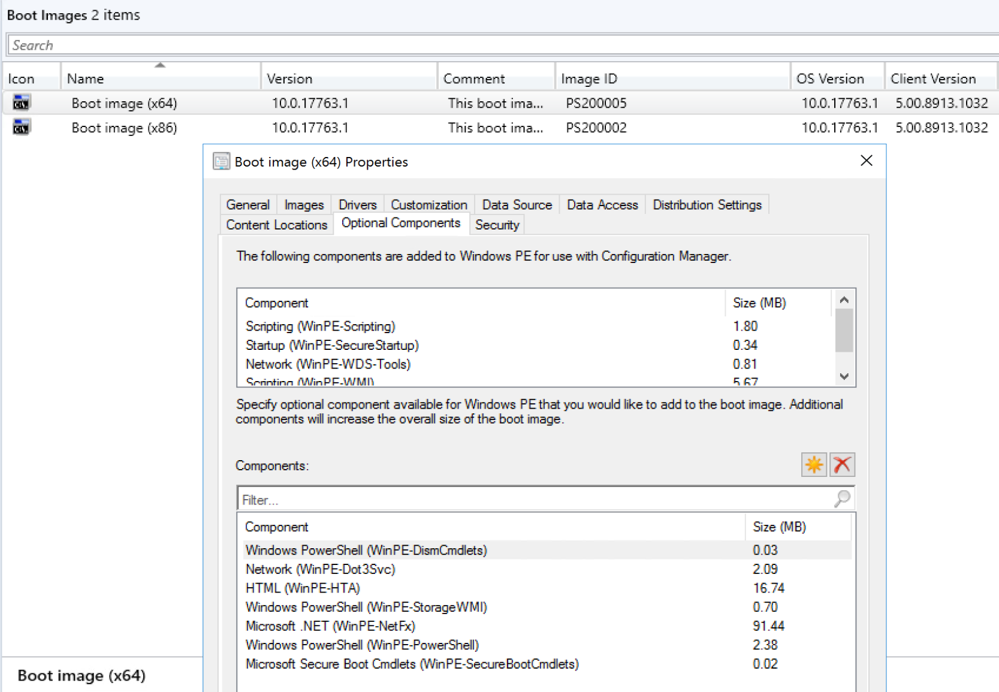

# Windows PE PowerShell Support

Windows PE Boot Media is a requirement for Operating System Deployment (OSD).

## MS Docs

MS Docs: <https://docs.microsoft.com/en-us/mem/configmgr/osd/get-started/manage-boot-images>

PowerShell:

- [Get-CMBootImage](https://docs.microsoft.com/en-us/powershell/module/configurationmanager/Get-CMBootImage?view=sccm-ps)
- [New-CMBootImage](https://docs.microsoft.com/en-us/powershell/module/configurationmanager/New-CMBootImage?view=sccm-ps)
- [Set-CMBootImage](https://docs.microsoft.com/en-us/powershell/module/configurationmanager/Set-CMBootImage?view=sccm-ps)
- [Set-CMDriverBootImage](https://docs.microsoft.com/en-us/powershell/module/configurationmanager/Set-CMDriverBootImage?view=sccm-ps)
- [New-CMBootableMedia](https://docs.microsoft.com/en-us/powershell/module/configurationmanager/New-CMBootableMedia?view=sccm-ps)

I'm going to cover the basics of using the default boot image provided in CM and adding requirements for OSD, and the typical items I personally add to the boot image and why along with a reflection about adding drivers to the boot image.

**Default Boot Images**
  

Let's look at these columns:

- Version:  User Editable field, I typically just duplicate the OS Version, but if you have something more helpful for your org, you can change it as you please.
- Comment: These are comments you can add, however the 2 default images will have been pre-populated with a comment to let you know they are the ones CM Creates / maintains for you.
- ImageID: The Package ID of the Boot Image.  These are ones you can feel free to remember as they will never change and are handy to know, especially if you're doing PXE using the default media
- OS Version: This will be the Windows Build number of your Boot Media.  It will be based on the Windows ADK you had installed at the time the media was created. <https://docs.microsoft.com/en-us/windows-hardware/get-started/adk-install>
- Client Version:  This is the CM Client that gets bundled into the WinPE client allowing the Task Sequence to run steps and connect to your infrastructure. You'll want to make sure this matches your production client.  See "Common issues" below for more details.
- Architecture: 64 bit or 32 bit.
- Date Modified: This will be the last date a change was made to the boot media.  Often it will align with the last time you performed a CM Upgrade, as is this case with my image above matching the history of my upgrades in the image below.
- Size: The size of the Boot Image.  Here you can see as you add different options that the size does grow a bit.
- Path: The path of the Boot Image source.  The Default ones you CANNOT change, and will be automatically pointed to a pre-configured configmgr share.

In this image, you can see that the Boot Image was last modified when I performed the CM 2002 upgrade, however the CM Client in my Boot Image is still down level using the 1910 client bits, meaning any of the cool new OSD features in 2002 will fail when I run a TS that has those new features incorporated in it.
  

**Windows ADK for WinPE**  
You'll need to install WinPE on your Server so it can then build the boot images.  It will use the WinPE in the ADK version.  I'm using an older version of the ADK, which is installed on my server as shown below, but this illustrates that the boot images CM Creates are based on the ADK you have installed.
  

**Adding Optional Components**  
When you open the boot image, you are able to add components, among other things, but  here I will show the components that I've installed to support the items I do in OSD. <https://docs.microsoft.com/en-us/windows-hardware/manufacture/desktop/winpe-add-packages--optional-components-reference>
  

- Windows PowerShell (WinPE-DismCmdlets)
  - Allows you to run DISM commands in WinPE
- Network (WinPE-Dot3Svc)
  - Adds support for 802.X
- HTML (WinPE-HTA)
  - Support for Frontends that are HTA, or if you have LENOVO and use their tools to set BIOS Settings.
- Windows PowerShell (WinPE-StorageWMI)
  - Additional support for Storage with PowerShell
- Microsoft .NET (WinPE-NetFX)
  - This gets automatically installed when you choose PowerShell
- Windows PowerShell (WinPE-PowerShell)
  - This enables using PowerShell in WinPE, without, you really limit yourself in WinPE.
- Microsoft Secure Boot Cmdlets (WinPE-SecureBootCmdlets)
  - Used to configure SecureBoot, if you plan to flash HP BIOS, You'll need this.

To see the screen captures of the Boot Image updating, along with other modifications, check out the "Modify Boot Images" Page.

#### Common Issues

- Wrong Client Version in Boot Image
  - You might forget to have your boot media updated after a CM Upgrade, then wonder why new features in your task sequence aren't working, just to find out that the client in WinPE is still order and doesn't support the new features in your TS that you've built.
- Wrong WinPE Version of Boot Image (Doesn't match ADK)
  - This is typically only an issue if you create a custom boot image, for like an MDT boot image or DaRT Boot Image, or for some other purpose.  
    - Having additional boot images means more to manage, which is why I always try to accomplish my goals with the built in boot media so I have less to keep updated and manage with each ConfigMgr and / or ADK Update.
- Permissions on Server
  - To build the media, DISM is launched, which requires admin access, if the account you're using to create boot images or modify them doesn't have admin rights on the server, it doesn't go well, typically access errors will follow.  So while an account might have rights in CM to accomplish the task, the account on the windows OS might not.

**About Recast Software**
1 in 3 organizations using Microsoft Configuration Manager rely on Right Click Tools to surface vulnerabilities and remediate quicker than ever before.  
[Download Free Tools](https://www.recastsoftware.com/?utm_source=cmdocs&utm_medium=referral&utm_campaign=cmdocs#formarea)  
[Request Pricing](https://www.recastsoftware.com/pricing?utm_source=cmdocs&utm_medium=referral&utm_campaign=cmdocs)
