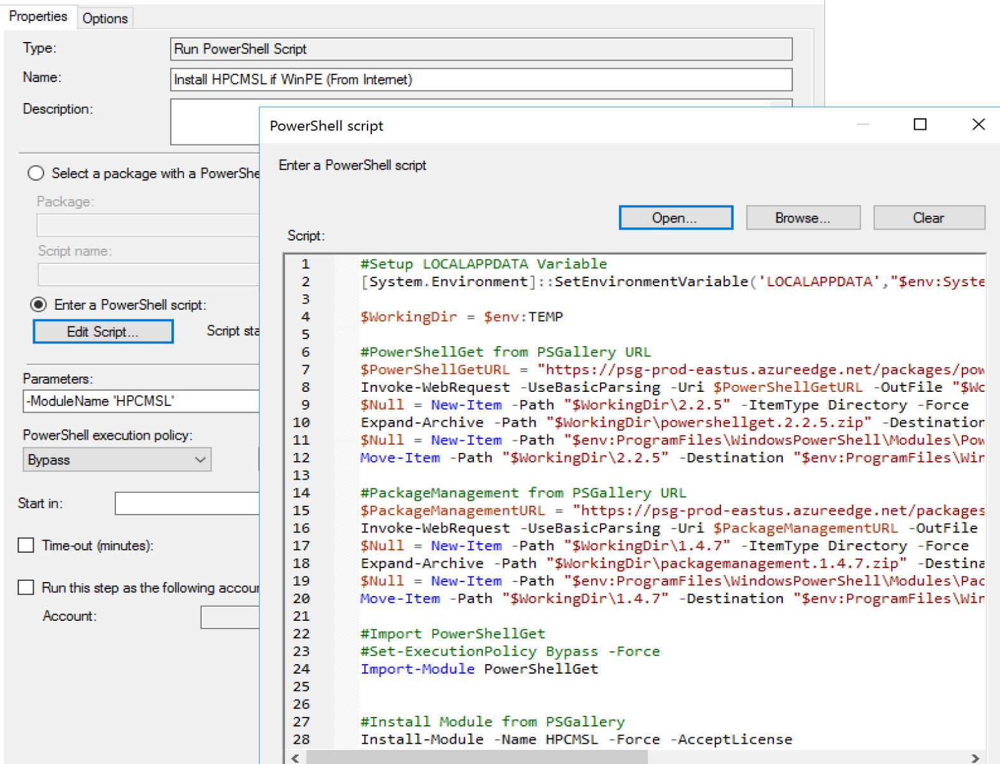
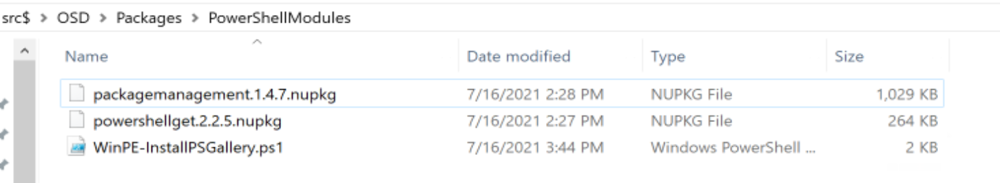
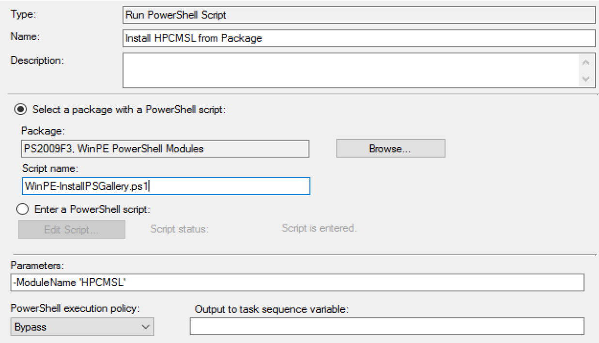
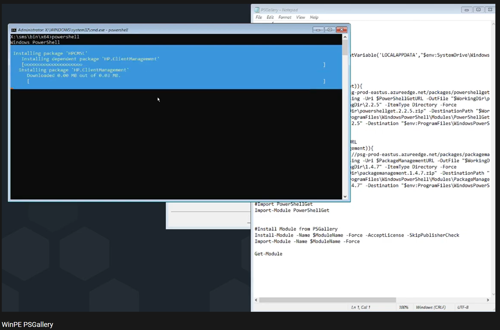

# Adding PowerShell Modules | PSGallery Support to WinPE

Thanks to David Segura for figuring this out and creating a module to updated your WinPE WIM, link at bottom to page.  If you're using his process, then you won't need any of this. :-)

Here we're going to cover adding this ability without modifying your boot image, and enabling the PSGallery during WinPE in a Task Sequence.  This will cover two different methods to enable PSGallery

Basic Requirements

- Add Environment Variable LOCALAPPDATA
- Add Modules: PowerShellGet & PackageManagement

## Adding LOCALAPPDATA Variable

Using this method, the variable only last the session in which it was created, so you'd need to run this in each script you want to call the PSGallery

```PowerShell
[System.Environment]::SetEnvironmentVariable('LOCALAPPDATA',"$env:SystemDrive\Windows\system32\config\systemprofile\AppData\Local")
```

## Pulling Requirements from Internet

With this process, we have a single powershell script that will download the required modules from the internet and install them.

I grabbed the URLs to the nupkg files of the modules I wanted from the [PowerShell Gallery](https://www.powershellgallery.com/), then using Invoke-WebRequest, I download them, extract and move into place.

For a step-through, check out this [Blog Post](https://randomnote1.github.io/powershell/manually-install-module-from-the-powershell-gallery/)

```PowerShell

param (
    [string]$ModuleName
)

#Setup LOCALAPPDATA Variable
[System.Environment]::SetEnvironmentVariable('LOCALAPPDATA',"$env:SystemDrive\Windows\system32\config\systemprofile\AppData\Local")

$WorkingDir = $env:TEMP

#PowerShellGet from PSGallery URL
if (!(Get-Module -Name PowerShellGet)){
    $PowerShellGetURL = "https://psg-prod-eastus.azureedge.net/packages/powershellget.2.2.5.nupkg"
    Invoke-WebRequest -UseBasicParsing -Uri $PowerShellGetURL -OutFile "$WorkingDir\powershellget.2.2.5.zip"
    $Null = New-Item -Path "$WorkingDir\2.2.5" -ItemType Directory -Force
    Expand-Archive -Path "$WorkingDir\powershellget.2.2.5.zip" -DestinationPath "$WorkingDir\2.2.5"
    $Null = New-Item -Path "$env:ProgramFiles\WindowsPowerShell\Modules\PowerShellGet" -ItemType Directory -ErrorAction SilentlyContinue
    Move-Item -Path "$WorkingDir\2.2.5" -Destination "$env:ProgramFiles\WindowsPowerShell\Modules\PowerShellGet\2.2.5"
    }

#PackageManagement from PSGallery URL
if (!(Get-Module -Name PackageManagement)){
    $PackageManagementURL = "https://psg-prod-eastus.azureedge.net/packages/packagemanagement.1.4.7.nupkg"
    Invoke-WebRequest -UseBasicParsing -Uri $PackageManagementURL -OutFile "$WorkingDir\packagemanagement.1.4.7.zip"
    $Null = New-Item -Path "$WorkingDir\1.4.7" -ItemType Directory -Force
    Expand-Archive -Path "$WorkingDir\packagemanagement.1.4.7.zip" -DestinationPath "$WorkingDir\1.4.7"
    $Null = New-Item -Path "$env:ProgramFiles\WindowsPowerShell\Modules\PackageManagement" -ItemType Directory -ErrorAction SilentlyContinue
    Move-Item -Path "$WorkingDir\1.4.7" -Destination "$env:ProgramFiles\WindowsPowerShell\Modules\PackageManagement\1.4.7"
    }

#Import PowerShellGet
Import-Module PowerShellGet


#Install Module from PSGallery
Install-Module -Name $ModuleName -Force -AcceptLicense -SkipPublisherCheck
Import-Module -Name $ModuleName -Force

```

Now the Script leverages a parameter for you to pass it the name of a module you want to install.

[](media/WinPEPSGallery02.png)


## Pulling Requirements from ConfigMgr Package

In this method, you've already downloaded the Module nupkg files and placed into a Package.  It's essentially the same thing, but pulls from your own servers and gives you full control.

Script is very similar, but is kept in the package with the source, and copies the source from the package instead of the internet.

```PowerShell
param (
    [string]$ModuleName
)
#Setup LOCALAPPDATA Variable
[System.Environment]::SetEnvironmentVariable('LOCALAPPDATA',"$env:SystemDrive\Windows\system32\config\systemprofile\AppData\Local")

$WorkingDir = $env:TEMP

#PowerShellGet

if (!(Get-Module -Name PowerShellGet)){
    Copy-Item "$PSScriptRoot\powershellget.2.2.5.nupkg" -Destination "$WorkingDir\powershellget.2.2.5.zip"
    Expand-Archive -Path "$WorkingDir\powershellget.2.2.5.zip" -DestinationPath "$WorkingDir\2.2.5"
    $Null = New-Item -Path "$env:ProgramFiles\WindowsPowerShell\Modules\PowerShellGet" -ItemType Directory -ErrorAction SilentlyContinue
    Move-Item -Path "$WorkingDir\2.2.5" -Destination "$env:ProgramFiles\WindowsPowerShell\Modules\PowerShellGet\2.2.5"
    }


#PackageManagement
if (!(Get-Module -Name PackageManagement)){
    Copy-Item "$PSScriptRoot\packagemanagement.1.4.7.nupkg" -Destination "$WorkingDir\packagemanagement.1.4.7.zip"
    Expand-Archive -Path "$WorkingDir\packagemanagement.1.4.7.zip" -DestinationPath "$WorkingDir\1.4.7"
    $Null = New-Item -Path "$env:ProgramFiles\WindowsPowerShell\Modules\PackageManagement" -ItemType Directory -ErrorAction SilentlyContinue
    Move-Item -Path "$WorkingDir\1.4.7" -Destination "$env:ProgramFiles\WindowsPowerShell\Modules\PackageManagement\1.4.7"
    }

#Import PowerShellGet
Import-Module PowerShellGet


#Install Module from PSGallery
Install-Module -Name $ModuleName -Force -AcceptLicense -SkipPublisherCheck
Import-Module -Name $ModuleName -Force
```

[](media/WinPEPSGallery01.png)
[](media/WinPEPSGallery03.png)

## In Action - YouTube Video

To see a demo of running these scripts, check out this YouTube Video:
[](https://www.youtube.com/watch?v=YXykIY6nIa8)

### Community Links

- [Enable-PEWimPSGallery - OSDeploy](https://osd.osdeploy.com/module/functions/winpe/enable-pewimpsgallery)

**About Recast Software**
1 in 3 organizations using Microsoft Configuration Manager rely on Right Click Tools to surface vulnerabilities and remediate quicker than ever before.  
[Download Free Tools](https://www.recastsoftware.com/?utm_source=cmdocs&utm_medium=referral&utm_campaign=cmdocs#formarea)  
[Request Pricing](https://www.recastsoftware.com/pricing?utm_source=cmdocs&utm_medium=referral&utm_campaign=cmdocs)
