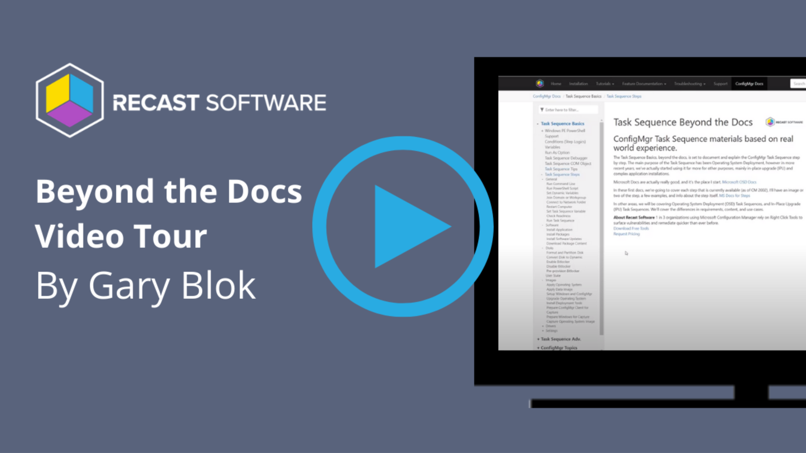

# Task Sequence Beyond the Docs

## ConfigMgr Task Sequence materials based on real world experience.

The Task Sequence Basics, beyond the docs, is set to document and explain the ConfigMgr Task Sequence step by step.  The main purpose of the Task Sequence has been Operating System Deployment, however in more recent years, we've actually started using it far more for other purposes, mainly in-place upgrade (IPU) and complex application installations.

Microsoft Docs are actually really good, and it's the place I start.
[Microsoft OSD Docs](https://docs.microsoft.com/en-us/mem/configmgr/osd/)

In these first docs, we're going to cover each step that is currently available (as of CM 2002), I'll have an image or two of the step, a few examples, and info about the step itself.
[MS Docs for Steps](https://docs.microsoft.com/en-us/mem/configmgr/osd/understand/task-sequence-steps)

In other areas, we will be covering Operating System Deployment (OSD) Task Sequences, and In-Place Upgrade (IPU) Task Sequences.  We'll cover the differences in requirements, content, and use cases.

**About Recast Software**
1 in 3 organizations using Microsoft Configuration Manager rely on Right Click Tools to surface vulnerabilities and remediate quicker than ever before.  
[Download Free Tools](https://www.recastsoftware.com/?utm_source=cmdocs&utm_medium=referral&utm_campaign=cmdocs#formarea)  
[Request Pricing](https://www.recastsoftware.com/pricing?utm_source=cmdocs&utm_medium=referral&utm_campaign=cmdocs)
