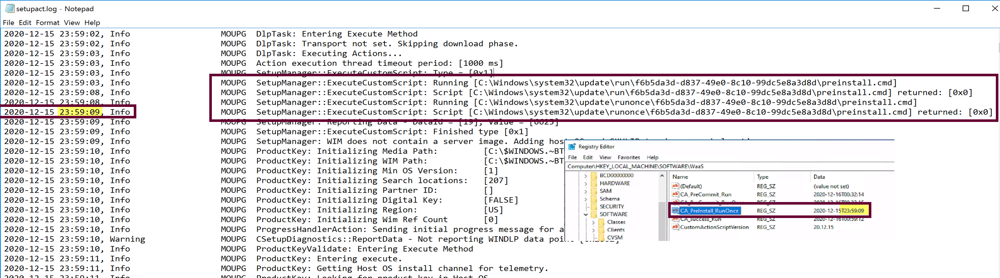
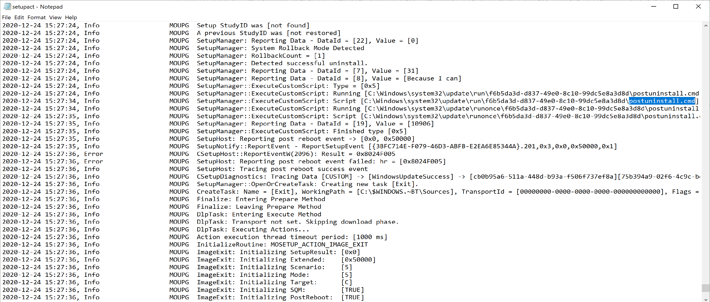

# Windows Upgrade Custom Action Scripts

The Custom Action Scripts allow you to run additional commands during the Windows Setup Process. Microsoft essentially gave you the ability to inject your own commands into the setup process.  The Windows 10 Setup engine has several hooks at different points that reach out, check specific locations and call scripts if they exist.  Microsoft has documented them pretty well below, but the intent of this post will be to go a bit deeper, showing them in action, showing how you can create them, and then showing the logs of when they get called.

## MS Docs

<https://docs.microsoft.com/en-us/windows-hardware/manufacture/desktop/windows-setup-enable-custom-actions>

If you're using native windows upgrade features, "Feature Updates", and not leveraging a task sequence to do your customizations, you'll need other methods to trigger actions, like disabling services or security products during your upgrades.  This means you'll need to pre-stage the files ahead of time, leveraging a Task Sequence or package, so that when the upgrade goes, those files will be there for the setup engine to leverage.

Typical Reasons for using Custom Action Scripts

- Disabling Services or AV before starting Downlevel Stage
- Trigging a 3rd Party Encryption pre-boot bypass
- Fix some applications after upgrade
  - For us, we had several apps that required files being re-registered or running the repair method on the MSI installer.
  - When this happens, I also suggest working with those vendors to get them to update their apps to survive an upgrade, or look for a different software.
- Apply some customizations
  - Lock Screen, Wallpapers, User Profile Pictures, etc
- Run Setup Diag
- Copy Logs
- Restore the CM Client after a rollback or OSUninstall (when using a Task Sequence to upgrade)

At this point, I'm going to assume you read the MS Docs, and know the basics:

- [Names](https://docs.microsoft.com/en-us/windows-hardware/manufacture/desktop/windows-setup-enable-custom-actions#about-custom-actions) of the Script Files (and associated error codes on failures)
  - preinstall.cmd | 0XC19001e2
  - precommit.cmd | 0XC19001e3
  - postuninstall.cmd | 
  - failure.cmd | 0XC19001e4
  - success.cmd | 
- [Locations](https://docs.microsoft.com/en-us/windows-hardware/manufacture/desktop/windows-setup-enable-custom-actions#custom-actions-folder-structure) of where to put the files
  - %windir%\System32\update\run\<GUID>
    - These Scripts will persist from upgrade to upgrade (permanent)
  - %windir%\System32\update\runonce\<GUID>
    - These Scripts will be removed after the upgrade (temporary)

In this Post, we're going to create each one of those files, and walk through Windows Setup leveraging them.

> [!TIP]
> While the Scripts Windows Setup calls are simple batch files, you can use those batch files to call more complex PowerShell Scripts

## Examples

In this example, I have an "Application" in CM that runs a powershell script that creates the custom action scripts, or copies pre-created scripts into place to be used in the Feature Update process.

Top level script is called: "CreateCustomActionScripts.ps1", it will generate one of each of the scripts in both a run and runonce folder, which tags the registry with a time stamp of when the script runs.  This will assist in helping to understand when the scripts run.  The script will also check the contents of the folder it's in, and if it finds a script, will copy it into the correct location.

### Application Contents

### Results of the Custom Action Scripts Install

The Application tags the registry with a version of the script, creates the custom action scripts, creates the customization files in ProgramData\WaaS and logs it all

Scripts for Application Content are hosted on [GitHub](https://github.com/gwblok/garytown/tree/master/Feature-Updates)

## Demo

### Basic Demo showing Logs

SetupAct.log = C:\windows\Panther\setupact.log (Post Upgrade Location)
The Preinstall script ran early in the process, before the Setup Engine was doing much.
  
The Machine finishes it work in the downlevel phase, took about 20 minutes on my VM, then it pauses and waits for the end user to approve the restart.  
  
  
Once the Restart is approved, the precommit script will run before the machine actually restarts. From these logs you can see that from the moment I clicked Restart, there was 39 seconds, in which time there is a lot of log.  

At this point, we don't see much for the custom actions scripts until the end, either success or failure.  

So that's a simple sample showing when they run, and how they show up in the setupact.log

For the next demo, lets kick it up a notice and have the scripts do something more than write to the registry.

### PreCommit Checks - Create a Failure

In this demo, I'm going to create a pre-flight style check that will error out the upgrade if it matches a rule we create in the preinstall script.
Shown here is Software Center displaying the results of the Feature Update, and the error code. 0xC19001E2 relates to an issue with preinstall.cmd

The log shows it ran the preinstall script and was given an exit code of 253, which is the exit code my custom script creates when it detects an application that doesn't meet the requirements I've set.  Since the preinstall script returns a non-zero code, it tells the setup engine there was an issue, and the setup engine starts to fail out of the upgrade before it really even started.

Because the upgrade is failing, it calls my custom failure.cmd script, which currently I don't have it doing anything other than writing a registry entry to confirm it ran when it said it did, which match up perfectly with the setupact.log.

Also, another great feature of Windows 10 20H2, it automatically triggers SetupDiag when a failure happens.  It captures to XML and to the registry.  Here is a capture of the registry.  

For additional details on SetupDiag and how it runs and what it captures, check out the [Docs](https://docs.microsoft.com/en-us/windows/deployment/upgrade/setupdiag)

### Success Script information, and leveraging for Customizations

This demo will be leveraging the success.cmd file, nothing too fancy, but a good example of what can be done.
Like with the other custom action scripts, I'll have success.cmd trigger a powershell script that will do the heavy lifting.  I also have it doing a couple other things.  
> [!NOTE]
> The Success.cmd file does not run from the place you put it (C:\Windows\System32\Update), the setup engine makes a copy in C:\Windows\Setup\Scripts\update, which is why you'll see it executing there.

Here is the custom actions scripts, and the contents of the success.cmd file. I'm using an "Application" to trigger a script to add the files into the correct locations.

The Success.cmd sets some permissions to setup replacing the Lock Screen and Wallpaper images, then calls two different powershell scripts.

In the scripts we're setting a few registry values, replacing the lock screen image and wallpaper images, and running setupdiag.exe for fun to get some metrics.

I have my scripts write to a custom log (c:\ProgramData\WaaS\CustomActions.log) so I know exactly when my scripts ran and what the did.  Each script uses a different "Component" name, to be able to keep track of which script is writing to the log file.

The Success.cmd file I have, triggers two different powershell files, Success.ps1 and SuccessSetupDiag.ps1, which both write to that log with different "Component" names.

- **SuccessSetupDiag.ps1** (Triggered by Success.cmd, but is not  monitored, Success.cmd continues)
  - Monitors the creation of windows.old, once created, triggers SetupDiag.exe to collect results and adds them to the registry: HKLM\SOFTWARE\WAAS\%BUILDNUMBER%
- **Success.ps1** (Triggered by Success.cmd and Success.cmd waits for return code)
  - Modifies Registry values to customize User Experience
  - Copies Lock Screen Image from staged area (ProgramData\WaaS) to Windows location
  - Copies Backgound Image from staged area to Windows location
  - Copies the User Profile Images (Default Corporate Logo) from staged area to Windows Location
  - Any additional customizations I'd want to do, I'd add here

The log above, shows the output from those two scripts running.
The results in the Registry after a Successful Upgrade.  Every Script that ran I have tag the registry to ensure it ran, and at the time it ran.

The SetupDiag results:

After the upgrade, as expected, the "Run" Folder has been migrated to the new OS, to be used for the next feature update, and the "RunOnce" Folder is gone

## Diagram

- **PreInstall** ran after downloading the DUs, which took 10 to 15 minutes on my VMs, if you disable dynamic updates, then PreInstall will run very quickly after starting the upgrade.
- **PreCommit** ran shortly after I clicked "Restart".  Basically the Feature Upgrade ran through the initial downlevel phase, got to a point where it notifies (or requests) the user of a reboot, then once approved, or continues automatically, the final downlevel phase processes run, including the PreCommit.
- **Success** ran nearly at the end of the entire process.  There were just a couple minutes between the time it ran and the time I was presented with the desktop logon screen.

## PostUninstall.cmd
This runs when a user leverages the "[go back](https://support.microsoft.com/en-us/windows/recovery-options-in-windows-10-31ce2444-7de3-818c-d626-e3b5a3024da5#bkmk_section6)" feature.  There are going to be several overlapping items between a "Uninstall" and a "rollback", logs will be in the same location, and it's actually the same log file for both.  But the system is smart enough to know the difference and run either the failure.cmd or the PostUninstall.cmd

The logs are located here: **$WINDOWS.~BT\Sources\Rollback**

At the start of the log, it shows Initiating rollback/uninstall, to confirm you're at the right place.

Towards the end, it shows that it ran the PostUninstall.cmd file.

## Stay tuned

- This post is not yet complete, still have plans to add information about failure.cmd and postuninstall.cmd with demos.

## References

- [MS Docs - Resolution procedures](https://docs.microsoft.com/en-us/windows/deployment/upgrade/resolution-procedures)

## Community Blog Links

- [YouTube Series on Enterprise Feature Management](https://www.youtube.com/playlist?list=PLcmROu_w9HU8WZTlAgHz48O-g1R_FvWG8)  
- [Windows 10 Feature Updates – Using Custom Action Scripts](https://www.asquaredozen.com/2019/08/25/windows-10-feature-updates-using-custom-action-scripts/) (asquaredozen.com)
- [Windows 10 Upgrade - Custom Action Scripts](https://garytown.com/windows-10-upgrade-custom-action-scripts) (garytown.com)
- [Running custom actions during a Windows 10 Feature Update with Configuration Manager](https://msendpointmgr.com/2021/04/12/running-custom-actions-during-a-windows-10-feature-update-with-configuration-manager/) ([Ben Whitmore](https://twitter.com/byteben))
- [GitHub - Windows 10 Features Update](https://github.com/AdamGrossTX/Windows10FeatureUpdates) (Adam Gross's Feature Update GitHub with a nice Framework to build yourself a support system for Feature Updates)
